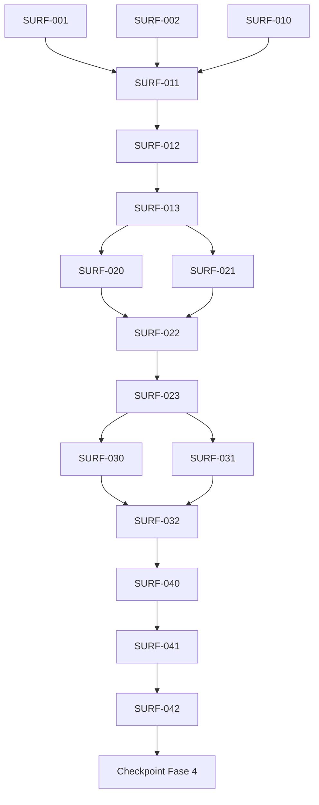

# Manifest DAG — SURF Fasi 0–3

## Ordine canonico di integrazione

1. `SURF-001`
2. `SURF-002`
3. `SURF-010`
4. `SURF-011`
5. `SURF-012`
6. `SURF-013`
7. `SURF-020`
8. `SURF-021`
9. `SURF-022`
10. `SURF-023`
11. `SURF-030`
12. `SURF-031`
13. `SURF-032`
14. `SURF-040`
15. `SURF-041`
16. `SURF-042`

L'ordine di integrazione non impedisce l'implementazione parallela dei gruppi esplicitamente indicati.

## DAG

## Gruppi parallelizzabili

### Wave A — avvio immediato

- `SURF-001` — hotspot: nessuno di produzione;
- `SURF-002` — hotspot `H2`;
- `SURF-010` — file tema, nessun overlap con gli altri due.

Tutti e tre possono partire dalla stessa base.

### Sequenza core

`SURF-011 → SURF-012 → SURF-013` è seriale e possiede `H1`.

### Wave B — Markdown

- `SURF-020` — live preview/completions/corpus;
- `SURF-021` — hotspot `H3` comandi.

Entrambi dipendono dall'exit gate di Fase 1 e possono essere implementati in parallelo.

Poi: `SURF-022 → SURF-023`, seriali.

### Wave C — clienti reali

- `SURF-030` — PlainTextProfile;
- `SURF-031` — FormulaProfile.

Devono partire dalla stessa versione verificata di `TextEngine` e non possono modificarla.

Poi: `SURF-032 → SURF-040 → SURF-041 → SURF-042`.

## Tabella compatta

| ID | Fase | Dipendenze | Rischio | Parallelo | Hotspot |
|---|---:|---|---|---|---|
| SURF-001 | 0 | — | basso | Wave A | — |
| SURF-002 | 0 | — | medio | Wave A | H2 |
| SURF-010 | 1/meccanico | — | basso | Wave A | — |
| SURF-011 | 1 | 001,002,010 | alto | no | H1 |
| SURF-012 | 1 | 011 | medio-alto | no | H1 |
| SURF-013 | 1 | 012 | medio | no | H1 |
| SURF-020 | 2 | 013 | basso | Wave B | — |
| SURF-021 | 2 | 013 | medio | Wave B | H3 |
| SURF-022 | 2 | 020,021 | alto | no | H4 |
| SURF-023 | 2 | 022 | alto | no | H1 |
| SURF-030 | 3 | 023 | basso-medio | Wave C | — |
| SURF-031 | 3 | 023 | medio-alto | Wave C | — |
| SURF-032 | 3 | 030,031 | medio | no | — |
| SURF-040 | 3 | 032 | medio | no | H2/H3 |
| SURF-041 | 3 | 040 | basso-medio | no | H5 |
| SURF-042 | 3 | 041 | basso | no | docs |

## Entry iniziale

I primi tre task da schedulare sono esattamente `SURF-001`, `SURF-002` e `SURF-010`.