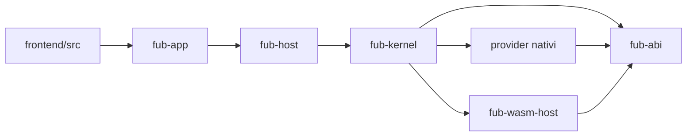

# Repository Guidelines

## Prima di modificare il codice

Leggi [CONTRIBUTING.md](CONTRIBUTING.md), la pagina architetturale pertinente e gli ADR collegati. Preferisci sempre un canale generico già esistente — provider, query, comando, view o evento — a un percorso speciale.

## Flusso principale



## Confini non negoziabili

- `fub-abi` contiene tipi e contratti condivisi; non compie I/O applicativo.
- `fub-kernel` non conosce Tauri, Markdown o Wasmtime.
- `fub-host` monta sessioni, bundle, watcher e job senza dipendere da Tauri.
- `fub-app` contiene soltanto colla Tauri e adattatori IPC.
- `fub-wasm-host` è l'unico crate che nomina Wasmtime.
- `fub-format-markdown` è il componente che conosce il Markdown.
- `fub-testkit` è solo una dipendenza di sviluppo.
- Nel frontend, solo il seam host autorizzato importa API Tauri.

La mappa dettagliata è in [docs/architecture/components.md](docs/architecture/components.md).

## Regole di implementazione

- I tipi pubblici condivisi vivono in `fub-abi` e sono riesportati dalla radice.
- Un cambio di contratto aggiorna Rust, WIT, mirror TypeScript e test di conformità.
- Gli errori attraversano i confini come varianti tipizzate, non come `to_string()`.
- Gli identificatori `u64` destinati a JavaScript viaggiano come stringhe.
- Non mantenere lock durante chiamate a provider.
- Il dispatch degli eventi resta accodato e non rientrante.
- Le feature ufficiali restano disattivabili in modo indipendente.
- I file generati si aggiornano dalla loro sorgente, mai a mano.
- La documentazione descrive soltanto comportamenti verificati; le proposte vivono in `docs/rfcs/`.

## Comandi di verifica

Dalla radice:

```bash
cargo fmt --all --check
cargo clippy --workspace --all-targets -- -D warnings
cargo test --workspace
node .github/scripts/check-doc-links.mjs
node .github/scripts/check-prose.mjs
node .github/scripts/check-tables.mjs
node .github/scripts/check-locale-loop.mjs
```

Da `frontend/`:

```bash
npm ci
npm run typecheck
npm test
npm run build
npm run bench:a11y
npm run bench:verify
```

I dettagli e le eccezioni cross-platform sono in [CONTRIBUTING.md](CONTRIBUTING.md).

## Documentazione

- Ingresso: [docs/README.md](docs/README.md)
- Architettura: [docs/architecture/overview.md](docs/architecture/overview.md)
- Contratti: [docs/reference/rust-contracts.md](docs/reference/rust-contracts.md)
- Stato: [docs/project/status.md](docs/project/status.md)
- Proposte: [docs/rfcs/README.md](docs/rfcs/README.md)
- Decisioni: [docs/decisions/README.md](docs/decisions/README.md)

Non creare alias, cartelle `archive/` o seconde roadmap. La cronologia Git conserva i documenti rimossi.
