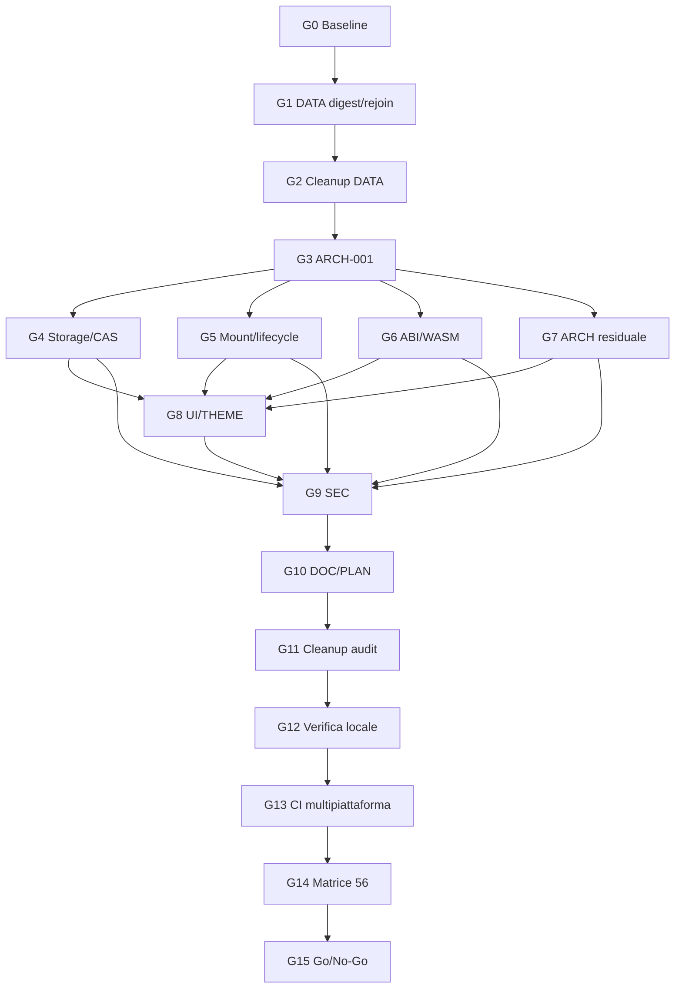

# Piano di azione operativo — audit e correzioni di `Fubeo/Fub`

> **Documento di esecuzione derivato dall’handoff del 1 settembre 2026.**  
> Questo piano non certifica lo stato live del repository: prima di applicarlo è obbligatoria la riconciliazione iniziale della branch.  
> **Stato di partenza dichiarato nell’handoff:** `NOT READY FOR PHASE 9 — non mergiare in main`.

---

## 0. Scopo, perimetro e regole di lettura

### 0.1 Obiettivo

Portare `fix/audit-integration` da una branch di lavoro con ricostruzioni parziali, commit temporanei e finding ancora aperti a un tree semantico:

- riconciliato finding-per-finding;
- protetto da test e guardie che dimostrano i contratti;
- documentato senza sovrastimare le garanzie reali;
- privo di helper e workflow monouso;
- verde localmente e nella CI multipiattaforma;
- valutabile per il passaggio alla **Phase 9 del progetto** e, solo dopo, per il merge in `main`.

### 0.2 Fonte e limiti informativi

La fonte è l’handoff `HANDOFF-FUB-AUDIT-2026-09-01(1).md`.

L’audit originario comprendeva 56 finding:

- `SEC-001..004`
- `DATA-001..011`
- `UI-001..009`
- `ARCH-001..007`
- `ABI-001..003`
- `WASM-001..003`
- `BUILD-001..002`
- `CI-001`
- `DOC-001..013`
- `THEME-001..002`
- `PLAN-001`

Il vecchio `issues.md` non è disponibile. Perciò:

1. non dedurre la definizione di un finding dal solo prefisso o dal nome di un file;
2. ricostruire ogni contratto da handoff, cronologia, codice, test e documentazione esistente;
3. segnare come **non ricostruito** ciò che non ha ancora una specifica verificabile;
4. non dichiarare chiuso un finding soltanto perché “sembra coperto” da un refactor vicino;
5. distinguere sempre:
   - **presenza della patch**;
   - **copertura di test**;
   - **coerenza documentale**;
   - **verifica locale**;
   - **verifica CI finale**.

### 0.3 Baseline dichiarata dall’handoff

| Elemento | Valore dichiarato |
|---|---|
| Repository | `Fubeo/Fub` |
| Branch di lavoro | `fix/audit-integration` |
| Base `main` | `96eba1695bcb8b92af3cd8e70c1b085f10e849c9` |
| HEAD branch | `8ac4d9f4cfae0f0457661cd4840c9b03b295a14e` |
| Messaggio HEAD | `ci(temp): cattura errore integrità anagrafe` |
| Distanza da `main` | 92 commit avanti, 0 indietro |
| Stato | commit temporaneo, non release-ready |
| Decisione | non mergiare in `main` |

Se lo stato remoto è cambiato, il piano resta valido come struttura ma bisogna aggiornare la baseline e rivalutare tutte le assunzioni dipendenti dal tree.

---

## 1. Contratti non negoziabili

Questi contratti sono **gate architetturali**, non preferenze implementative. Nessuna correzione può indebolirli per ottenere una suite verde.

### C-01 — filesystem capability-based

Le operazioni filesystem di produzione devono essere relative a una capability o a un handle di directory.

Non è sufficiente:

- canonicalizzare un path;
- validare che il path “sembri” interno a una root;
- effettuare poi accessi ambient per path assoluto o relativo al processo.

### C-02 — perimetro reale della CAS

La CAS può essere esatta tra writer Fub/cooperativi che rispettano lo stesso lock capability.

La documentazione non deve promettere una garanzia universale contro:

- processi esterni arbitrari;
- writer che ignorano il lock;
- modifiche ambient fuori protocollo.

### C-03 — mount transazionale e topologico

Il mount di un bundle deve essere:

- **all-or-nothing**;
- dotato di rollback completo;
- ordinato in modo deterministico tramite `requires/provides`;
- indipendente dall’ordine casuale della tabella o dell’inventory.

Non è accettabile “correggere” il caso `trash` spostandolo manualmente dopo `commands`.

### C-04 — callback provider fuori dal lock Workspace

Nessuna callback di provider o altro codice esterno deve essere eseguita mentre è detenuto il lock `Custody<Workspace>`.

La forma richiesta è:

1. preparare sotto lock;
2. rilasciare il lock;
3. chiamare il provider;
4. rientrare sotto lock;
5. verificare e finalizzare.

`lend()` può risolvere aliasing Rust interno, ma non rilascia automaticamente il lock esterno dell’host.

### C-05 — porte strette, non `Host::workspace` generico

I consumer non devono ricevere accesso generico al workspace. Devono usare capability o servizi stretti e intenzionali.

### C-06 — immutabilità dei WIT frozen

Un WIT frozen esistente non si modifica.

Una breaking change richiede:

- una nuova versione ABI esatta;
- un nuovo frozen;
- conformance esplicita;
- rifiuto delle combinazioni non supportate.

### C-07 — eventi plugin non autorevoli

Gli eventi esposti ai plugin non sostituiscono gli eventi autorevoli interni del kernel.

### C-08 — UI fedele alle funzionalità disponibili

La UI non deve mostrare come disponibile:

- un tema non caricabile;
- una funzionalità non implementata;
- un toggle che non ha effetto reale;
- uno stato “enabled” non sostenuto dal runtime.

### C-09 — dati derivati fuori dallo spazio autorevole

Indici e cache derivati non devono vivere nello spazio dati autorevole.

### C-10 — identità `DocId` preservata

Parse e import non possono cambiare silenziosamente il `DocId` richiesto.

---

## 2. Modello operativo

### 2.1 Stati ammessi per un finding

Usare soltanto questi stati nel registro finale:

| Stato | Significato |
|---|---|
| `NOT_RECONSTRUCTED` | La specifica originale non è ancora ricostruita con sufficiente evidenza. |
| `RECONSTRUCTED` | Contratto e perimetro sono documentati, ma non è stata verificata una patch completa. |
| `PARTIAL` | Esiste lavoro rilevante, ma manca almeno una parte del contratto, dei test o della documentazione. |
| `IMPLEMENTED_UNVERIFIED` | La patch sembra completa, ma manca una verifica richiesta. |
| `VERIFIED_LOCAL` | Patch, test e documentazione sono coerenti e verdi localmente. |
| `VERIFIED_CI` | Il finding è dimostrato sul commit finale dalla CI richiesta. |
| `BLOCKED` | Esiste un impedimento esplicito, descritto con causa ed evidenza. |
| `ACCEPTED_RISK` | Il rischio residuo è stato esplicitamente accettato; non equivale automaticamente a chiusura. |

Non usare `DONE` o `CLOSED` finché non sono soddisfatti tutti i criteri della sezione 18.

### 2.2 Unità minima di evidenza

Per ogni finding registrare:

- ID;
- specifica ricostruita;
- file e callsite interessati;
- commit semantico;
- test di regressione;
- guardia strutturale, se pertinente;
- documentazione;
- rischio residuo;
- esito locale;
- esito Linux;
- esito macOS;
- esito Windows;
- revisore;
- note di compatibilità/migrazione.

### 2.3 Regole sui commit

1. I commit `ci(temp): ...`, di cattura log, retry e helper non sono milestone semantiche.
2. Ogni tranche deve terminare con un commit semanticamente leggibile.
3. Prima di passare alla tranche successiva:
   - ispezionare il diff del commit semantico;
   - verificare che non contenga rumore;
   - collegare il commit ai finding pertinenti.
4. Non riscrivere la branch remota o forzare push senza una decisione esplicita e documentata.
5. Non cherry-pickare isolatamente:
   - `b7e8c3318f7cc29f2c6f8eb5b8e0481ffe0883da`;
   - `949fbaa45e1fa55d5ac77d6b12a45a5c9ec8d1fd`.
6. I due commit sopra descrivono un incidente e il suo ripristino esatto; non sono riferimenti semantici.
7. `main` resta immutato finché il gate finale non è superato.

### 2.4 Ancore semantiche già note

| Area | Commit | Significato |
|---|---|---|
| `DATA-008` | `9487543b2e5f4e50d2438cfb095f328446303da4` | preserva l’identità durante il parse |
| Markdown | `33fe561d232470e2110e0771d59f2c8797428d5b` | separa attributi radice e payload |
| Rustfmt Markdown | `f5b2be07de3ccb6023614f7d305574abcbd8d794` | formattazione successiva |
| CI | `375306b2f97df13188c3a432268465617c03868d` | pin/permessi/toolchain, parte della tranche |
| CI | `2ad66b9388cf267a8b7022c248ba81de6b8bbf48` | checkpoint con run completo verde |
| Checkpoint pre-DATA | `5d3042138d882b45901cf12be6bb9ac3d337badd` | molte ricostruzioni già presenti |
| `DATA-002` | `d17eb1fc7540d2560d6d0e7f67aeb1d9d90cdafa` | SHA-256 per le revisioni |
| HEAD handoff | `8ac4d9f4cfae0f0457661cd4840c9b03b295a14e` | commit temporaneo di cattura log |

Queste ancore aiutano la ricostruzione ma non sostituiscono la verifica del tree finale.

---

## 3. Mappa delle fasi e dei gate

| Fase | Obiettivo | Gate di uscita |
|---:|---|---|
| 0 | Riconciliare repository e baseline | `G0 — Baseline affidabile` |
| 1 | Chiudere il banco DATA digest/identità/rejoin | `G1 — Commit DATA semantico e verde` |
| 2 | Pulire gli helper della tranche DATA | `G2 — Nessun residuo DATA non giustificato` |
| 3 | Chiudere `ARCH-001` | `G3 — Callback provider fuori lock` |
| 4 | Verificare storage capability e CAS cooperativa | `G4 — Storage contract verified` |
| 5 | Verificare mount/lifecycle/provider ausiliari | `G5 — Mount transazionale e topologico` |
| 6 | Audit e chiusura ABI/WASM | `G6 — ABI/WASM conformance` |
| 7 | Chiudere architettura residua | `G7 — ARCH-004/005/007 verificati` |
| 8 | Riconciliare frontend UI/THEME | `G8 — UI/THEME verificati` |
| 9 | Riconciliare sicurezza | `G9 — SEC ricostruiti e verificati` |
| 10 | Riconciliare documentazione e piano | `G10 — DOC/PLAN coerenti` |
| 11 | Rimuovere infrastruttura temporanea audit | `G11 — Tree semantico pulito` |
| 12 | Eseguire verifica finale locale completa | `G12 — Matrice locale verde` |
| 13 | Eseguire CI finale multipiattaforma | `G13 — Linux/macOS/Windows verdi` |
| 14 | Chiudere la matrice dei 56 finding | `G14 — Ogni finding ha evidenza completa` |
| 15 | Decisione Phase 9 e merge | `G15 — Go/No-Go esplicito` |

Le fasi possono avere attività esplorative sovrapposte, ma nessun gate successivo può essere dichiarato superato saltando i gate dipendenti.

---

# FASE 0 — Riconciliazione iniziale e messa in sicurezza

## 0.1 Obiettivo

Stabilire con precisione:

- quale commit è realmente in HEAD;
- se il remoto è avanzato rispetto all’handoff;
- se `main` è rimasto invariato;
- quali file temporanei sono presenti;
- quali workflow sono attivi;
- se la working tree è pulita;
- se esistono divergenze o modifiche locali non documentate.

## 0.2 Procedura

### Passo 0.2.1 — sincronizzare i riferimenti senza modificare il tree

```bash
git fetch origin --prune
git status --short --branch
git branch --show-current
git rev-parse HEAD
git rev-parse origin/fix/audit-integration
git rev-parse origin/main
git rev-list --left-right --count origin/main...origin/fix/audit-integration
```

### Passo 0.2.2 — confrontare con la baseline dell’handoff

Verificare:

- [ ] branch attiva: `fix/audit-integration`;
- [ ] HEAD atteso nell’handoff: `8ac4d9f4cfae0f0457661cd4840c9b03b295a14e`;
- [ ] `main` atteso nell’handoff: `96eba1695bcb8b92af3cd8e70c1b085f10e849c9`;
- [ ] distanza attesa: 92 avanti, 0 indietro;
- [ ] nessun merge in `main`;
- [ ] nessuna modifica locale non spiegata.

Se i valori differiscono:

1. non effettuare reset automatici;
2. registrare:
   - nuovo SHA;
   - autore;
   - messaggio;
   - file modificati;
   - run CI associati;
3. confrontare il delta con:
   ```bash
   git log --oneline --decorate --graph \
     8ac4d9f4cfae0f0457661cd4840c9b03b295a14e..origin/fix/audit-integration
   git diff --stat \
     8ac4d9f4cfae0f0457661cd4840c9b03b295a14e..origin/fix/audit-integration
   ```
4. aggiornare la sezione “baseline effettiva” del registro di lavoro;
5. rivalutare la Fase 1 prima di applicare altri commit.

### Passo 0.2.3 — inventario dei file temporanei

```bash
find . -type f \( -name '.audit-*' -o -path '*/.audit-*' \) -print | sort
find .github/workflows -maxdepth 1 -type f -print | sort
git ls-files | grep -E '(^|/)\.audit-|audit-.*\.ya?ml$' || true
```

Classificare ogni voce:

| Classe | Significato | Azione |
|---|---|---|
| `ACTIVE_CURRENT_TRANCHE` | necessaria per il banco DATA corrente | conservare fino a `G1` |
| `ACTIVE_OTHER_TRANCHE` | necessaria per lavoro non ancora concluso | documentare dipendenza |
| `RESIDUAL_VERIFIED` | residuo non più necessario, ruolo verificato | rimuovere con commit normale |
| `UNKNOWN` | ruolo non ricostruito | non cancellare finché non chiarito |
| `FINAL_REQUIRED` | file permanente, non realmente temporaneo | rinominare/documentare se il nome è fuorviante |

### Passo 0.2.4 — inventario dei run e dei checkpoint

Registrare almeno:

- run completo verde storico sul checkpoint `2ad66b9`: `33370986607`;
- ultimo run DATA noto: `33450900318`;
- job `apply`: `99680327727`;
- HEAD effettivo;
- ultimo commit semantico;
- ultimo commit temporaneo;
- eventuali run successivi.

Lo scopo è distinguere evidenza storica da certificazione del commit finale.

## 0.3 Gate `G0 — Baseline affidabile`

Superato soltanto quando:

- [ ] la branch effettiva è nota;
- [ ] il delta dall’handoff è stato ispezionato;
- [ ] la working tree è pulita o le modifiche sono state classificate;
- [ ] `main` non è stato modificato, oppure l’eventuale modifica è stata segnalata come blocco;
- [ ] gli helper sono inventariati;
- [ ] nessun reset o force-push ha cancellato evidenza;
- [ ] è chiaro quale commit usare come base per la Fase 1.

## 0.4 Condizioni di stop

Bloccare l’esecuzione se:

- `main` contiene merge non attesi;
- la branch ha divergenze non comprese;
- sono presenti modifiche locali non attribuibili;
- il workflow DATA è già stato rimosso ma il commit semantico atteso non esiste;
- uno degli script temporanei è cambiato dopo l’ultimo run senza documentazione.

---

# FASE 1 — Chiusura del banco DATA: digest, identità e rejoin

## 1.1 Obiettivo

Correggere l’unico errore noto dell’ultimo run, rilanciare il banco e ottenere il commit semantico:

```text
fix(data): verifica digest e identità nei rejoin
```

## 1.2 Stato noto da cui partire

L’ultimo run dichiarato ha prodotto:

- `entry_store`: 11/11 verdi;
- `rejoin`: 10/10 verdi;
- `the_storage`: 5/5 verdi;
- `cargo check -p fub-kernel --all-targets`: verde;
- unico fallimento: Clippy nel test generato `crates/fub-kernel/tests/rejoin.rs:515`.

Espressione generata non accettata da Clippy:

```rust
ws.organization().icons.get("b.txt").is_none()
```

Espressione richiesta:

```rust
!ws.organization().icons.contains_key("b.txt")
```

La correzione deve avvenire nello **script generatore**, non soltanto nel file generato.

## 1.3 Procedura dettagliata

### Passo 1.3.1 — localizzare il frammento nello script

```bash
rg -n 'get\("b\.txt"\)\.is_none\(\)|contains_key\("b\.txt"\)' \
  .audit-data-rejoin-tests.py \
  crates/fub-kernel/tests/rejoin.rs
```

Esito atteso:

- lo script contiene ancora la forma `get(...).is_none()`;
- il test generato riflette la forma prodotta dallo script;
- non esistono più copie divergenti dello stesso frammento in altri helper.

### Passo 1.3.2 — modificare il generatore

Nello script `.audit-data-rejoin-tests.py`, sostituire la generazione della condizione con:

```rust
!ws.organization().icons.contains_key("b.txt")
```

Controlli immediati:

- [ ] modifica minima;
- [ ] nessun cambiamento al significato del test;
- [ ] nessun abbassamento di lint;
- [ ] nessun `#[allow(...)]`;
- [ ] nessuna rimozione del caso di regressione;
- [ ] nessun cambiamento ai contratti digest/rejoin.

### Passo 1.3.3 — validare il diff dello script

```bash
git diff -- .audit-data-rejoin-tests.py
git diff --check
```

Il diff deve mostrare soltanto la correzione semantica necessaria.

### Passo 1.3.4 — retrigger del workflow

Applicare un cambiamento innocuo e chiaramente temporaneo a:

```text
.github/workflows/audit-apply.yml
```

Il cambiamento deve:

- retriggerare il workflow;
- non disabilitare test;
- non cambiare permessi;
- non cambiare toolchain;
- non ignorare Clippy;
- non introdurre `continue-on-error`;
- non cambiare il commit semantico finale;
- essere destinato alla rimozione con il workflow/helper audit.

Verificare il diff aggregato:

```bash
git diff -- \
  .audit-data-rejoin-tests.py \
  .github/workflows/audit-apply.yml
git diff --check
```

### Passo 1.3.5 — commit temporaneo controllato

Creare un commit temporaneo chiaramente riconoscibile. Esempio coerente con la cronologia:

```bash
git add .audit-data-rejoin-tests.py .github/workflows/audit-apply.yml
git commit -m "ci(temp): corregge lint test rejoin generato"
git push origin fix/audit-integration
```

Non usare questo commit come milestone di chiusura.

### Passo 1.3.6 — osservare il nuovo run

Con GitHub CLI, se disponibile:

```bash
gh run list \
  --workflow audit-apply.yml \
  --branch fix/audit-integration \
  --limit 5

gh run watch <RUN_ID> --exit-status
```

In caso di fallimento:

```bash
gh run view <RUN_ID> --log-failed
```

Verificare esplicitamente che il nuovo run esegua:

- [ ] `cargo test -p fub-kernel --test entry_store`;
- [ ] 11 test `entry_store`;
- [ ] `cargo test -p fub-kernel --test rejoin`;
- [ ] 10 test `rejoin`;
- [ ] `cargo test -p fub-kernel --test the_storage`;
- [ ] 5 test `the_storage`;
- [ ] `cargo check -p fub-kernel --all-targets`;
- [ ] Clippy con warning trattati come errori;
- [ ] cleanup degli helper previsto dal workflow;
- [ ] creazione del commit semantico solo dopo esito interamente verde.

### Passo 1.3.7 — verificare i casi di regressione chiave

Nel log o nella suite devono restare presenti e verdi almeno:

- `same_size_and_mtime_do_not_hide_changed_bytes`;
- `an_attachment_fingerprint_persists_and_updates_after_rename`;
- `copy_then_delete_with_the_same_bytes_is_not_a_rename`;
- `equal_contents_do_not_make_two_real_renames_ambiguous`;
- `repair_keeps_side_data_after_two_equal_content_files_are_renamed`.

Interpretazione richiesta:

- dimensione e mtime uguali non bastano a dichiarare byte invariati;
- il digest contribuisce alla rilevazione del contenuto;
- l’identità filesystem, quando disponibile, contribuisce all’identità dell’entry;
- contenuti uguali non implicano identità uguale;
- copy+delete non deve essere promosso automaticamente a rename;
- casi ambigui devono restare prudenti;
- i side data corretti devono restare associati alle identità corrette.

### Passo 1.3.8 — verificare il commit prodotto dal workflow

Dopo il run verde:

```bash
git fetch origin
git log --oneline --decorate -n 10 origin/fix/audit-integration
```

Cercare esattamente:

```text
fix(data): verifica digest e identità nei rejoin
```

Quindi aggiornare la branch locale senza merge impliciti:

```bash
git switch fix/audit-integration
git pull --ff-only origin fix/audit-integration
```

Individuare lo SHA del commit semantico e ispezionarlo:

```bash
git show --stat --summary <SHA_DATA>
git show --find-renames --find-copies <SHA_DATA>
git diff <SHA_DATA>^..<SHA_DATA> --check
```

### Passo 1.3.9 — verificare il cleanup automatico

Il commit semantico deve avere eliminato:

- `.audit-data-integrity.py`;
- `.audit-data-integrity-scriptfix.py`;
- `.audit-data-integrity-rejoinfix.py`;
- `.audit-data-rejoin-tests.py`;
- `.audit-data-entry-testfix.py`;
- `.audit-error.txt`, se presente.

Controlli:

```bash
for f in \
  .audit-data-integrity.py \
  .audit-data-integrity-scriptfix.py \
  .audit-data-integrity-rejoinfix.py \
  .audit-data-rejoin-tests.py \
  .audit-data-entry-testfix.py \
  .audit-error.txt
do
  test ! -e "$f" || printf 'RESIDUO: %s\n' "$f"
done
```

### Passo 1.3.10 — ispezione semantica della patch DATA

Verificare nel diff che:

- [ ] la logica usa digest e identità filesystem come previsto;
- [ ] non inferisce rename dal solo contenuto;
- [ ] non usa soltanto size+mtime;
- [ ] preserva side data nelle rinomine reali;
- [ ] resta prudente nei casi ambigui;
- [ ] non altera silenziosamente identità autorevoli;
- [ ] non sposta indici/cache nello spazio dati autorevole;
- [ ] non modifica i contratti `DATA-002` e `DATA-008`;
- [ ] non introduce path ambient;
- [ ] non contiene helper temporanei;
- [ ] non contiene file di errore;
- [ ] non contiene suppressioni lint.

## 1.4 Diagnostica in caso di fallimento

### Caso A — Clippy fallisce ancora sulla stessa riga

Controllare:

1. lo script modificato è realmente quello eseguito dal workflow;
2. il workflow parte dal commit corretto;
3. non esiste un secondo script che rigenera il test;
4. la sostituzione non è stata sovrascritta;
5. il file generato contiene `contains_key`.

Non correggere manualmente soltanto il file generato.

### Caso B — i test DATA regrediscono

Azioni:

1. acquisire il log completo;
2. isolare il primo test fallito;
3. confrontare il test generato con il precedente run;
4. verificare che la modifica sia limitata alla forma Clippy;
5. non rimuovere il test;
6. non allargare euristiche di rename per ottenere il verde;
7. non sostituire identità filesystem con uguaglianza di digest.

### Caso C — il workflow è verde ma non crea il commit semantico

Verificare:

- condizioni `if`;
- permessi del token;
- presenza di diff dopo il cleanup;
- identità Git configurata;
- eventuale errore nel push;
- branch target;
- concorrenza con un altro run;
- protezioni della branch.

### Caso D — il commit semantico include modifiche inattese

Non procedere alla Fase 2.

Produrre un inventario file-per-file e separare:

- patch DATA voluta;
- cleanup voluto;
- modifica infrastrutturale non voluta;
- modifica proveniente da drift remoto.

## 1.5 Gate `G1 — Commit DATA semantico e verde`

Superato soltanto quando:

- [ ] il run è interamente verde;
- [ ] i conteggi 11/10/5 sono confermati;
- [ ] check è verde;
- [ ] Clippy `-D warnings` è verde;
- [ ] esiste il commit `fix(data): verifica digest e identità nei rejoin`;
- [ ] il commit è stato ispezionato;
- [ ] i cinque helper DATA sono rimossi;
- [ ] `.audit-error.txt` è rimossa;
- [ ] i casi di regressione restano presenti;
- [ ] nessun contratto è stato indebolito;
- [ ] il commit è registrato nella matrice dei finding pertinenti.

---

# FASE 2 — Pulizia controllata degli helper residui

## 2.1 Obiettivo

Rimuovere i residui temporanei della tranche conclusa senza cancellare materiale ancora necessario o non compreso.

## 2.2 Procedura

### Passo 2.2.1 — nuovo inventario

```bash
find . -type f \( -name '.audit-*' -o -path '*/.audit-*' \) -print | sort
git ls-files | grep -E '(^|/)\.audit-|audit-.*\.ya?ml$' || true
```

### Passo 2.2.2 — ricostruire il ruolo di ogni helper

Per ogni file:

```bash
git log --follow --oneline -- <FILE>
git blame -- <FILE>
rg -n --fixed-strings "$(basename <FILE>)" .
```

Compilare:

| File | Tranche | Ultimo uso verificato | Dipendenze | Stato | Azione |
|---|---|---|---|---|---|

### Passo 2.2.3 — rimuovere soltanto i residui verificati

Regole:

- non cancellare file `UNKNOWN`;
- non cancellare helper necessari a storage/ABI/frontend ancora aperti;
- non conservare helper DATA solo per “sicurezza” dopo che il commit semantico è verificato;
- non inglobare nuove patch funzionali nel commit di cleanup.

### Passo 2.2.4 — commit di pulizia

```bash
git diff --check
git add -A
git commit -m "chore(audit): rimuove helper DATA conclusi"
```

Usare un messaggio differente se il workflow DATA ha già effettuato tutto il cleanup e non esiste alcun diff: in quel caso non creare un commit vuoto.

## 2.3 Gate `G2 — Nessun residuo DATA non giustificato`

- [ ] nessuno dei cinque helper DATA esiste;
- [ ] `.audit-error.txt` non esiste;
- [ ] ogni `.audit-*` residuo ha un ruolo documentato;
- [ ] nessun helper sconosciuto è stato cancellato;
- [ ] il diff di cleanup non contiene patch funzionali;
- [ ] il tree è pulito.

---

# FASE 3 — `ARCH-001`: callback provider fuori da `Custody<Workspace>`

## 3.1 Obiettivo

Eliminare ogni percorso in cui una callback esterna viene eseguita mentre l’host detiene il lock del workspace.

Il contratto deve essere dimostrato non soltanto per un callsite, ma per l’intero perimetro di callback.

## 3.2 Callsite iniziali da verificare

In `crates/fub-host/src/session.rs`:

- `read_workspace` mantiene `session.workspace.read()?` per tutta la closure;
- `write_workspace` mantiene `session.workspace.write()?` per tutta la closure;
- `Host::render_view` usa il percorso read;
- `Host::view_action` usa il percorso write;
- `Host::invoke_user_command` usa il percorso write.

Nel kernel, tali metodi arrivano a callback esterne.

## 3.3 Perimetro minimo delle callback

Inventariare:

- `CommandProvider`;
- `ViewProvider::render_view`;
- `ViewProvider::on_action`;
- `ServiceProvider`;
- `EventHandler`;
- `IndexProvider`;
- `FormatProvider`;
- `SyntaxRule`;
- `CustomRenderer`;
- import;
- export;
- callback aggiunte dopo il precedente audit;
- callback indirette richiamate da lifecycle, mount, job o eventi.

## 3.4 Fase di ricostruzione del call graph

### Passo 3.4.1 — ricerca statica iniziale

```bash
rg -n \
  'trait (CommandProvider|ViewProvider|ServiceProvider|EventHandler|IndexProvider|FormatProvider|SyntaxRule|CustomRenderer)' \
  crates

rg -n \
  '(render_view|view_action|invoke_user_command|invoke_command|on_action|handle_event|format|render|import|export)' \
  crates/fub-host crates/fub-kernel crates/fub-wasm-host
```

### Passo 3.4.2 — tabella di tracciamento

Compilare una riga per ogni callback:

| Callback | Entrypoint host | Lock acquisito | Prepare | Call esterna | Finalize | Stato |
|---|---|---|---|---|---|---|

Una riga non può essere marcata conforme se non è chiaro dove il lock viene rilasciato.

### Passo 3.4.3 — distinguere codice esterno da codice interno

Classificare come esterno almeno:

- trait object fornito da plugin/provider;
- callback WASM;
- implementazioni registrabili a runtime;
- handler che possono rientrare nell’host;
- codice che può bloccare, fare I/O o acquisire altre capability.

Non assumere che una callback sia “sicura” perché attualmente implementata in-tree.

## 3.5 Design richiesto: `prepare → call → finalize`

I nomi concreti possono adattarsi al codebase; la separazione semantica è obbligatoria.

### 3.5.1 Prepare sotto lock

Responsabilità:

- validare input;
- risolvere owner/provider;
- verificare lifecycle e disponibilità;
- estrarre o clonare i dati necessari;
- rimuovere temporaneamente un provider mutabile, se necessario;
- catturare versione/epoch/revision del contesto;
- predisporre un token di finalizzazione;
- impostare stack/flag interni in modo recuperabile.

Il risultato deve essere una struttura autocontenuta che consenta la call senza accesso al guard del workspace.

Esempi di forme possibili, non prescrittive:

```rust
struct PreparedInvocation<P, I, C> {
    provider: P,
    input: I,
    context: C,
    finalize_token: FinalizeToken,
}
```

oppure strutture dedicate:

- `PreparedCommandCall`;
- `PreparedViewRender`;
- `PreparedViewAction`;
- `PreparedEventDispatch`.

### 3.5.2 Rilascio esplicito del lock

Il guard `Custody<Workspace>` deve uscire dallo scope prima della call.

La review deve poter indicare una linea o uno scope preciso dove il lock termina.

Non sono prove sufficienti:

- `lend()` su una tabella interna;
- `catch_unwind` spostato;
- clonare un riferimento che conserva accesso al workspace;
- chiamare un metodo kernel che nasconde la callback sotto lock;
- usare un helper generico la cui closure continua a vivere dentro il guard.

### 3.5.3 Call fuori lock

La callback riceve un host/proxy a capacità strette.

Il proxy deve:

- acquisire capability per una singola operazione;
- non esporre `Host::workspace`;
- permettere re-entry legittimo;
- evitare di trattenere lock fra chiamate;
- rispettare eventuali limiti di lifecycle/job;
- propagare errori in modo esplicito.

Il precedente riferimento concettuale è un proxy in stile `JobHost`.

### 3.5.4 Finalize sotto lock

Al ritorno:

- riacquisire il lock;
- verificare che il contesto non sia diventato stale;
- validare owner/provider/versione;
- reinserire provider mutabili estratti;
- applicare l’esito soltanto se ancora valido;
- ripristinare stack e flag;
- registrare errori o panic in modo coerente;
- drenare gli eventi dopo il ritorno della callback;
- evitare doppia finalizzazione.

### 3.5.5 Semantica di staleness

Definire esplicitamente:

- quale versione/epoch invalida il risultato;
- quali modifiche concorrenti sono compatibili;
- cosa succede a un risultato stale;
- come viene ripristinato un provider estratto;
- come vengono gestiti effetti già avvenuti nel provider;
- quali operazioni sono retryable.

Non inventare una semantica permissiva. Se la specifica non è ricostruibile, fallire in modo prudente.

## 3.6 Strategia di implementazione per famiglie

### 3.6.1 Comandi

- preparare owner, comando, input e contesto;
- estrarre la callback senza mantenere il lock;
- eseguire tramite proxy stretto;
- finalizzare risultato, stack, eventi e provider;
- testare re-entry da un comando verso una capability host indipendente.

### 3.6.2 View rendering

- separare lettura del modello/context dalla callback renderer;
- non tenere il read lock durante `render_view`;
- finalizzare cache o stato soltanto dopo verifica del contesto;
- garantire che render lento non blocchi operazioni indipendenti.

### 3.6.3 View action

- preparare action e contesto;
- rilasciare il write lock;
- chiamare `on_action`;
- finalizzare patch/stato soltanto se il contesto resta valido;
- gestire esplicitamente action stale.

### 3.6.4 Service provider

- verificare se il servizio è autonomo o workspace-bound;
- usare `WorkspaceServices`/porte strette dove appropriato;
- eliminare dipendenze implicite dal guard globale.

### 3.6.5 Event handler

- snapshot o coda degli eventi sotto lock;
- callback fuori lock;
- ritorno e applicazione sotto lock;
- eventi generati dalla callback drenati dopo il ritorno;
- prevenire ricorsione incontrollata o perdita dell’ordine autorevole.

### 3.6.6 Index provider

- separare query/contesto dalla callback;
- non concedere accesso generico al workspace;
- coordinarsi con `ARCH-007` per le famiglie tipizzate.

### 3.6.7 Format provider, syntax rule e custom renderer

- identificare i dati minimi necessari;
- evitare prestiti che prolungano il guard;
- trattare ogni implementazione come codice esterno;
- testare errore, panic e ritorno stale.

### 3.6.8 Import/export e callback aggiuntive

- cercare percorsi introdotti da commit successivi;
- applicare lo stesso schema;
- verificare anche identità `DocId`, path byte-oriented e boundary ABI.

## 3.7 Test indispensabile di re-entry/progresso

### 3.7.1 Proprietà da dimostrare

Durante una callback esterna:

- la callback deve poter invocare una capacità host legittima;
- tale capacità deve fare progresso;
- il test deve fallire o andare in timeout controllato prima del refactor;
- il test deve completarsi dopo il refactor;
- la suite non deve potersi bloccare indefinitamente.

### 3.7.2 Struttura raccomandata

Usare:

- thread dedicato;
- barriera o canale per segnalare ingresso nella callback;
- callback che effettua re-entry;
- `recv_timeout` o meccanismo equivalente;
- timeout breve ma robusto;
- messaggio diagnostico che distingua deadlock da errore funzionale.

Evitare:

- `sleep` come unica sincronizzazione;
- test che lasciano thread bloccati senza controllo;
- asserzioni basate su timing fragile;
- mock che non attraversano il vero lock.

### 3.7.3 Matrice minima dei test

| Caso | Esito richiesto |
|---|---|
| comando effettua re-entry | completa |
| view render effettua re-entry read-only | completa |
| view action effettua re-entry | completa |
| callback ritorna errore | provider/stack ripristinati |
| callback va in panic | stato interno ripristinato secondo contratto |
| contesto cambia durante call | finalize rifiuta o gestisce esplicitamente lo stale |
| callback genera eventi | eventi drenati dopo il ritorno |
| provider mutabile estratto | reinserito una sola volta |

## 3.8 Verifiche mirate

Comandi da adattare ai test effettivi del repository:

```bash
cargo fmt --all -- --check
cargo test -p fub-host
cargo test -p fub-kernel
cargo test -p fub-host --test concurrency
cargo test -p fub-host --test runner
cargo test -p fub-host --test headless
cargo clippy -p fub-host -p fub-kernel --all-targets -- -D warnings
```

Poi:

```bash
cargo check --workspace --all-targets
cargo clippy --workspace --all-targets -- -D warnings
```

## 3.9 Review manuale obbligatoria

Per ogni callsite:

- [ ] il guard termina prima della callback;
- [ ] il proxy non espone il workspace generico;
- [ ] non viene passato un riferimento che prolunga il prestito;
- [ ] panic/error ripristinano lo stato;
- [ ] finalize verifica staleness;
- [ ] eventi sono drenati nel punto previsto;
- [ ] nessuna callback indiretta resta sotto lock;
- [ ] il test attraversa il percorso reale.

## 3.10 Gate `G3 — Callback provider fuori lock`

- [ ] call graph completo delle callback;
- [ ] tutti i percorsi usano prepare/call/finalize o equivalente dimostrabile;
- [ ] nessun provider è chiamato dentro `read_workspace`/`write_workspace`;
- [ ] test di re-entry verde;
- [ ] test stale verde;
- [ ] error/panic cleanup verificato;
- [ ] `Host::workspace` non è stato usato come scorciatoia;
- [ ] Clippy `-D warnings` verde;
- [ ] commit semantico ispezionato;
- [ ] `ARCH-001` aggiornato nella matrice.

## 3.11 Condizioni di stop

Non dichiarare chiuso `ARCH-001` se:

- è stato spostato soltanto `catch_unwind`;
- `lend()` è l’unica modifica;
- una sola famiglia di provider è stata trattata;
- il test usa un mock che non acquisisce il vero lock;
- la callback riceve comunque accesso generico al workspace;
- finalize applica risultati senza controllo di staleness;
- l’assenza di deadlock è dedotta senza test di progresso.

---

# FASE 4 — Storage capability-based e CAS cooperativa

## 4.1 Obiettivo

Verificare, correggere e dimostrare:

1. accessi filesystem relativi a directory handle;
2. assenza di fallback ambient non autorizzati;
3. CAS esatta tra writer cooperativi;
4. documentazione onesta rispetto ai writer esterni arbitrari;
5. preservazione dei contratti SHA-256 e legacy FNV già verificati.

## 4.2 Superficie da ispezionare

Almeno:

- `crates/fub-kernel/src/storage.rs`;
- `crates/fub-kernel/src/storage/rooted.rs`;
- `crates/fub-kernel/src/vault.rs`;
- `crates/fub-kernel/src/workspace.rs`;
- test `guarded_write`;
- test `the_storage`;
- test concorrenti storage;
- implementazioni alternative del trait storage;
- callsite che costruiscono `RootedFsStorage`.

## 4.3 Verifica capability filesystem

### Passo 4.3.1 — cercare accessi ambient

```bash
rg -n \
  'std::fs|tokio::fs|canonicalize|File::open|OpenOptions|read_to_string|write\(' \
  crates/fub-kernel/src \
  crates/fub-host/src \
  crates/fub-wasm-host/src
```

Per ogni match classificare:

- test-only;
- bootstrap autorizzato;
- operazione relativa a `cap_std::fs::Dir`;
- accesso ambient di produzione da eliminare;
- codice non pertinente.

### Passo 4.3.2 — verificare la root

Controllare che:

- la root sia aperta una volta come capability;
- le operazioni successive siano relative alla capability;
- path traversal e symlink non riportino a accesso ambient;
- rename, metadata, lettura e scrittura usino la stessa radice;
- file temporanei siano creati nello scope corretto;
- l’API non accetti path assoluti senza rifiuto esplicito.

### Passo 4.3.3 — test avversariali

Prevedere casi:

- `../` e componenti parent;
- path assoluto;
- separatori/piattaforme;
- symlink o reparse point, dove supportato;
- rename fuori root;
- file mancante;
- collisione temp;
- root rimossa o sostituita;
- path non UTF-8, se il contratto byte-oriented è pertinente.

Non assumere identico comportamento tra Unix e Windows: usare test portabili o condizionati in modo esplicito.

## 4.4 Verifica di `write_if_unchanged`

### Invariante richiesto

Per writer cooperativi:

1. acquisire un lock capability obbligatorio;
2. mantenere il lock;
3. leggere lo stato/expected mentre il lock è detenuto;
4. confrontare la revisione;
5. preparare la nuova scrittura;
6. eseguire il rename/replace mentre il lock è ancora detenuto;
7. rilasciare il lock solo dopo il punto di commit.

Verificare che non esista una finestra:

```text
read expected → release/no lock → external cooperative write → rename
```

### Passo 4.4.1 — tracciare lo scope del lock

Documentare nel codice o nella review:

- tipo del lock;
- file/risorsa di lock;
- ownership;
- scope lessicale;
- errori di acquisizione;
- comportamento su crash;
- interazione fra due istanze separate.

### Passo 4.4.2 — test concorrente con due istanze

Il test deve costruire due istanze indipendenti di `RootedFsStorage` sulla stessa root.

Schema:

1. scrivere contenuto iniziale;
2. ottenere la stessa revisione expected da entrambe le istanze;
3. sincronizzare i due writer con una barriera;
4. lanciare due `write_if_unchanged`;
5. raccogliere entrambi gli esiti;
6. verificare che:
   - esattamente uno committi;
   - l’altro riceva `Stale`/conflitto coerente;
   - il file finale corrisponda interamente a un vincitore;
   - non esista contenuto parziale;
   - la revisione finale corrisponda ai byte finali.

Il test non deve condividere per errore un singolo oggetto che serializza internamente tutto senza dimostrare interoperabilità fra istanze.

### Passo 4.4.3 — writer esterno arbitrario

La documentazione deve dichiarare:

- garanzia esatta fra writer cooperativi Fub;
- best-effort rispetto a writer esterni che ignorano il lock.

Non aggiungere un test che pretende universalità non garantita.

## 4.5 Preservazione `DATA-002`

Verificare che restino veri:

- nuove `Revision`: SHA-256 con prefisso `sha256:`;
- legacy FNV a 16 cifre leggibile solo quando i byte corrispondono;
- `WriteBase::DescendsFrom` accetta base FNV valida durante migrazione;
- una modifica esterna rende la base legacy `Stale`;
- nuove revisioni restano SHA-256.

Suite storica dichiarata:

- `fub-abi`: 229/229;
- `guarded_write`: 10/10;
- `cargo check`: verde;
- Clippy `-D warnings`: verde.

Questi numeri sono evidenza storica, non sostituiscono l’esecuzione sul tree finale.

## 4.6 Documentazione storage

Aggiornare ogni documento che descrive CAS/storage affinché distingua:

| Scenario | Garanzia |
|---|---|
| due writer Fub che rispettano il lock | CAS esatta |
| writer esterno che rispetta lo stesso protocollo | potenzialmente cooperativo, se compatibile |
| writer arbitrario che ignora il lock | best-effort |
| accesso filesystem | relativo alla capability |
| path ambient | non parte del contratto di produzione |

## 4.7 Verifiche

```bash
cargo test -p fub-kernel --test guarded_write
cargo test -p fub-kernel --test the_storage
cargo test -p fub-kernel --test entry_store
cargo check -p fub-kernel --all-targets
cargo clippy -p fub-kernel --all-targets -- -D warnings
```

Aggiungere/eseguire il test concorrente a due istanze.

## 4.8 Gate `G4 — Storage contract verified`

- [ ] operazioni relative a directory handle;
- [ ] nessun uso ambient in produzione non giustificato;
- [ ] lock obbligatorio verificato;
- [ ] expected letto sotto lock;
- [ ] rename/replace sotto lock;
- [ ] test due istanze verde;
- [ ] SHA-256/FNV preservati;
- [ ] documentazione non promette universalità;
- [ ] path edge case coperti;
- [ ] finding `DATA-001` e correlati riconciliati senza assegnazioni speculative.

---

# FASE 5 — Mount topologico, lifecycle e provider ausiliari

## 5.1 Obiettivo

Verificare che il refactor già presente chiuda realmente i contratti di mount e lifecycle, senza rifare automaticamente lavoro già integrato.

## 5.2 Superficie

Almeno:

- `crates/fub-host/src/mount.rs`;
- `crates/fub-host/src/registry.rs`;
- `crates/fub-host/src/session.rs`;
- test mount;
- test headless;
- test runner;
- test concurrency;
- integrazione WasmBundle;
- provider `maintenance`;
- provider `markdown`;
- gestione ownership/unmount/rollback.

## 5.3 Contratti da dimostrare

### M-01 — transazione all-or-nothing

Se una parte del bundle fallisce:

- nessun provider parzialmente registrato deve restare;
- nessun owner/lifecycle parziale deve restare;
- nessun side effect di registry deve sopravvivere;
- le risorse estratte devono essere ripristinate;
- l’errore deve identificare il punto di fallimento.

### M-02 — rollback completo

Il rollback deve coprire:

- provider principali;
- provider ausiliari;
- ownership;
- capability/provides;
- handler/eventi;
- job/lifecycle;
- registrazioni WASM;
- stato di sessione correlato.

### M-03 — ordine da `requires/provides`

L’algoritmo deve:

- calcolare i provider pronti;
- montare in ordine deterministico;
- ritentare quelli bloccati quando nuove capability sono disponibili;
- terminare con errore esplicito per dipendenza mancante o ciclo;
- non dipendere dall’ordine di iterazione della tabella.

### M-04 — caso regressivo `fub.trash`

Scenario originario:

- `fub.trash` richiede `Commands`;
- inventory visita `trash` prima del provider `Commands`;
- un one-shot mount salta `trash`.

Il test deve costruire intenzionalmente un ordine sfavorevole e dimostrare che `trash` viene comunque montato tramite retry/topological ordering.

### M-05 — ownership reale di `maintenance` e `markdown`

Verificare:

- owner esplicito;
- teardown legato all’owner;
- nessuna registrazione orfana;
- nessuna ownership implicita ereditata dal “last instance”.

### M-06 — nessun “last instance” implicito del `WasmBundle`

Il comportamento non deve dipendere da:

- ultima istanza visitata;
- ordine della tabella;
- variabile globale mutata incidentalmente;
- singleton non dichiarato.

## 5.4 Procedura

### Passo 5.4.1 — ricostruire la transazione

Disegnare una sequenza:

```text
discover → resolve dependencies → prepare registrations
→ apply step N → ...
→ commit bundle
```

e per ogni step la relativa compensazione:

```text
failure at N → rollback N-1 ... 1 → restore pre-mount state
```

### Passo 5.4.2 — snapshot di stato per i test

Prima del mount fallibile acquisire uno snapshot osservabile:

- provider registrati;
- capability disponibili;
- owner;
- handler;
- lifecycle;
- eventuali conteggi.

Dopo il fallimento, confrontare con lo snapshot iniziale.

### Passo 5.4.3 — casi topologici

Testare:

| Caso | Esito |
|---|---|
| ordine già valido | mount riuscito |
| ordine inverso | mount riuscito nello stesso risultato finale |
| dipendenza fornita più tardi | retry e successo |
| dipendenza mancante | errore esplicito, zero residui |
| ciclo | errore esplicito, zero residui |
| provider fallisce a metà | rollback completo |
| capability duplicata incompatibile | errore deterministico |
| bundle equivalente con ordine diverso | stesso stato finale |

### Passo 5.4.4 — determinismo

Ripetere il mount con ordini d’inventory differenti e confrontare:

- provider finali;
- ownership;
- order logico;
- errori;
- side effect.

### Passo 5.4.5 — lifecycle

Verificare:

- mount;
- attivazione;
- uso;
- failure;
- unmount;
- remount;
- cleanup dopo panic/errore;
- nessun job orfano;
- nessun handler ancora chiamabile dopo teardown.

## 5.5 Verifiche

```bash
cargo test -p fub-host --test mount
cargo test -p fub-host --test headless
cargo test -p fub-host --test runner
cargo test -p fub-host --test concurrency
cargo test -p fub-host
cargo clippy -p fub-host --all-targets -- -D warnings
```

Usare i nomi reali dei target presenti; non creare comandi fittizi se i test sono organizzati diversamente.

## 5.6 Gate `G5 — Mount transazionale e topologico`

- [ ] all-or-nothing dimostrato;
- [ ] rollback confrontato con snapshot pre-mount;
- [ ] ordine inverso verde;
- [ ] caso `fub.trash` verde;
- [ ] missing dependency e ciclo falliscono in modo deterministico;
- [ ] `maintenance` e `markdown` hanno ownership reale;
- [ ] nessun “last instance” implicito;
- [ ] lifecycle/unmount non lasciano residui;
- [ ] commit semantico e test registrati nei finding pertinenti.

---

# FASE 6 — Audit specifico ABI/WASM

## 6.1 Obiettivo

Riconciliare `ABI-001..003` e `WASM-001..003` senza assumere che le modifiche già presenti in `crates/fub-wasm-host/src/component.rs` siano sufficienti.

## 6.2 Regola fondamentale

Nessun WIT frozen esistente può essere modificato.

Se serve una breaking change:

- introdurre una nuova versione esatta;
- mantenere intatto il frozen precedente;
- testare conformance e compatibilità dichiarata;
- rifiutare input misti o non canonici.

## 6.3 Inventario iniziale

```bash
find wit -maxdepth 4 -type f -print | sort
git status --short -- wit
git log --oneline -- wit
git diff origin/main...HEAD -- wit
```

Creare una tabella:

| Frozen/versione | File | Modificato rispetto alla baseline? | Contratto | Test |
|---|---|---:|---|---|

### Controllo specifico

- [ ] `wit/frozen/0.1` intatto;
- [ ] nuovo frozen `0.2.0`, se richiesto;
- [ ] nessuna modifica retroattiva mascherata da formatting;
- [ ] versione dichiarata e directory coerenti.

## 6.4 Version parser rigoroso

Il parser deve accettare soltanto versioni canoniche supportate.

Testare almeno:

- forma esatta supportata;
- zeri o componenti non canonici;
- spazi;
- prefissi/suffissi;
- versioni parziali;
- versioni future;
- versione frozen vecchia;
- versione nuova;
- combinazioni miste.

Non scegliere regole di canonicalizzazione non ricostruite dalla specifica: in dubbio, rifiuto esplicito.

## 6.5 World/import/export

Verificare che l’host rifiuti:

- world misto;
- import di una versione ed export di un’altra;
- subset non supportato presentato come compatibile;
- componenti con dichiarazioni contraddittorie;
- fallback silenzioso a una versione diversa.

Produrre errori diagnostici che indichino:

- versione rilevata;
- world rilevato;
- combinazione attesa;
- ragione del rifiuto.

## 6.6 `DocumentSource`

Ricostruire il contratto esatto da codice/storia e verificare:

- rappresentazione del source;
- identità;
- path/byte semantics;
- attraversamento ABI;
- import/export;
- compatibilità con `DocId`;
- nessuna mutazione silenziosa dell’identità richiesta.

## 6.7 `PluginEvent` separato dall’evento autorevole

Dimostrare che:

- l’evento interno del kernel resta la fonte autorevole;
- `PluginEvent` è una rappresentazione esposta;
- conversioni sono esplicite;
- campi non esponibili non vengono persi dal kernel;
- un plugin non può sostituire o riscrivere l’evento autorevole;
- lifecycle e ordering restano coerenti.

## 6.8 Risultati espliciti in `host-events`

Verificare:

- successo esplicito;
- errore esplicito;
- nessun fallimento trasformato in valore default ambiguo;
- nessun panic usato come protocollo;
- mapping errori Rust/WIT coerente;
- test per ogni ramo.

## 6.9 Path byte-oriented

Verificare:

- path non ridotti obbligatoriamente a UTF-8 se il contratto è byte-oriented;
- round-trip dei byte;
- separazione fra path host e stringa UI;
- comportamento su Unix e Windows;
- nessuna normalizzazione silenziosa che cambi identità;
- nessun traversal introdotto dalla conversione.

## 6.10 Limiti runtime Wasmtime

L’handoff richiede limiti runtime, ma non contiene soglie esatte.

Procedura:

1. ricostruire da commit, test e configurazione esistenti:
   - tipo di limite;
   - soglia;
   - ownership della configurazione;
   - comportamento al superamento;
2. non inventare valori “ragionevoli” senza evidenza;
3. testare:
   - risorsa sotto soglia;
   - soglia esatta;
   - superamento;
   - cleanup dopo trap;
   - riuso sessione dopo failure;
   - nessun leak di job/provider.

Possibili categorie da verificare, senza assumere che siano tutte richieste:

- memoria;
- fuel/istruzioni;
- epoch/tempo cooperativo;
- numero di risorse;
- dimensione payload;
- profondità/ricorsione;
- job concorrenti.

## 6.11 Lifecycle/job

Verificare:

- creazione;
- registrazione;
- esecuzione;
- cancellazione;
- trap;
- teardown;
- unmount;
- nessun job orfano;
- nessuna callback sotto lock Workspace;
- capability strette.

## 6.12 Matrice minima dei test ABI/WASM

| Area | Test positivo | Test negativo |
|---|---|---|
| frozen 0.1 | vecchio componente conforme | modifica/mismatch rifiutato |
| ABI 0.2.0 | componente esatto accettato | 0.2 o 0.2.0+suffix rifiutato, se non canonico |
| world | world supportato | world misto |
| import/export | versioni coerenti | versioni miste |
| DocumentSource | round-trip | identità/path invalidi |
| PluginEvent | conversione controllata | tentativo di autorità impropria |
| host-events | risultati espliciti | errore non ambiguo |
| path bytes | round-trip | conversione lossless impossibile gestita |
| runtime limit | sotto soglia | trap/errore sopra soglia |
| lifecycle | teardown completo | trap senza leak |

## 6.13 Verifiche

```bash
cargo test -p fub-wasm-host
cargo check -p fub-wasm-host --all-targets
cargo clippy -p fub-wasm-host --all-targets -- -D warnings
```

Eseguire inoltre:

- test WIT conformance;
- test additivity;
- componenti fixture di ogni versione;
- test lifecycle/job;
- test integrati host/kernel dove la callback attraversa il boundary.

## 6.14 Gate `G6 — ABI/WASM conformance`

- [ ] `wit/frozen/0.1` intatto;
- [ ] nuova versione esatta presente se richiesta;
- [ ] parser canonico;
- [ ] world/import/export misti rifiutati;
- [ ] `DocumentSource` verificato;
- [ ] `PluginEvent` non autorevole;
- [ ] `host-events` espliciti;
- [ ] path byte-oriented verificati;
- [ ] limiti runtime ricostruiti e testati;
- [ ] lifecycle/job completo;
- [ ] `ABI-001..003` e `WASM-001..003` valutati singolarmente;
- [ ] nessun finding chiuso “per area” senza riga individuale.

---

# FASE 7 — Architettura residua: `ARCH-004`, `ARCH-005`, `ARCH-007`

## 7.1 `ARCH-004` — `WorkspaceServices` autonomi e cloneable

### Obiettivo

Servizi indipendenti devono poter progredire anche mentre un write lock del workspace è detenuto.

### Azioni

1. inventariare i servizi correnti;
2. classificare:
   - realmente dipendenti dal workspace;
   - indipendenti;
   - parzialmente dipendenti;
3. estrarre servizi indipendenti in `WorkspaceServices` o equivalente;
4. rendere cloneable soltanto handle sicuri e stretti;
5. eliminare dipendenze dal guard globale;
6. definire ownership e shutdown;
7. testare progresso concorrente.

### Test obbligatorio

- un thread trattiene intenzionalmente il write lock del workspace;
- un secondo percorso usa un servizio indipendente;
- il servizio completa entro timeout controllato;
- il test attraversa il servizio reale;
- nessun accesso generico al workspace viene introdotto.

### Gate locale

- [ ] servizio indipendente completa sotto lock trattenuto;
- [ ] API stretta;
- [ ] ownership chiara;
- [ ] no leak/shutdown incompleto.

## 7.2 `ARCH-005` — rimozione della porta generica `Host::workspace`

### Stato noto

Esiste una guardia:

```text
.github/scripts/check-host-workspace-boundary.mjs
```

La guardia è utile ma non basta se l’API generica resta pubblicamente disponibile.

### Azioni

1. cercare definizione e re-export:
   ```bash
   rg -n 'Host::workspace|fn workspace|pub .*workspace|workspace\(' crates apps
   ```
2. classificare i callsite;
3. progettare porte strette per ogni bisogno reale;
4. migrare i consumer;
5. rendere impossibile o non pubblico l’accesso generico;
6. aggiornare la guardia strutturale;
7. aggiungere un test/compile-fail se il repository usa tale infrastruttura;
8. verificare che plugin e provider non ricevano scorciatoie equivalenti.

### Gate locale

- [ ] nessuna API pubblica generica;
- [ ] callsite migrati;
- [ ] guardia verde;
- [ ] API strette documentate;
- [ ] nessun bypass attraverso re-export o trait blanket.

## 7.3 `ARCH-007` — famiglie tipizzate per gli indici

### Contratto

`IndexQuery` grezzo può restare un trasporto ABI.

La shell non deve esporre una porta libera `queryIndex` in ogni callsite. Deve usare famiglie tipizzate:

- content;
- vault;
- presentation.

### Azioni

1. inventariare ogni `queryIndex`/`IndexQuery`;
2. distinguere:
   - boundary ABI;
   - shell/app;
   - provider interno;
3. definire porte tipizzate;
4. migrare callsite shell;
5. mantenere il raw transport soltanto al boundary;
6. validare schema e risultati per famiglia;
7. rimuovere stringly-typed dispatch dalla shell;
8. aggiungere test per query errata/misrouted.

### Gate locale

- [ ] raw `IndexQuery` confinato;
- [ ] famiglie tipizzate in shell;
- [ ] nessun callsite libero residuo;
- [ ] errori di famiglia espliciti;
- [ ] test di routing verdi.

## 7.4 Verifica integrata Fase 7

```bash
node .github/scripts/check-host-workspace-boundary.mjs
cargo test -p fub-host
cargo test -p fub-kernel
cargo clippy --workspace --all-targets -- -D warnings
```

## 7.5 Gate `G7 — Architettura residua verificata`

- [ ] `ARCH-004` con test di progresso;
- [ ] `ARCH-005` senza API generica;
- [ ] `ARCH-007` con famiglie tipizzate;
- [ ] nessuna regressione `ARCH-001`;
- [ ] commit e test mappati individualmente.

---

# FASE 8 — Riconciliazione frontend `UI-001..009` e `THEME-001..002`

## 8.1 Obiettivo

Confrontare finding-per-finding ciò che è già presente nella branch con i contratti storici. Ricostruire soltanto ciò che manca.

## 8.2 Superficie già modificata

- `apps/client/src/state/store.ts`;
- `apps/client/src/state/store.test.ts`;
- `apps/client/src/ui/node.ts`;
- `apps/client/src/ui/node.test.ts`;
- `apps/client/src/ui/sanitize-css.ts`;
- `apps/client/src/ui/sanitize-css.test.ts`.

Questa presenza non equivale a chiusura automatica dei finding.

## 8.3 Metodo di riconciliazione

Per ciascuno di `UI-001..009`, `THEME-001..002`:

1. ricostruire la specifica;
2. localizzare il codice attuale;
3. identificare patch già presenti;
4. confrontare test esistenti con il contratto;
5. classificare `PARTIAL`/`IMPLEMENTED_UNVERIFIED`/altro;
6. aggiungere soltanto il delta necessario;
7. verificare visuale e accessibilità, non soltanto unit test.

## 8.4 Contratti storici da preservare

### UI-A — patch solo con match globale univoco

Comportamento:

- se il target della patch ha un match globale univoco, applicare la patch;
- se è assente o ambiguo, effettuare full render;
- non applicare una patch al primo match arbitrario.

Test:

- zero match → full render;
- un match → patch;
- due match → full render;
- target cambia durante batch → fence/ricalcolo;
- nodi equivalenti in documenti diversi → nessuna collisione globale.

### UI-B — fence generazione/documento sul flush dirty

Il flush deve essere legato a:

- generazione;
- documento;
- contesto/pane pertinente.

Test:

- dirty di doc A non si applica a doc B;
- render generation N non applica flush N-1;
- cambio documento durante scheduling;
- unmount prima del flush;
- retry non duplica effetti.

### UI-C — stato editor per `(pane, document)`

Non usare stato unico per solo pane o solo documento.

Test:

- stesso documento in due pane;
- due documenti nello stesso pane in tempi diversi;
- ritorno a un documento preserva stato corretto;
- chiusura pane pulisce soltanto la coppia interessata.

### UI-D — identità read-only per documenti in background

Un documento background deve:

- mantenere identità stabile;
- non ricevere mutazioni editor non intenzionali;
- non essere scambiato con il documento foreground;
- non acquisire ownership della selezione attiva.

### UI-E — preflight del contesto

Prima di applicare azioni asincrone:

- verificare documento;
- pane;
- generazione;
- owner/lifecycle;
- availability;
- capability.

Un risultato stale deve essere ignorato o gestito esplicitamente, non applicato al nuovo contesto.

### UI-F — thenable/rejection nel sync bus

Gestire:

- Promise nativa;
- thenable non-Promise;
- rejection;
- throw sincrono;
- risoluzione tardiva;
- lifecycle terminato;
- nessun unhandled rejection.

### UI-G — controlli nativi e accessibili

Preferire semantica nativa:

- `button`;
- `input`;
- `select`;
- label associata;
- focus keyboard;
- stato disabled reale;
- ARIA soltanto dove necessario.

Testare:

- tab order;
- Enter/Space;
- focus visible;
- name/role/value;
- disabled;
- screen-reader semantics.

### UI-H — lifecycle owner/disposer

Ogni subscription/listener/timer/observer deve avere:

- owner;
- disposer;
- cleanup su unmount;
- cleanup su remount;
- nessun doppio handler;
- nessun update dopo disposal.

### UI-I — fallback/disabled statici corretti

Quando una funzione non è disponibile:

- fallback statico corretto;
- controllo realmente disabled o non mostrato;
- nessuna azione no-op presentata come attiva;
- messaggio coerente, se previsto.

### THEME-A — sanitizer CSS AST/token-aware

Il sanitizer non deve basarsi su sostituzioni testuali fragili.

Verificare almeno:

- tokenizzazione;
- commenti;
- escape;
- URL;
- funzioni annidate;
- custom properties;
- at-rule consentite/vietate;
- casing;
- whitespace;
- stringhe che contengono parole vietate senza essere costrutti;
- costrutti pericolosi spezzati da escape/commenti.

La allowlist deve essere esplicita e testata.

### THEME-B — nessun falso toggle

La UI deve mostrare soltanto temi realmente caricabili.

Test:

- tema presente e valido → selezionabile;
- tema assente → non selezionabile;
- tema invalido → fallback/errore;
- caricamento fallito → stato UI aggiornato;
- persistenza non riattiva un tema non più disponibile;
- toggle non produce stato fittizio.

## 8.5 Revisione dei test esistenti

Per ogni file test:

- verificare che il test fallisca realmente senza patch;
- evitare snapshot troppo permissivi;
- evitare test che controllano soltanto assenza di throw;
- aggiungere asserzioni sullo stato finale;
- usare DOM/accessibility query semantiche;
- coprire cleanup e concorrenza asincrona.

## 8.6 Sequenza di verifica frontend

### Passo 8.6.1 — installazione riproducibile

```bash
npm ci
```

### Passo 8.6.2 — enumerare gli script reali

```bash
npm run
```

Usare i nomi realmente definiti nel repository per:

- typecheck;
- Vitest completo;
- build;
- guardie strutturali;
- theme verification;
- licenze/audit/SBOM;
- Playwright visuale;
- Playwright accessibilità.

Non inventare script mancanti e non sostituire la suite completa con un subset senza registrarlo.

### Passo 8.6.3 — esecuzione

Ordine raccomandato:

1. typecheck;
2. unit test mirati;
3. Vitest completo;
4. build;
5. guardie strutturali;
6. theme verification;
7. Playwright visuale;
8. Playwright accessibilità;
9. audit/licenze/SBOM.

## 8.7 Gate `G8 — UI/THEME verificati`

- [ ] 11 finding valutati individualmente;
- [ ] nessun contratto assegnato a un ID senza evidenza;
- [ ] patch unique-match/full-render verificata;
- [ ] fence generation/document verificata;
- [ ] stato `(pane, document)` verificato;
- [ ] background read-only identity verificata;
- [ ] context preflight verificato;
- [ ] thenable/rejection verificati;
- [ ] controlli accessibili verificati;
- [ ] lifecycle/disposer verificato;
- [ ] fallback/disabled fedeli;
- [ ] sanitizer token-aware;
- [ ] nessun falso theme toggle;
- [ ] Vitest/build/Playwright verdi;
- [ ] documentazione UI coerente.

---

# FASE 9 — Riconciliazione `SEC-001..004`

## 9.1 Obiettivo

Ricostruire e verificare i quattro finding di sicurezza senza inventarne la definizione dal solo prefisso.

## 9.2 Metodo

Per ogni `SEC-*`:

1. cercare riferimenti in:
   - handoff precedenti;
   - commit message;
   - test;
   - script di guardia;
   - documentazione;
   - commenti;
   - PR o issue locali disponibili;
2. scrivere una specifica breve ma verificabile;
3. collegare superfici e minaccia;
4. identificare patch attuale;
5. progettare un test negativo;
6. verificare documentazione e rischio residuo;
7. ottenere review separata.

## 9.3 Lenti di audit trasversali

Queste sono aree da controllare, non assegnazioni automatiche ai quattro ID:

- filesystem capability e traversal;
- boundary host/workspace;
- callback esterne sotto lock;
- CSS injection/sanitization;
- ABI/WASM validation;
- supply chain GitHub Actions;
- permessi CI;
- npm supply chain;
- dipendenze Rust;
- path byte-oriented;
- input parsing;
- eventi/plugin trust boundary;
- artifact e secret exposure;
- workflow monouso con permessi e push.

## 9.4 Verifiche supply-chain già presenti da riconfermare

- action esterne pinnate a SHA completo;
- `permissions: contents: read`;
- Rust 1.89 esplicito;
- `.github/scripts/check-actions-pinned.mjs`;
- workflow NPM supply-chain;
- dipendenze/build aggiornate.

Eseguire la guardia:

```bash
node .github/scripts/check-actions-pinned.mjs
```

Ispezionare tutti i workflow:

```bash
find .github/workflows -type f -maxdepth 1 -print -exec sed -n '1,240p' {} \;
```

Verificare:

- nessun tag mobile;
- nessun permission globale eccessivo;
- eccezioni write limitate al job che deve davvero pushare;
- workflow audit monouso destinato alla rimozione;
- nessun secret stampato;
- nessun artifact con dati sensibili.

## 9.5 Test negativi

Per ogni finding di sicurezza deve esistere almeno una prova che:

- costruisce l’input avversario;
- attraversa il boundary reale;
- osserva rifiuto/isolamento;
- non si limita a una funzione helper;
- fallirebbe con la vulnerabilità originaria.

## 9.6 Gate `G9 — SEC ricostruiti e verificati`

- [ ] definizione ricostruita per `SEC-001..004`;
- [ ] patch e test negativo per ognuno;
- [ ] supply-chain guardie verdi;
- [ ] nessuna eccezione non documentata;
- [ ] rischio residuo esplicito;
- [ ] CI/security tooling verde;
- [ ] nessun finding chiuso per semplice vicinanza tematica.

---

# FASE 10 — Riconciliazione `DOC-001..013` e `PLAN-001`

## 10.1 Obiettivo

Allineare documentazione e piano alle garanzie reali del tree finale.

## 10.2 Ricostruzione finding documentali

Per ciascun `DOC-*` e `PLAN-001`:

- specifica originaria;
- documento interessato;
- claim corrente;
- comportamento reale;
- patch;
- guardia/test;
- reviewer;
- stato.

## 10.3 Claim da verificare obbligatoriamente

### Storage/CAS

La documentazione deve dire:

- capability-relative;
- CAS esatta fra writer cooperativi;
- best-effort contro writer esterni arbitrari.

### Mount

Deve descrivere:

- all-or-nothing;
- rollback;
- ordine `requires/provides`;
- errore su ciclo/missing dependency;
- nessuna dipendenza dall’ordine inventory.

### Lock/provider

Deve ribadire:

- nessuna callback provider sotto lock;
- prepare/call/finalize;
- porte strette;
- finalize verificato.

### ABI/WASM

Deve indicare:

- versioni esatte supportate;
- frozen immutabili;
- compatibilità reale;
- limiti runtime;
- eventi plugin non autorevoli;
- path semantics.

### UI/THEME

Deve elencare soltanto:

- temi disponibili;
- funzionalità realmente caricabili;
- fallback reali;
- controlli e limiti effettivi.

### Dati

Deve preservare:

- `DocId`;
- SHA-256 revisioni;
- supporto FNV legacy limitato;
- comportamento rejoin/rename prudente;
- separazione dati autorevoli/derivati.

## 10.4 Guardie documentali

Eseguire le guardie esistenti e verificare:

- link/reference;
- snippet;
- versioni;
- diagrammi Mermaid;
- esempi;
- terminologia;
- status badge;
- roadmap/Phase 9.

Non modificare una guardia per far accettare un claim falso.

## 10.5 Mermaid

Per ogni diagramma:

- sintassi valida;
- nodi coerenti col codice;
- lock boundary visibile dove pertinente;
- prepare/call/finalize rappresentato correttamente;
- versioni ABI corrette;
- nessuna freccia che suggerisca accesso generico vietato.

## 10.6 `PLAN-001`

Il piano/roadmap deve:

- riflettere lo stato reale;
- non dichiarare Phase 9 pronta prima di `G14`;
- distinguere lavoro completato, parziale e aperto;
- includere rischi residui;
- non usare run storici come certificazione finale;
- riportare il commit finale verificato.

## 10.7 Gate `G10 — DOC/PLAN coerenti`

- [ ] 14 finding documentali/piano valutati individualmente;
- [ ] claim storage corretti;
- [ ] claim mount corretti;
- [ ] claim lock/provider corretti;
- [ ] claim ABI/WASM corretti;
- [ ] claim UI/theme corretti;
- [ ] Mermaid valida;
- [ ] guardie documentali verdi;
- [ ] nessuna sovrapromessa;
- [ ] stato Phase 9 ancora `NO-GO` finché manca un gate.

---

# FASE 11 — Rimozione dell’infrastruttura temporanea di audit

## 11.1 Obiettivo

Produrre un tree semantico finale privo di:

- helper `.audit-*` non permanenti;
- file di errore;
- workflow monouso;
- soglie disabilitate;
- `continue-on-error` temporanei;
- commenti di retry;
- artifact/debug non necessari.

## 11.2 Inventario finale

```bash
find . -type f \( -name '.audit-*' -o -path '*/.audit-*' \) -print | sort
git ls-files | grep -Ei 'audit|temp|debug|error' || true
rg -n \
  'continue-on-error|allow-failure|TODO\(audit\)|ci\(temp\)|audit-apply|capture.*error' \
  .github crates apps package.json Cargo.toml
```

Ogni match deve essere:

- rimosso;
- oppure giustificato come parte permanente con nome/documentazione adeguati.

## 11.3 Workflow

Rimuovere `.github/workflows/audit-apply.yml` quando:

- il commit DATA semantico esiste;
- non serve ad altre tranche;
- nessun run attivo dipende da esso;
- la sua rimozione non elimina una guardia permanente.

Non rimuovere i workflow CI permanenti.

## 11.4 Soglie e check

Verificare assenza di:

- lint abbassati;
- test ignorati senza motivazione;
- `#[allow]` introdotti per la tranche;
- coverage threshold ridotte;
- audit disattivati;
- `|| true` su comandi bloccanti;
- filtri che omettono test problematici;
- matrix OS ridotta.

## 11.5 Incidente `vault.rs`

Durante review e cleanup:

- non usare il diff del commit incidente come riferimento;
- verificare il tree risultante, non la singola coppia di commit;
- non cherry-pickare uno dei due isolatamente;
- controllare `crates/fub-kernel/src/vault.rs` con test e diff semantico.

## 11.6 Commit di cleanup finale

Il commit deve contenere solo cleanup/infrastruttura.

Esempio:

```text
chore(audit): rimuove infrastruttura temporanea
```

Prima del commit:

```bash
git diff --check
git status --short
git diff --stat
git diff
```

## 11.7 Gate `G11 — Tree semantico pulito`

- [ ] nessun helper temporaneo residuo;
- [ ] nessun workflow audit monouso;
- [ ] nessun file di errore;
- [ ] nessuna soglia indebolita;
- [ ] nessun test disabilitato per ottenere verde;
- [ ] `vault.rs` coerente;
- [ ] tree pulito;
- [ ] commit di cleanup separato dalle patch funzionali.

---

# FASE 12 — Verifica finale locale completa

## 12.1 Regola

Tutti i comandi devono essere eseguiti sullo **stesso commit finale candidato**.

Registrare:

```bash
git rev-parse HEAD
git status --short
```

Se un comando produce una patch, il commit cambia e l’intera matrice finale va rieseguita sul nuovo SHA.

## 12.2 Rust

### Formatting

```bash
cargo fmt --all -- --check
```

### Clippy

```bash
cargo clippy --workspace --all-targets -- -D warnings
```

### Test workspace

```bash
cargo test --workspace
```

### Test specifici

Eseguire esplicitamente le suite relative a:

- storage;
- guarded write/CAS;
- entry store;
- rejoin;
- mount;
- host;
- concurrency/re-entry;
- runner;
- headless;
- WASM;
- ABI;
- lifecycle/job;
- WIT conformance/additivity.

### Dependency policy

```bash
cargo deny check
```

Usare il comando/configurazione reale del repository.

### SBOM

Generare/verificare l’SBOM con lo strumento già previsto dal progetto. Registrare:

- tool e versione;
- formato;
- commit;
- esito;
- artifact prodotto.

## 12.3 Frontend

### Installazione

```bash
npm ci
```

### Script

```bash
npm run
```

Eseguire gli script reali per:

- typecheck;
- test Vitest completi;
- build;
- guardie strutturali;
- theme verification;
- audit;
- licenze;
- SBOM;
- Playwright visuale;
- Playwright accessibilità.

### Regole

- non usare aggiornamenti lockfile non intenzionali;
- non saltare test e2e per comodità;
- non accettare screenshot diff senza review;
- non aggiornare baseline visuali automaticamente senza ispezione;
- registrare browser/versione se rilevante.

## 12.4 Repository e documentazione

Eseguire:

- guardie documentali;
- validazione Mermaid;
- `git diff --check`;
- controllo helper;
- controllo workflow temporanei;
- controllo pin action;
- controllo boundary host/workspace;
- controllo theme;
- controllo WIT frozen.

Comandi minimi:

```bash
git diff --check
node .github/scripts/check-actions-pinned.mjs
node .github/scripts/check-host-workspace-boundary.mjs
find . -type f -name '.audit-*' -print
```

Aggiungere le altre guardie realmente presenti.

## 12.5 Matrice di esecuzione locale

| Area | Comando/suite | Esito | Log/artifact | SHA |
|---|---|---|---|---|
| fmt |  |  |  |  |
| clippy |  |  |  |  |
| cargo test workspace |  |  |  |  |
| storage |  |  |  |  |
| CAS concurrency |  |  |  |  |
| rejoin |  |  |  |  |
| mount |  |  |  |  |
| ARCH re-entry |  |  |  |  |
| ABI/WIT |  |  |  |  |
| WASM |  |  |  |  |
| cargo deny |  |  |  |  |
| Rust SBOM |  |  |  |  |
| npm ci |  |  |  |  |
| typecheck |  |  |  |  |
| Vitest |  |  |  |  |
| frontend build |  |  |  |  |
| theme |  |  |  |  |
| Playwright visuale |  |  |  |  |
| Playwright a11y |  |  |  |  |
| npm audit/licenze |  |  |  |  |
| frontend SBOM |  |  |  |  |
| docs/Mermaid |  |  |  |  |
| action pins |  |  |  |  |
| host boundary |  |  |  |  |
| diff check |  |  |  |  |
| temp files |  |  |  |  |

## 12.6 Gate `G12 — Matrice locale verde`

- [ ] tutti i comandi eseguiti sullo stesso SHA;
- [ ] nessun fallimento ignorato;
- [ ] nessuna modifica non committata;
- [ ] log conservati o collegati;
- [ ] SBOM prodotti/verificati;
- [ ] test visuali e accessibilità inclusi;
- [ ] nessun helper/workflow temporaneo;
- [ ] nessuna soglia indebolita.

---

# FASE 13 — CI finale multipiattaforma

## 13.1 Obiettivo

Certificare il commit candidato su:

- Ubuntu;
- macOS;
- Windows.

## 13.2 Regole

1. La CI deve riferirsi allo stesso SHA validato localmente.
2. Un nuovo commit, anche solo documentale, invalida la certificazione precedente.
3. Non usare run storici come sostituti.
4. Non dichiarare “tutto verde” finché ogni job richiesto non è concluso e verde.
5. Rerun di un job flaky:
   - deve essere registrato;
   - richiede analisi della causa;
   - non deve mascherare una race reale.
6. Nessun job può essere escluso dalla matrix per ottenere il gate.

## 13.3 Verifiche per OS

### Ubuntu

- suite Rust;
- frontend;
- WIT/WASM;
- supply chain;
- docs;
- SBOM;
- Playwright, se configurato.

### macOS

- path/case behavior;
- filesystem capability;
- build Tauri/app;
- test host/kernel;
- frontend;
- eventuali differenze di toolchain.

### Windows

- path byte-oriented/encoding;
- separatori e path traversal;
- rename/replace/CAS;
- file locking;
- build;
- test host/kernel/WASM;
- frontend.

## 13.4 Raccolta evidenze

Per ogni run registrare:

| OS | Run | Job | SHA | Esito | Retry | Note |
|---|---|---|---|---|---|---|

## 13.5 Gate `G13 — Linux/macOS/Windows verdi`

- [ ] stesso SHA su tutti gli OS;
- [ ] tutti i job obbligatori verdi;
- [ ] nessun job skipped inaspettato;
- [ ] retry spiegati;
- [ ] nessuna flaky race aperta;
- [ ] artifact/SBOM presenti;
- [ ] status check richiesti soddisfatti.

---

# FASE 14 — Riconciliazione finale dei 56 finding

## 14.1 Criterio di completamento per ogni finding

Ogni finding deve avere almeno:

1. patch presente sulla branch remota;
2. test o guardia che dimostri il contratto;
3. documentazione coerente con la garanzia reale;
4. rischio residuo esplicitamente accettato, se esiste;
5. CI finale multipiattaforma verde.

## 14.2 Registro completo

Compilare una riga per ogni ID.

### Sicurezza

| ID | Specifica ricostruita | Stato | Commit | Test/guardia | Docs | Rischio | CI |
|---|---|---|---|---|---|---|---|
| SEC-001 |  | `NOT_RECONSTRUCTED` |  |  |  |  |  |
| SEC-002 |  | `NOT_RECONSTRUCTED` |  |  |  |  |  |
| SEC-003 |  | `NOT_RECONSTRUCTED` |  |  |  |  |  |
| SEC-004 |  | `NOT_RECONSTRUCTED` |  |  |  |  |  |

### Dati

| ID | Specifica ricostruita | Stato iniziale noto | Commit | Test/guardia | Docs | Rischio | CI |
|---|---|---|---|---|---|---|---|
| DATA-001 | storage capability/CAS e correlati da riconciliare | `PARTIAL` |  |  |  |  |  |
| DATA-002 | revisioni SHA-256 con lettura FNV legacy verificata sui byte | `VERIFIED_LOCAL` storico | `d17eb1f...` | `fub-abi`, `guarded_write` |  |  |  |
| DATA-003 |  | `NOT_RECONSTRUCTED` |  |  |  |  |  |
| DATA-004 |  | `NOT_RECONSTRUCTED` |  |  |  |  |  |
| DATA-005 |  | `NOT_RECONSTRUCTED` |  |  |  |  |  |
| DATA-006 |  | `NOT_RECONSTRUCTED` |  |  |  |  |  |
| DATA-007 |  | `NOT_RECONSTRUCTED` |  |  |  |  |  |
| DATA-008 | parse preserva `DocId` richiesto | `VERIFIED_LOCAL` storico | `9487543...` | regressioni positive/negative |  |  |  |
| DATA-009 |  | `NOT_RECONSTRUCTED` |  |  |  |  |  |
| DATA-010 |  | `NOT_RECONSTRUCTED` |  |  |  |  |  |
| DATA-011 |  | `NOT_RECONSTRUCTED` |  |  |  |  |  |

> La tranche digest/identità/rejoin non va assegnata a specifici ID DATA senza ricostruzione documentata.

### UI

| ID | Specifica ricostruita | Stato | Commit | Test/guardia | Docs | Rischio | CI |
|---|---|---|---|---|---|---|---|
| UI-001 |  | `NOT_RECONSTRUCTED` |  |  |  |  |  |
| UI-002 |  | `NOT_RECONSTRUCTED` |  |  |  |  |  |
| UI-003 |  | `NOT_RECONSTRUCTED` |  |  |  |  |  |
| UI-004 |  | `NOT_RECONSTRUCTED` |  |  |  |  |  |
| UI-005 |  | `NOT_RECONSTRUCTED` |  |  |  |  |  |
| UI-006 |  | `NOT_RECONSTRUCTED` |  |  |  |  |  |
| UI-007 |  | `NOT_RECONSTRUCTED` |  |  |  |  |  |
| UI-008 |  | `NOT_RECONSTRUCTED` |  |  |  |  |  |
| UI-009 |  | `NOT_RECONSTRUCTED` |  |  |  |  |  |

### Architettura

| ID | Specifica ricostruita | Stato iniziale | Commit | Test/guardia | Docs | Rischio | CI |
|---|---|---|---|---|---|---|---|
| ARCH-001 | provider fuori lock con prepare/call/finalize | `OPEN` |  | re-entry/progresso |  |  |  |
| ARCH-002 |  | `NOT_RECONSTRUCTED` |  |  |  |  |  |
| ARCH-003 |  | `NOT_RECONSTRUCTED` |  |  |  |  |  |
| ARCH-004 | servizi indipendenti progrediscono sotto write lock Workspace | `OPEN/REASSESS` |  | progresso |  |  |  |
| ARCH-005 | nessun `Host::workspace` generico pubblico | `OPEN/REASSESS` |  | boundary guard |  |  |  |
| ARCH-006 |  | `NOT_RECONSTRUCTED` |  |  |  |  |  |
| ARCH-007 | famiglie query tipizzate nella shell | `OPEN/REASSESS` |  | routing |  |  |  |

### ABI

| ID | Specifica ricostruita | Stato | Commit | Test/guardia | Docs | Rischio | CI |
|---|---|---|---|---|---|---|---|
| ABI-001 |  | `NOT_RECONSTRUCTED` |  |  |  |  |  |
| ABI-002 |  | `NOT_RECONSTRUCTED` |  |  |  |  |  |
| ABI-003 |  | `NOT_RECONSTRUCTED` |  |  |  |  |  |

### WASM

| ID | Specifica ricostruita | Stato | Commit | Test/guardia | Docs | Rischio | CI |
|---|---|---|---|---|---|---|---|
| WASM-001 |  | `NOT_RECONSTRUCTED` |  |  |  |  |  |
| WASM-002 |  | `NOT_RECONSTRUCTED` |  |  |  |  |  |
| WASM-003 |  | `NOT_RECONSTRUCTED` |  |  |  |  |  |

### Build e CI

| ID | Specifica ricostruita | Stato iniziale noto | Commit | Test/guardia | Docs | Rischio | CI |
|---|---|---|---|---|---|---|---|
| BUILD-001 |  | `REASSESS` |  |  |  |  |  |
| BUILD-002 |  | `REASSESS` |  |  |  |  |  |
| CI-001 | pin action/permessi/toolchain e contratto originario da ricostruire | `IMPLEMENTED_UNVERIFIED_FINAL` | `375306b...`, `2ad66b9...` | pin guard |  |  |  |

### Documentazione

| ID | Specifica ricostruita | Stato | Commit | Test/guardia | Rischio | CI |
|---|---|---|---|---|---|---|
| DOC-001 |  | `NOT_RECONSTRUCTED` |  |  |  |  |
| DOC-002 |  | `NOT_RECONSTRUCTED` |  |  |  |  |
| DOC-003 |  | `NOT_RECONSTRUCTED` |  |  |  |  |
| DOC-004 |  | `NOT_RECONSTRUCTED` |  |  |  |  |
| DOC-005 |  | `NOT_RECONSTRUCTED` |  |  |  |  |
| DOC-006 |  | `NOT_RECONSTRUCTED` |  |  |  |  |
| DOC-007 |  | `NOT_RECONSTRUCTED` |  |  |  |  |
| DOC-008 |  | `NOT_RECONSTRUCTED` |  |  |  |  |
| DOC-009 |  | `NOT_RECONSTRUCTED` |  |  |  |  |
| DOC-010 |  | `NOT_RECONSTRUCTED` |  |  |  |  |
| DOC-011 |  | `NOT_RECONSTRUCTED` |  |  |  |  |
| DOC-012 |  | `NOT_RECONSTRUCTED` |  |  |  |  |
| DOC-013 |  | `NOT_RECONSTRUCTED` |  |  |  |  |

### Tema e piano

| ID | Specifica ricostruita | Stato | Commit | Test/guardia | Docs | Rischio | CI |
|---|---|---|---|---|---|---|---|
| THEME-001 |  | `NOT_RECONSTRUCTED` |  |  |  |  |  |
| THEME-002 |  | `NOT_RECONSTRUCTED` |  |  |  |  |  |
| PLAN-001 | stato/roadmap coerente con garanzie reali | `OPEN` |  | doc guards | piano |  |  |

## 14.3 Controllo di completezza

Contare le righe:

```text
4 SEC
+ 11 DATA
+ 9 UI
+ 7 ARCH
+ 3 ABI
+ 3 WASM
+ 2 BUILD
+ 1 CI
+ 13 DOC
+ 2 THEME
+ 1 PLAN
= 56
```

Il registro deve contenere esattamente 56 ID unici.

## 14.4 Gate `G14 — Ogni finding ha evidenza completa`

- [ ] 56/56 righe presenti;
- [ ] 0 `NOT_RECONSTRUCTED`;
- [ ] 0 `PARTIAL`;
- [ ] 0 `IMPLEMENTED_UNVERIFIED`;
- [ ] eventuali `ACCEPTED_RISK` approvati esplicitamente;
- [ ] ogni riga ha commit;
- [ ] ogni riga ha test/guardia;
- [ ] ogni riga ha docs coerenti;
- [ ] ogni riga punta alla CI finale;
- [ ] nessuna evidenza si riferisce soltanto a un commit storico precedente al candidato.

---

# FASE 15 — Decisione Phase 9 e merge

## 15.1 Pacchetto di decisione

Preparare un riepilogo con:

- SHA candidato;
- delta da `main`;
- elenco commit semantici;
- matrice 56 finding;
- run Ubuntu/macOS/Windows;
- rischi residui;
- eventuali deviazioni;
- conferma assenza helper/workflow temporanei;
- conferma WIT frozen;
- conferma `main` ancora non modificato;
- strategia di merge proposta.

## 15.2 Checklist Go/No-Go

### Go soltanto se

- [ ] `G0..G14` superati;
- [ ] working tree pulita;
- [ ] branch remota allineata;
- [ ] 56 finding con evidenza;
- [ ] CI finale sullo stesso SHA;
- [ ] nessun rischio bloccante;
- [ ] nessun check disabilitato;
- [ ] nessun helper residuo;
- [ ] documentazione aggiornata;
- [ ] review finale approvata.

### No-Go se anche una sola condizione è vera

- un finding è `NOT_RECONSTRUCTED`, `PARTIAL` o `IMPLEMENTED_UNVERIFIED`;
- un OS è rosso o non eseguito;
- il commit finale differisce da quello certificato;
- esiste un workflow audit monouso;
- una callback provider resta sotto lock;
- la CAS è descritta come universale;
- un WIT frozen è stato modificato;
- mount non è all-or-nothing;
- la UI mostra temi/funzionalità non reali;
- esiste accesso generico a `Host::workspace`;
- indici/cache derivati contaminano lo spazio autorevole;
- parse/import può cambiare `DocId`;
- un test o lint è stato indebolito.

## 15.3 Merge

Il merge in `main` è un’attività successiva al Go.

Prima del merge:

1. aggiornare i riferimenti remoti;
2. verificare che `main` non sia avanzato in modo incompatibile;
3. rieseguire o riconfermare i check richiesti dalla policy;
4. evitare cherry-pick isolati della coppia incidente;
5. preservare la tracciabilità dei commit semantici;
6. non confondere la pulizia della cronologia con la validità del tree;
7. registrare lo SHA risultante del merge;
8. verificare i check post-merge previsti.

## 15.4 Gate `G15 — Go/No-Go esplicito`

Output richiesto:

```text
Decisione: GO oppure NO-GO
Commit candidato:
Commit main:
Matrice finding:
CI Linux:
CI macOS:
CI Windows:
Rischi accettati:
Blocchi:
Reviewer:
Data:
```

Fino a un `GO` completo:

> **NOT READY FOR PHASE 9 — NON MERGIARE IN `main`.**

---

# 16. Dipendenze fra workstream



Note:

- `ARCH-001` precede le verifiche integrate perché provider, servizi e WASM possono condividere il problema del lock.
- Storage, mount, ABI/WASM e architettura residua possono essere esplorati in parallelo, ma devono convergere prima della certificazione frontend/security/docs.
- La documentazione finale deve seguire il comportamento stabilizzato, non anticiparlo.
- Il cleanup globale deve avvenire prima della matrice finale.

---

# 17. Registro dei rischi

| Rischio | Segnale | Impatto | Mitigazione | Gate |
|---|---|---|---|---|
| Drift remoto dall’handoff | SHA differenti | piano applicato al tree sbagliato | Fase 0, no reset automatico | G0 |
| Correzione del file generato e non del generatore | lint ricompare | loop di CI | modificare `.audit-data-rejoin-tests.py` | G1 |
| Test verde ottenuto indebolendo lint | `allow`, filter, continue-on-error | falsa chiusura | review diff e guardie | G1/G11 |
| Callback indiretta ancora sotto lock | deadlock/re-entry bloccata | blocco runtime | call graph completo + test progresso | G3 |
| Finalize senza staleness | risultato vecchio applicato | corruzione logica | token/versione e test stale | G3 |
| CAS solo intra-istanza | test con oggetto condiviso | race fra processi/istanze | test con due istanze | G4 |
| Documentazione CAS eccessiva | claim “atomica contro tutto” | aspettative false | wording cooperativi/best-effort | G4/G10 |
| Mount dipendente dall’ordine | test passa solo in un ordine | provider saltati | permutazioni + topological retry | G5 |
| Rollback incompleto | registrazioni residue | sessione contaminata | snapshot pre/post | G5 |
| WIT frozen modificato | diff sotto `wit/frozen/0.1` | rottura ABI | hash/diff e nuova versione | G6 |
| Parser versione permissivo | versioni miste accettate | incompatibilità silenziosa | test canonici negativi | G6 |
| Limiti Wasmtime non ricostruiti | soglie arbitrarie | DoS o incompatibilità | ricostruzione da evidenza | G6 |
| `Host::workspace` reintrodotto | callsite generico | bypass architetturale | API stretta + guard | G7 |
| UI applica risultato stale | cambio doc/pane | corruzione stato | preflight/fence | G8 |
| Sanitizer testuale | escape/comment bypass | CSS injection | parser/token aware | G8/G9 |
| Finding assegnato per intuizione | ID senza specifica | matrice falsa | stato `NOT_RECONSTRUCTED` | G14 |
| Run storico usato come certificazione | SHA diverso | release non testata | stessa SHA locale/CI | G12/G13 |
| Helper sconosciuto cancellato | test/tranche rotta | perdita lavoro | classificazione prima del cleanup | G2/G11 |
| Commit incidente cherry-picked isolato | `vault.rs` troncato/alterato | corruzione sorgente | vietare cherry-pick singolo | G11 |
| Flaky retry non indagato | rerun verde casuale | race residua | registrare e correggere causa | G13 |

---

# 18. Definition of Done globale

Il progetto può essere considerato pronto per la decisione Phase 9 soltanto quando:

## Codice

- [ ] i contratti C-01..C-10 sono dimostrati;
- [ ] nessuna callback provider sotto lock;
- [ ] storage capability-based;
- [ ] CAS cooperativa esatta;
- [ ] mount transazionale/topologico;
- [ ] ABI/WASM versionati correttamente;
- [ ] API host strette;
- [ ] frontend coerente e accessibile;
- [ ] sanitizer robusto;
- [ ] identità dati preservata.

## Test

- [ ] regressioni positive e negative;
- [ ] concorrenza/re-entry;
- [ ] due istanze storage;
- [ ] rollback mount;
- [ ] WIT conformance/additivity;
- [ ] runtime limits;
- [ ] Vitest completo;
- [ ] Playwright visuale;
- [ ] Playwright accessibilità;
- [ ] security/supply-chain guards.

## Documentazione

- [ ] garanzie reali, non aspirazionali;
- [ ] rischio residuo esplicito;
- [ ] versioni ABI esatte;
- [ ] temi/funzionalità reali;
- [ ] Mermaid valida;
- [ ] stato Phase 9 corretto.

## Repository

- [ ] nessun helper temporaneo;
- [ ] nessun workflow audit monouso;
- [ ] nessun file errore;
- [ ] nessun check indebolito;
- [ ] `git diff --check` verde;
- [ ] working tree pulita.

## CI

- [ ] Ubuntu verde;
- [ ] macOS verde;
- [ ] Windows verde;
- [ ] stesso SHA;
- [ ] SBOM;
- [ ] dependency policy;
- [ ] nessun job obbligatorio saltato.

## Governance

- [ ] 56/56 finding con evidenza;
- [ ] rischi accettati da un decisore;
- [ ] review finale;
- [ ] Go/No-Go registrato;
- [ ] nessun merge prima del Go.

---

# 19. Checklist operativa compatta per ogni iterazione

Prima di modificare:

- [ ] sono sulla branch corretta;
- [ ] tree pulito;
- [ ] HEAD registrato;
- [ ] finding e contratto ricostruiti;
- [ ] test che dovrebbe fallire identificato;
- [ ] nessun contratto non negoziabile coinvolto in modo ambiguo.

Durante la modifica:

- [ ] patch minima;
- [ ] nessun suppress lint;
- [ ] nessun accesso ambient;
- [ ] nessun lock durante callback;
- [ ] nessun accesso generico al workspace;
- [ ] nessuna modifica WIT frozen;
- [ ] nessun fallback UI fittizio.

Prima del commit:

- [ ] unit test mirati;
- [ ] test negativo;
- [ ] fmt;
- [ ] Clippy;
- [ ] `git diff --check`;
- [ ] diff ispezionato;
- [ ] messaggio semantico;
- [ ] matrice finding aggiornata.

Prima del gate:

- [ ] suite dell’area completa;
- [ ] documentazione;
- [ ] rischio residuo;
- [ ] commit remoto;
- [ ] CI pertinente;
- [ ] nessun helper della tranche.

---

# 20. Modello di scheda per un singolo finding

```markdown
## <ID> — <Titolo ricostruito>

### Specifica
<Contratto preciso e verificabile>

### Fonte della ricostruzione
- Handoff:
- Commit:
- Test:
- Documentazione:
- Altro:

### Stato iniziale
`NOT_RECONSTRUCTED | RECONSTRUCTED | PARTIAL | IMPLEMENTED_UNVERIFIED | ...`

### Superficie
- File:
- Trait/API:
- Entrypoint:
- Boundary:
- Piattaforme:

### Minaccia o failure mode
<Cosa accade senza la correzione>

### Patch
- Commit:
- Descrizione:
- Compatibilità:
- Migrazione:

### Test
- Positivo:
- Negativo:
- Concorrenza:
- Cross-platform:
- Guardia:

### Documentazione
- File:
- Claim aggiornato:
- Limiti dichiarati:

### Rischio residuo
- Descrizione:
- Probabilità:
- Impatto:
- Mitigazione:
- Accettazione:

### Evidenza finale
- Locale:
- Ubuntu:
- macOS:
- Windows:
- SHA finale:

### Decisione
`VERIFIED_CI | BLOCKED | ACCEPTED_RISK`
```

---

# 21. Primo blocco operativo da eseguire

La prima sequenza concreta resta:

1. verificare la baseline effettiva;
2. modificare `.audit-data-rejoin-tests.py`;
3. generare `!contains_key(...)`;
4. toccare in modo innocuo `.github/workflows/audit-apply.yml`;
5. pushare il commit temporaneo;
6. ottenere 11/11 `entry_store`;
7. ottenere 10/10 `rejoin`;
8. ottenere 5/5 `the_storage`;
9. ottenere check verde;
10. ottenere Clippy verde;
11. verificare il commit `fix(data): verifica digest e identità nei rejoin`;
12. ispezionare il diff;
13. verificare la rimozione dei cinque helper e di `.audit-error.txt`;
14. soltanto allora iniziare `ARCH-001`.

---

# 22. Stato finale da mantenere fino alla chiusura

Finché non sono superati tutti i gate:

```text
Branch: fix/audit-integration
Main: non modificare
Merge: vietato
Phase 9: NO-GO
Stato: NOT READY FOR PHASE 9
```
