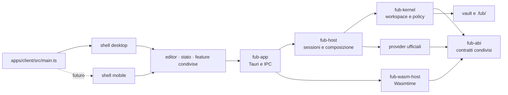

# Fub

Fub è un workspace di scrittura **local-first**: apre vault di file Markdown
senza convertirli, conserva i dati dell'utente sul disco e separa il core dai
formati, dalla shell nativa e dai runtime dei plugin.

Il client unificato vive in `apps/client/`: logica applicativa, editor, stato e
contratto host sono condivisi, mentre desktop e mobile hanno shell di
presentazione distinte. La shell corrente usa Tauri v2 e Vite/TypeScript. Il
core è un workspace Rust. Markdown è il primo `FormatProvider`, non il formato
incorporato nel kernel.

## Architettura in un minuto



Le dipendenze principali puntano verso `fub-abi`. `fub-kernel` non conosce
Tauri, Wasmtime o Markdown; `fub-host` non conosce Tauri; soltanto
`fub-wasm-host` dipende da Wasmtime.

## Cosa esiste

- apertura e gestione di vault compatibili con file Markdown e frontmatter;
- editor CodeMirror, live preview e modalità di lettura;
- wikilink, tag, backlink, ricerca full-text e Graph View;
- cestino, bozze, versioning, organizzazione e indici persistenti;
- comandi, view e query instradati tramite registri generici;
- feature ufficiali come provider nativi indipendenti;
- contratto WIT `fub:abi@0.1.1`, congelato e verificato per additività;
- runtime WASM funzionante per `Plugin` e `CommandProvider`.

M5 non è ancora conclusa: discovery, installazione end-to-end, provider WASM
aggiuntivi e validazione della UI non fidata restano tracciati nelle issue e in
[`docs/project/m5-wasm-runtime.md`](docs/project/m5-wasm-runtime.md).

## Avvio

Prerequisiti supportati dal repository:

- Rust **1.89**;
- Node.js **22** e npm;
- dipendenze native richieste da Tauri v2 sul sistema operativo.

```bash
cd apps/client
npm ci
cd ../..

cargo tauri dev --config crates/fub-app/tauri.conf.json
```

La procedura completa, inclusi build, test e problemi comuni, è in
[`docs/getting-started/install-and-run.md`](docs/getting-started/install-and-run.md).

## Documentazione

Il punto d'ingresso unico è [`docs/README.md`](docs/README.md).

- [Panoramica del prodotto](docs/product/overview.md)
- [Architettura](docs/architecture/overview.md)
- [Workflow di sviluppo](docs/development/workflow.md)
- [Stato e roadmap](docs/project/status.md)
- [Decisioni architetturali](docs/decisions/README.md)

La documentazione descrive il presente. Le attività eseguibili vivono nelle
GitHub Issues; la cronologia resta in Git.

## Contribuire e sicurezza

- [`CONTRIBUTING.md`](CONTRIBUTING.md)
- [`SECURITY.md`](SECURITY.md)
- [`CODE_OF_CONDUCT.md`](CODE_OF_CONDUCT.md)
- [`CHANGELOG.md`](CHANGELOG.md)

## Licenza

Fub è distribuito, a scelta, con licenza
[MIT](LICENSE-MIT) oppure [Apache-2.0](LICENSE-APACHE).
