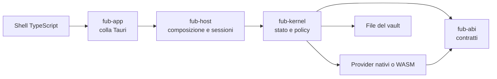

# Fub

Fub è un'app desktop **local-first** per lavorare su documenti conservati in file locali. È scritta in Rust con Tauri v2 e usa una shell TypeScript basata su Vite e CodeMirror 6.

Il nucleo non dipende dal Markdown: i formati e le funzionalità entrano attraverso i contratti di `fub-abi`. Il Markdown è il primo `FormatProvider`; le funzioni ufficiali sono provider nativi e il runtime WASM sta aggiungendo un secondo backend per provider di terze parti.



## Inizia da qui

- [Panoramica del prodotto](docs/getting-started/overview.md)
- [Installazione e avvio](docs/getting-started/install-and-run.md)
- [Architettura](docs/architecture/overview.md)
- [Stato corrente](docs/project/status.md)
- [Documentazione completa](docs/README.md)

## Sviluppo e governance

- [Contribuire](CONTRIBUTING.md)
- [Sicurezza](SECURITY.md)
- [Codice di condotta](CODE_OF_CONDUCT.md)
- [Changelog](CHANGELOG.md)
- [Decisioni architetturali](docs/decisions/README.md)

## Avvio rapido

Prerequisiti: Rust 1.89, Node.js 22, npm e le dipendenze di sistema richieste da Tauri v2.

```bash
cd frontend
npm ci
cd ..
cargo tauri dev --config crates/fub-app/tauri.conf.json
```

Per la verifica completa usa i comandi documentati in [CONTRIBUTING.md](CONTRIBUTING.md).

## Licenza

Fub è distribuito con doppia licenza: [MIT](LICENSE-MIT) oppure [Apache-2.0](LICENSE-APACHE).

Obsidian è un marchio del rispettivo titolare. Fub non è affiliato né approvato da Obsidian; legge e scrive convenzioni di file compatibili per favorire la portabilità dei dati.
