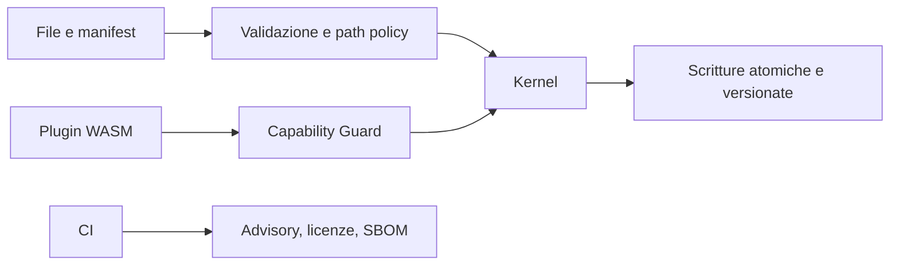

# Sicurezza

## Segnalare una vulnerabilità

Non aprire una issue pubblica. Usa uno dei canali seguenti:

1. [GitHub Security Advisories](https://github.com/Fubeo/Fub/security/advisories/new);
2. `fabio99marchetti@gmail.com`.

Includi percorso di riproduzione, commit o versione, sistema operativo e impatto. Un proof-of-concept è utile; una categoria priva di caso riproducibile deve essere presentata come ipotesi.

## Tempi indicativi

| Passo | Aspettativa |
|---|---|
| Primo riscontro | entro 7 giorni |
| Valutazione | entro 30 giorni |
| Correzione confermata | prima del rilascio successivo |
| Divulgazione | dopo la correzione, concordata con chi segnala |

Non è un SLA: il progetto ha un solo manutentore.

## Versioni supportate

| Versione | Stato |
|---|---|
| `main` | in sviluppo, non ancora rilasciata |

## Perimetro

Sono nel perimetro:

- input non fidato nei file del vault;
- letture o scritture fuori dalla radice del vault;
- perdita silenziosa di dati;
- esecuzione di script nell'anteprima;
- comandi IPC più permissivi del contratto;
- aggiramento delle capability dei plugin WASM;
- dipendenze compromesse o non ammesse.

Non sono vulnerabilità del progetto:

- azioni di chi possiede già accesso in scrittura alla macchina;
- esecuzione volontaria di codice sorgente modificato;
- comportamento di provider nativi già compilati nel programma, salvo violazioni dei confini promessi.

## Presidi principali

- Content-Security-Policy in `crates/fub-app/tauri.conf.json`;
- controllo centralizzato delle capability nel kernel;
- errori tipizzati al confine;
- advisory, licenze e SBOM nella CI;
- contratto WIT congelato e verificato;
- test cross-platform su path, lock e persistenza.

L'architettura di fiducia è descritta in [docs/architecture/plugin-boundary.md](docs/architecture/plugin-boundary.md).
