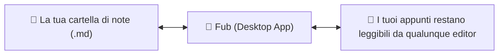

# Cos'è Fub

Per chi è: chiunque si avvicini al progetto per la prima volta.

---

## In poche parole

**Fub** è un'applicazione desktop per prendere appunti in formato Markdown.

A differenza di molte altre applicazioni per note:
- **È *local-first***: tutti i tuoi dati sono conservati direttamente sul tuo computer, in una normale cartella di file `.md`. Non ci sono database nascosti, server proprietari o account obbligatori.
- **È compatibile con Obsidian**: puoi aprire una cartella esistente di Obsidian direttamente con Fub senza dover convertire le tue note.
- **È modulare e basata su plugin**: ogni funzione (ricerca, visualizzazione dei collegamenti, tag, anteprime) è costruita come un componente intercambiabile.

---

## I quattro principi di Fub

1. **La verità è nei tuoi file**: se disinstalli Fub, tutte le tue note, i tag e i collegamenti restano file di testo perfettamente leggibili.
2. **Il Markdown è un modulo, non il padrone**: il nucleo di Fub gestisce strutture generiche di documenti e non dipende da una specifica variante di Markdown.
3. **Le funzioni integrate sono plugin**: la ricerca con `tantivy`, la vista a grafo e i backlink utilizzano le stesse identiche interfacce che useranno gli sviluppatori di terze parti.
4. **Sicurezza per i plugin**: i plugin esterni girano dentro WebAssembly (WASM), in una sandbox protetta con permessi controllati.

---

## Se vuoi il dettaglio

- Scopri come avviare Fub sul tuo computer in [`docs/00-inizia-qui/02-come-si-avvia.md`](./02-come-si-avvia.md).
- Guarda la spiegazione dei concetti base in [`docs/01-per-studenti/`](../01-per-studenti).
