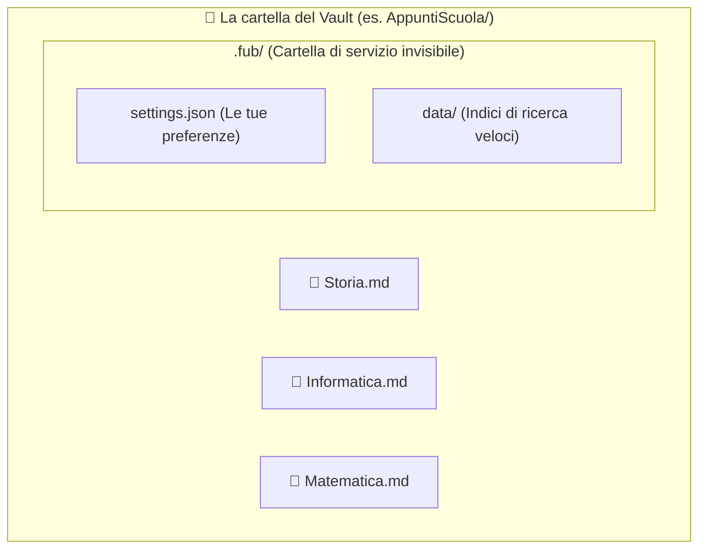

# Il Vault: una cartella di note sul tuo disco

## L'analogia: la cartellina con i fogli

Immagina di avere una cartellina trasparente con tanti fogli a quadretti. Su ogni foglio scrivi una lezione diversa, e su un foglio puoi scrivere una freccia che rimanda a un altro foglio (come `[[Geografia - I Fiumi]]`).

In Fub, questa cartellina si chiama **Vault**:
- Non è un file magico o un database cifrato.
- È una **semplice cartella sul tuo computer** piena di normali file di testo con estensione `.md` (Markdown).
- Puoi aprirla con Fub, ma puoi anche aprirla con Obsidian, con Blocco Note, con VS Code o visualizzarla da terminale.

---

## Cosa c'è dentro un Vault

1. **I tuoi file di testo (`.md`)**: sono il contenuto che scrivi. Rimangono sempre tuoi e non vengono alterati.
2. **Le immagini e gli allegati**: se trascini un'immagine o un PDF in una nota, viene salvato dentro la cartella del vault.
3. **La cartella nascosta `.fub/`**: Fub crea una cartellina speciale all'interno del vault dove tiene le preferenze della vista e gli indici di ricerca per trovare le parole all'istante. Se cancelli `.fub/`, non perdi nessuna nota: Fub la ricreerà automaticamente alla riapertura.

---

## Se vuoi il dettaglio

- Guarda [`docs/05-disco/01-note-utente.md`](../05-disco/01-note-utente.md) per scoprire i dettagli tecnici del formato delle note.
- Guarda [`docs/05-disco/02-cartella-fub.md`](../05-disco/02-cartella-fub.md) per la struttura della cartella `.fub/`.
