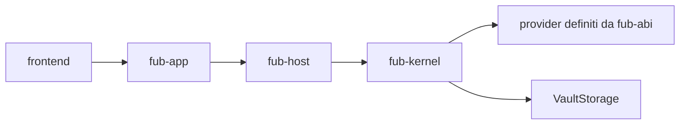

# Il kernel

`fub-kernel` è il nucleo che mantiene coerente un vault aperto. Conosce
identità, documenti, policy, registri, indici ed eventi; non conosce Tauri,
Wasmtime o la sintassi Markdown.

## Il percorso reale

La shell non chiama direttamente il kernel. `fub-app` adatta l'IPC Tauri,
`fub-host` sceglie la sessione e compone i provider, poi il kernel esegue
l'operazione applicando le regole comuni.

## Cosa fa

- tiene il catalogo dei documenti conosciuti;
- legge e scrive il vault attraverso l'astrazione `VaultStorage`;
- sceglie il provider in base al formato dichiarato;
- mantiene grafo, metadati e indici sotto il proprietario corretto;
- applica i permessi alle capacità di `HostApi`;
- registra viste, comandi, servizi, sintassi e altri provider;
- emette eventi con origine, filtri e protezione dai cicli senza fine.

## Cosa non fa

- non disegna finestre o pannelli;
- non contiene un parser Markdown;
- non esegue componenti WebAssembly;
- non decide come installare o distribuire un plugin;
- non importa implementazioni concrete quando basta un trait di `fub-abi`.

Aggiungere un formato nuovo dovrebbe richiedere un nuovo `FormatProvider` e gli
eventuali adattamenti del contratto, non un ramo dedicato nel kernel.

La struttura interna è in
[`../02-componenti/03-fub-kernel.md`](../02-componenti/03-fub-kernel.md).
