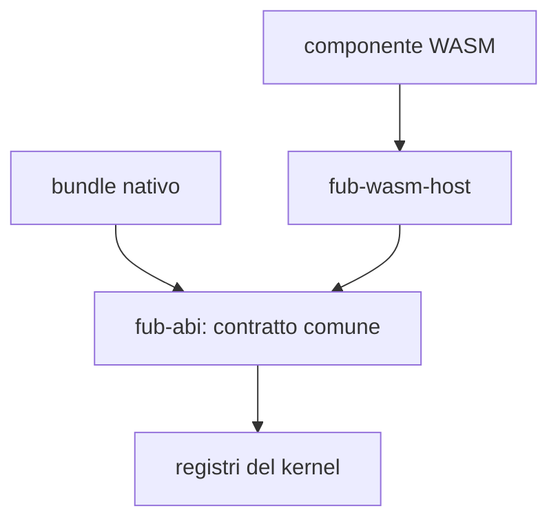

# I plugin e i provider

Fub usa un contratto comune per aggiungere formati, comandi, viste, indici,
servizi e altre capacità. Un **provider** implementa una di queste famiglie; un
**bundle** raccoglie manifest, ciclo di vita e provider che vengono montati
insieme.

## Due backend

| Backend | Stato | Caratteristiche |
|---|---|---|
| Nativo | **Implementato** | Codice Rust compilato con Fub; è fidato e gira nello stesso processo. |
| WebAssembly | **Parziale** | Componente caricato da Wasmtime; oggi attraversa `Plugin` e `CommandProvider`, ma non è ancora installabile dalla shell. |

Le funzionalità ufficiali in `fub-features` sono bundle nativi. Il runtime WASM
serve a portare lo stesso modello di estensione a componenti di terzi senza
aggiungere una seconda architettura.

## Sicurezza: cosa è già vero

Un componente WASM non riceve un ambiente WASI generale. Può chiamare soltanto
le famiglie che `fub-wasm-host` collega esplicitamente e le operazioni protette
passano dai permessi del kernel. Memoria e durata delle chiamate hanno limiti.

Questa protezione non si applica allo stesso modo al codice nativo: un crate
Rust compilato nel processo potrebbe usare direttamente le API del sistema
operativo. I provider nativi sono quindi codice fidato; `HostApi` è per loro un
confine architetturale e di policy, non una sandbox del sistema operativo.

## Cosa manca al percorso utente

- scoperta dei bundle esterni;
- installazione, aggiornamento e disinstallazione dalla shell;
- adattatori WASM per tutte le famiglie del contratto;
- passaggio completo delle viste dichiarative prodotte dal guest.

Un toolchain può produrre un plugin soltanto se sa generare un componente
compatibile con il WIT di Fub; non basta produrre un modulo `.wasm` generico.

Vedere [`../04-plugin/01-nativo-vs-wasm.md`](../04-plugin/01-nativo-vs-wasm.md)
e [`../04-plugin/04-esempio-ping.md`](../04-plugin/04-esempio-ping.md).
