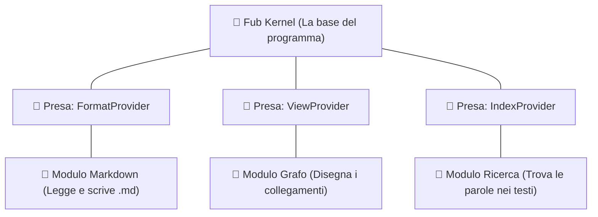

# I Plugin: mattoncini Lego intercambiabili

## L'analogia: la presa USB o i mattoncini Lego

Quando colleghi una chiavetta USB, un mouse o una tastiera al tuo computer, non devi aprire il case e saldare nuovi fili alla scheda madre: il computer ha una **porta standard** (USB) e ogni accessorio sa come parlarci.

In Fub, un **plugin** è proprio un accessorio modulare:
- Tutte le funzioni aggiuntive (come il motore di ricerca veloce `tantivy`, la mappa grafica dei collegamenti o il cestino) sono scritte come plugin.
- Si collegano al programma attraverso un insieme di regole fisse chiamate **trait** (definiti nel modulo [`crates/fub-abi`](../../crates/fub-abi)).

---

## Chiunque può scrivere un plugin

Fub permette a chiunque di scrivere estensioni usando lo standard WebAssembly (WASM):
1. Scrivi il tuo codice nel linguaggio che preferisci (Rust, C, Go, ecc.).
2. Lo compili in un file `.wasm`.
3. Fub carica il file ed esegue il tuo plugin in una "stanza protetta" (chiamata **sandbox**), impedendogli di fare danni o rubare dati.

---

## Se vuoi il dettaglio

- Guarda [`docs/04-plugin/01-nativo-vs-wasm.md`](../04-plugin/01-nativo-vs-wasm.md) per capire la differenza tra plugin interni e WebAssembly.
- Guarda [`docs/04-plugin/04-esempio-ping.md`](../04-plugin/04-esempio-ping.md) per un esempio pratico.
