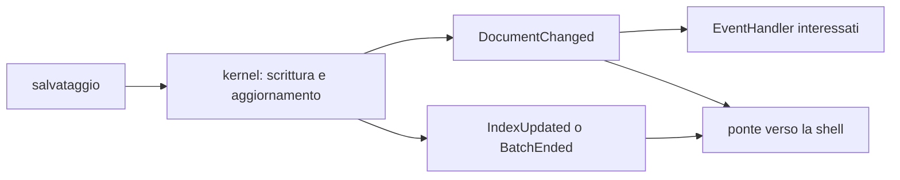

# Gli eventi

Gli eventi informano le parti interessate che qualcosa è successo nel vault.
Non sostituiscono le operazioni autorevoli: il kernel modifica prima il dato e
gli indici che possiede, poi pubblica la notifica osservabile.

## Esempio

Il tipo corretto per una nota creata o modificata è `DocumentChanged`; non
esiste un evento `DocumentSaved`.

## Perché l'indice non dipende dal bus

La coda degli eventi ha un budget e può segnalare `Overflow`. Un indice che
perdesse una notifica potrebbe rispondere con dati falsi, quindi ricerca, grafo
e catalogo vengono aggiornati dal loro proprietario nel percorso della
mutazione. Gli eventi servono a ridisegnare viste, avviare reazioni ammissibili
e informare la shell.

## Proprietà importanti

- `Notice` contiene sia l'evento sia `Origin`, cioè chi ha richiesto l'operazione e l'eventuale lotto.
- `EventMask` filtra specie, topic e soggetti; un handler non riceve necessariamente tutto.
- Un lotto continua a emettere gli eventi per documento, ma sostituisce molti `IndexUpdated` con un solo `BatchEnded`.
- `Overflow` rende esplicito che la coda è stata troncata e che lo stato derivato dagli eventi deve essere riconciliato.
- I job hanno `JobStarted`, `JobProgress` e `JobDone`.

Il contratto completo è in
[`crates/fub-abi/src/event.rs`](../../crates/fub-abi/src/event.rs); il percorso
della shell è illustrato in
[`../03-uml/02-sequenza-tasto-pixel.md`](../03-uml/02-sequenza-tasto-pixel.md).
