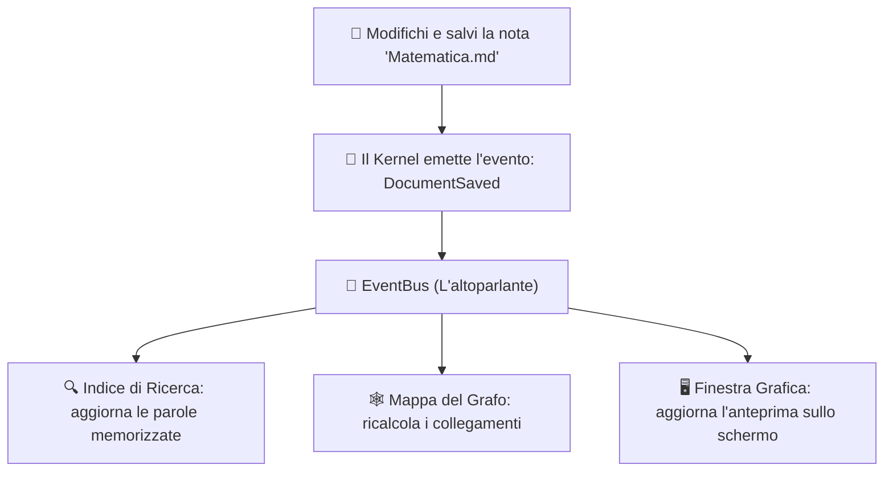

# Gli Eventi: il sistema di messaggistica

## L'analogia: l'annuncio pubblico

Pensa a una stazione ferroviaria quando un treno è in arrivo:
- La centrale non cerca ogni singolo passeggero per avvisarlo di persona.
- Trasmette un annuncio all'altoparlante: tutti ascoltano contemporaneamente e solo chi è interessato a quel treno si sposta al binario.

In Fub, il sistema di comunicazione si basa su questo stesso principio ed è chiamato **Event Bus** (il bus degli eventi, situato in [`crates/fub-kernel/src/bus.rs`](../../crates/fub-kernel/src/bus.rs)):

---

## Perché usare gli eventi?

1. **Disaccoppiamento**: chi salva il file non ha bisogno di conoscere tutti i pannelli e i plugin installati. Emette semplicemente l'annuncio: *"Il file X è stato salvato"*.
2. **Reattività immediata**: qualunque plugin interessato può mettersi in ascolto e reagire immediatamente senza dover continuamente controllare il disco.

---

## Se vuoi il dettaglio

- Guarda [`docs/03-uml/02-sequenza-tasto-pixel.md`](../03-uml/02-sequenza-tasto-pixel.md) per vedere come un evento attraversa tutto il sistema.
- Guarda [`crates/fub-abi/src/event.rs`](../../crates/fub-abi/src/event.rs) per l'elenco di tutti gli eventi previsti dal contratto.
