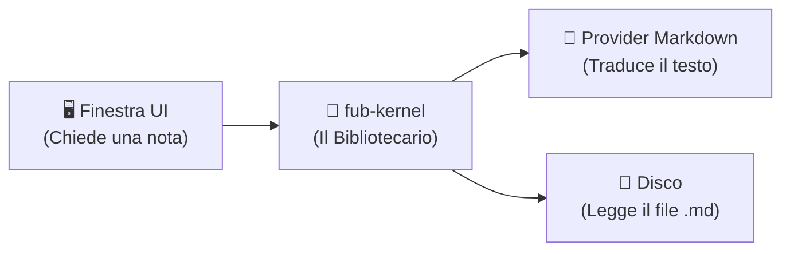

# Il Kernel: il bibliotecario del programma

Per chi è: studenti delle superiori che vogliono capire cosa fa il motore centrale di Fub.

---

## L'analogia: il bibliotecario

Pensa a una biblioteca scolastica.
- Il bibliotecario sa esattamente dove si trova ogni libro, chi lo ha preso in prestito e quanti libri parlano di scienze.
- Tuttavia, il bibliotecario **non legge tutti i libri riga per riga** e **non dipinge le pareti della biblioteca**.

In Fub, [`fub-kernel`](../../crates/fub-kernel) è esattamente il bibliotecario:
1. Sa quali file ci sono nella cartella (`DocumentStore`).
2. Mantiene una mappa di tutti i collegamenti tra le note (`LinkGraph`), così quando apri una pagina sa subito quali altre pagine la citano.
3. Se chiedi "dammi tutte le note con il tag `#esame`", chiede agli indici specializzati e ti restituisce l'elenco.
4. Non sa cosa sia una finestra o un pulsante sullo schermo (quello lo fa il frontend).
5. Non sa come è fatto il linguaggio Markdown (quello lo fa il modulo `fub-format-markdown`).

---

## Perché separare il Kernel dal resto?

Questa separazione è uno dei principi più importanti dell'ingegneria del software: la **modularità**.

Se un giorno volessimo supportare file scritti in un altro formato (per esempio AsciiDoc o LaTeX), basterà aggiungere un nuovo traduttore (provider), senza dover riscrivere una singola riga del kernel!

---

## Se vuoi il dettaglio

- Guarda [`docs/02-componenti/03-fub-kernel.md`](../02-componenti/03-fub-kernel.md) per scoprire i moduli interni di `fub-kernel`.
