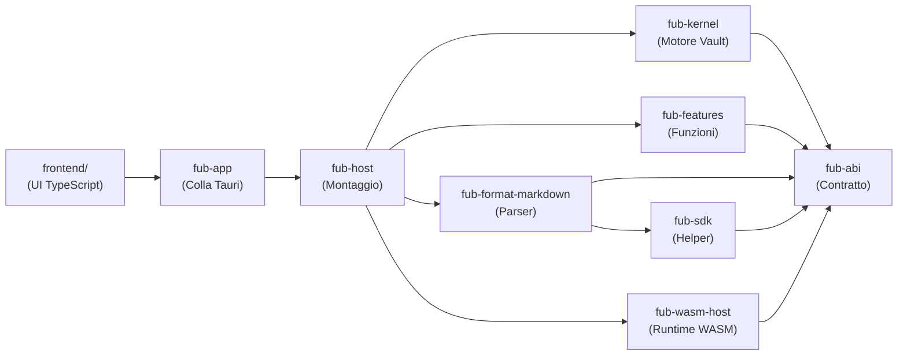

# Panoramica dei componenti

Per chi è: studenti che vogliono una visione d'insieme su come è suddiviso il codice sorgente di Fub tra i vari moduli (detti *crate* in Rust) e il frontend.

---

## La suddivisione in moduli

Fub è organizzato come un **workspace multi-crate**, cioè un progetto suddiviso in diversi pacchetti indipendenti, ciascuno con un compito ben preciso e confini stabiliti.

---

## Tabella dei componenti

| Componente | Cartella sul disco | Linguaggio | A cosa serve |
|---|---|---|---|
| **fub-abi** | [`crates/fub-abi`](file:///home/fubeo/Files/Progetti/Fub/crates/fub-abi) | Rust + WIT | Il contratto comune: definisce tutti i tipi e i trait del sistema. Non compie I/O. |
| **fub-kernel** | [`crates/fub-kernel`](file:///home/fubeo/Files/Progetti/Fub/crates/fub-kernel) | Rust | Il motore centrale: gestisce lo stato dei file, l'anagrafe delle note e gli indici. |
| **fub-sdk** | [`crates/fub-sdk`](file:///home/fubeo/Files/Progetti/Fub/crates/fub-sdk) | Rust | Strumenti di supporto per chi scrive plugin e test di conformità. |
| **fub-format-markdown** | [`crates/fub-format-markdown`](file:///home/fubeo/Files/Progetti/Fub/crates/fub-format-markdown) | Rust | Il primo provider nativo: legge, analizza e converte file Markdown con `comrak`. |
| **fub-features** | [`crates/fub-features`](file:///home/fubeo/Files/Progetti/Fub/crates/fub-features) | Rust | Le funzionalità ufficiali (ricerca full-text con tantivy, grafo, backlink, tag, versioning). |
| **fub-host** | [`crates/fub-host`](file:///home/fubeo/Files/Progetti/Fub/crates/fub-host) | Rust | Assembla tutti i pezzi, gestisce la sessione del vault, il file watcher e i thread dei job. |
| **fub-wasm-host** | [`crates/fub-wasm-host`](file:///home/fubeo/Files/Progetti/Fub/crates/fub-wasm-host) | Rust | Esegue plugin di terze parti in formato WebAssembly tramite `wasmtime`. |
| **fub-app** | [`crates/fub-app`](file:///home/fubeo/Files/Progetti/Fub/crates/fub-app) | Rust | L'applicazione desktop basata su Tauri v2: collega l'interfaccia web al backend. |
| **fub-testkit** | [`crates/fub-testkit`](file:///home/fubeo/Files/Progetti/Fub/crates/fub-testkit) | Rust | Strumenti di collaudo e test per simulare vault ed eventi senza aprire la finestra grafica. |
| **frontend** | [`frontend`](file:///home/fubeo/Files/Progetti/Fub/frontend) | TypeScript | L'interfaccia grafica: layout, pannelli, navigazione e l'editor CodeMirror 6. |
| **esempi** | [`esempi`](file:///home/fubeo/Files/Progetti/Fub/esempi) | Rust | Esempi pratici di plugin (come `ping-wasm`, `ciclo-wasm`, `eventi-wasm`, `modello-wasm`). |
| **tools** | [`tools`](file:///home/fubeo/Files/Progetti/Fub/tools) | Rust | Strumenti di supporto per la compilazione e verifica del varco WebAssembly (`varco-wasm`). |

---

## Se vuoi il dettaglio

Esplora le schede dedicate ai singoli componenti in questa cartella (`docs/02-componenti/`).
