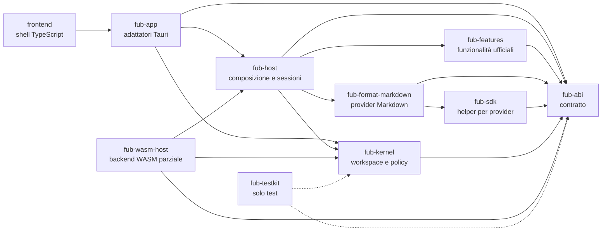

# Panoramica dei componenti

Fub è diviso in crate e cartelle con responsabilità separate. La regola più
importante è il verso delle dipendenze: il codice di dominio dipende dal
contratto, mentre interfaccia, formati e runtime restano ai bordi.

## Mappa sintetica

Le frecce rappresentano dipendenze o confini di composizione, non ogni singola
chiamata a runtime. In particolare, `fub-wasm-host` è già un backend eseguibile
e collaudato, ma `fub-app` non lo collega ancora a un percorso desktop di
scoperta e installazione dei plugin.

## Componenti

| Componente | Responsabilità | Dipendenze da non introdurre |
|---|---|---|
| [`fub-abi`](02-fub-abi.md) | Tipi, trait, errori, modello del documento e contratto WIT. | Markdown, Tauri, Wasmtime e I/O di applicazione. |
| [`fub-kernel`](03-fub-kernel.md) | Workspace, catalogo dei documenti, policy, registri, indici ed eventi. | Formati concreti, Tauri e Wasmtime. |
| [`fub-sdk`](04-fub-sdk.md) | Helper Rust per implementare e collaudare provider contro il contratto. | `fub-kernel`. |
| [`fub-format-markdown`](05-fub-format-markdown.md) | Parsing, resa e generazione del formato Markdown compatibile con i vault supportati. | Logica della shell e runtime dei plugin. |
| [`fub-features`](06-fub-features.md) | Bundle ufficiali come ricerca, backlink, grafo, proprietà e comandi. | `fub-kernel` come dipendenza di produzione. |
| [`fub-host`](07-fub-host.md) | Montaggio, sessioni dei vault, bundle, job, watcher, impostazioni e capacità del sistema. | Tauri e Wasmtime. |
| [`fub-wasm-host`](08-fub-wasm-host.md) | Caricamento Wasmtime e adattatori da componenti WASM ai trait comuni. | Tauri e dettagli della shell. |
| [`fub-app`](09-fub-app.md) | Comandi IPC, eventi della webview, dialoghi e avvio Tauri. | Logica di dominio che può vivere nell'host o nel kernel. |
| [`fub-testkit`](10-fub-testkit.md) | Banco di integrazione con filesystem temporaneo e kernel reale. | Dipendenze di produzione. |
| [`frontend`](11-frontend.md) | Shell TypeScript, editor, pannelli, stato, temi e confine IPC. | Chiamate Tauri sparse fuori dai moduli di confine. |
| [`esempi/` e `tools/`](12-esempi-e-tools.md) | Componenti WASM di prova e presidio statico del contratto WIT. | Ingresso automatico nel workspace Rust principale. |

## Percorso di una richiesta

Una richiesta tipica della shell segue questo percorso:

1. il frontend chiama un metodo del confine tipizzato in `frontend/src/host/`;
2. `fub-app` traduce la richiesta in una chiamata a `fub-host` o al workspace;
3. `fub-host` sceglie la sessione del vault e coordina il lavoro;
4. `fub-kernel` applica identità, policy e registri;
5. un provider implementato contro `fub-abi` esegue la parte specifica;
6. gli eventi tornano alla shell attraverso il ponte dell'host e Tauri.

Il formato Markdown e le funzionalità ufficiali sono implementazioni del
contratto. Il kernel non contiene rami speciali che conoscano quei crate.

## Stato del backend WASM

Il contratto WIT e il runtime esistono. Oggi un componente può essere compilato,
caricato esplicitamente, montato come `Bundle` e attraversare `Plugin` e
`CommandProvider`. Mancano ancora il collegamento completo di tutte le famiglie
di provider e il flusso utente di scoperta, installazione e aggiornamento.

Lo stato operativo è in [`../PIANO.md`](../PIANO.md).
