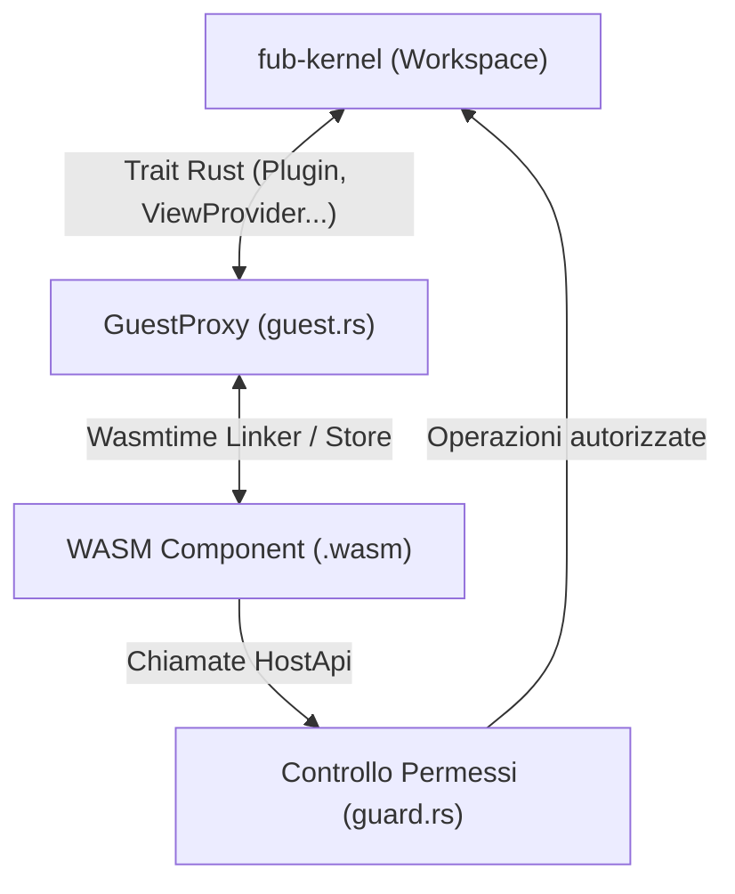

# `fub-wasm-host` — L'ambiente per plugin WebAssembly

## A cosa serve

[`crates/fub-wasm-host`](../../crates/fub-wasm-host) è il motore di runtime (sviluppato per la Milestone 5) incaricato di caricare, isolare ed eseguire in sicurezza plugin di terze parti distribuiti come binari WebAssembly (`.wasm`).

Sfrutta lo standard **Wasmtime Component Model** e le interfacce **WASI 0.2**:
- **Sandbox deterministica**: il plugin è racchiuso in una sandbox con isolamento di memoria; non ha accesso al filesystem dell'host o alla rete a meno che non siano esplicitamente autorizzati tramite `fub-abi` e `guard.rs`.
- **Adattatore trasparente (`GuestProxy`)**: implementa i trait nativi di Rust (`Plugin`, `ViewProvider`, `IndexProvider`, `CommandProvider`, `EventHandler`), consentendo al kernel di trattare i plugin WASM esattamente allo stesso modo dei plugin scritti in Rust nativo.
- **Controllo delle risorse**: previene consumi anomali o attacchi Denial-of-Service tramite limiti di memoria e budget temporali.

---

## Architettura e Moduli Interni

### 1. `component.rs` — Caricamento e Linker
Configura il motore Wasmtime (`Engine`), il gestore di stato (`Store`), il registro dei tipi esportati e instanzia il componente WASM collegando le importazioni `host-*`.

### 2. `guest.rs` — Proxy dei Trait Fub
Rappresenta l'adattatore che traduce le chiamate ai metodi dei trait (`render_view`, `query`, `handle`, `invoke`) in invocazioni dirette sulle funzioni esportate dal guest WebAssembly.

### 3. `translate.rs` — Conversione Tipi
Esegue la traduzione ad alta efficienza e zero-copy ove possibile tra i tipi generati da `wit-bindgen` per il Component Model e le strutture dati native di `fub-abi`.

### 4. `limits.rs` — Limiti di Risorse
Monitora e impone limiti stringenti sul consumo di memoria massima del componente, prevenendo saturazioni della RAM di sistema.

### 5. `events.rs` & `model.rs` — Dispatching Eventi e AST
Gestisce il passaggio degli eventi del bus (`Event`) e la serializzazione/deserializzazione della struttura ad albero del documento (`DocumentModel`).

---

## Dipendenze e Invarianti

- **Dipendenze interne**: [`fub-abi`](../../crates/fub-abi), [`fub-kernel`](../../crates/fub-kernel) e [`fub-host`](../../crates/fub-host).
- **Dipendenze esterne**: `wasmtime` (motore di runtime JIT/AOT WebAssembly), `wasmtime-wasi`, `camino`, `tracing`.
- **Invariante fondamentale**: la libreria `wasmtime` è utilizzata **esclusivamente all'interno di questo crate**. Nessun altro modulo del workspace vede o dipende direttamente da `wasmtime`.

---

## File chiave del modulo

- [`crates/fub-wasm-host/src/lib.rs`](../../crates/fub-wasm-host/src/lib.rs): entrypoint della libreria e inizializzazione del runtime.
- [`crates/fub-wasm-host/src/component.rs`](../../crates/fub-wasm-host/src/component.rs): caricamento del file binario `.wasm` e configurazione del `Linker`.
- [`crates/fub-wasm-host/src/guest.rs`](../../crates/fub-wasm-host/src/guest.rs): implementazione proxy dei trait `fub-abi`.
- [`crates/fub-wasm-host/src/translate.rs`](../../crates/fub-wasm-host/src/translate.rs): conversione bidirezionale dei tipi WIT.
- [`crates/fub-wasm-host/src/limits.rs`](../../crates/fub-wasm-host/src/limits.rs): applicazione dei limiti di allocazione memoria e timeout.
- [`crates/fub-wasm-host/src/events.rs`](../../crates/fub-wasm-host/src/events.rs): recapito degli eventi di Fub al componente WASM.
- [`crates/fub-wasm-host/src/model.rs`](../../crates/fub-wasm-host/src/model.rs): adattamento del modello del documento per il passaggio attraverso il varco WebAssembly.

---

## Se vuoi il dettaglio

- Guarda [`docs/04-plugin/01-nativo-vs-wasm.md`](../04-plugin/01-nativo-vs-wasm.md) per capire come funziona l'esecuzione sicura dei plugin.
- Guarda i plugin di esempio in [`esempi/`](../../esempi) (come [`esempi/ping-wasm/`](../../esempi/ping-wasm)).
- Guarda [`docs/06-contratto/03-il-contratto-wit.md`](../06-contratto/03-il-contratto-wit.md) per la specifica formale del contratto WIT.
