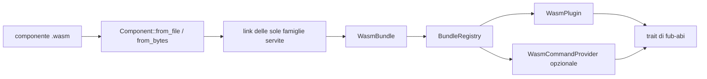

# `fub-wasm-host` — il secondo backend del contratto

[`crates/fub-wasm-host/`](../../crates/fub-wasm-host) è il solo crate del
workspace che dipende da Wasmtime. Riceve un componente WebAssembly, lo carica
nel component model e presenta al resto di Fub oggetti che implementano i trait
di `fub-abi`.

> **Stato:** runtime parziale della milestone M5. Oggi attraversano il confine
> il ciclo di vita `Plugin` e `CommandProvider`; gli altri provider e la
> scoperta automatica dei bundle di terzi non sono ancora completi.

## Responsabilità

- compilare e istanziare un componente fornito come file o byte;
- rifiutare componenti non validi o privi dell'export `fub:abi/plugin`;
- collegare soltanto le famiglie host che il runtime sa servire;
- tradurre tipi, risultati ed errori fra WIT e `fub-abi`;
- montare il componente attraverso lo stesso `BundleRegistry` usato dai bundle nativi;
- imporre un tetto di memoria e una scadenza alle chiamate del guest;
- mantenere Wasmtime fuori da kernel, ABI e host generale.

Il crate non scopre da solo i file del vault e non decide quali plugin siano
fidati. Il chiamante gli consegna il componente e il grado `Trust`; il registro
dell'host esegue poi il normale ciclo di montaggio.

## Cosa attraversa oggi

### Interfacce esportate dal componente

| Interfaccia | Stato | Adattatore Rust |
|---|---|---|
| `fub:abi/plugin` | **Obbligatoria** | `WasmPlugin` implementa `Plugin`. |
| `fub:abi/command` | **Opzionale e implementata** | `WasmCommandProvider` implementa `CommandProvider`. |
| Altre famiglie di provider | **Pianificate** | Il contratto le descrive, ma questo crate non espone ancora i relativi proxy. |

### Capacità offerte dall'host

Il linker serve esplicitamente:

- `host-env`;
- `host-vault-read`;
- `host-data-read`;
- `host-data-write`;
- `host-events`.

Una famiglia `fub:abi/host-*` non presente nell'elenco causa un rifiuto al
caricamento con il nome della famiglia mancante. Il componente può essere
compilato per `wasm32-wasip2`, ma Fub non gli collega un ambiente WASI generale:
filesystem, rete e altre capacità del sistema operativo non diventano
accessibili per effetto del target.

I permessi non vengono rivalutati in questo crate. Le host function ricevono un
`HostApi` già protetto dal `Guard` del kernel e si limitano a inoltrare la
chiamata.

## Flusso



`Component` conserva il componente compilato e gli indici delle interfacce
esportate. Ogni montaggio crea una nuova istanza; `WasmBundle` espone manifest,
fiducia, plugin e provider al registro comune.

## Moduli

| File | Responsabilità |
|---|---|
| [`lib.rs`](../../crates/fub-wasm-host/src/lib.rs) | Moduli pubblici e binding host generati dal WIT. |
| [`component.rs`](../../crates/fub-wasm-host/src/component.rs) | Caricamento, linker, istanze, `WasmBundle`, `WasmPlugin` e `WasmCommandProvider`. |
| [`guest.rs`](../../crates/fub-wasm-host/src/guest.rs) | Implementazioni delle host function offerte al componente. |
| [`borrow.rs`](../../crates/fub-wasm-host/src/borrow.rs) | Prestito temporaneo dell'`HostApi` allo store durante una chiamata. |
| [`translate.rs`](../../crates/fub-wasm-host/src/translate.rs) | Conversioni esaustive fra tipi generati dal WIT e tipi Rust dell'ABI. |
| [`model.rs`](../../crates/fub-wasm-host/src/model.rs) | Traduzione del modello di documento fra albero Rust e arena WIT. |
| [`events.rs`](../../crates/fub-wasm-host/src/events.rs) | Capacità `host-events` e gestione del verso rientrante guest → host. |
| [`limits.rs`](../../crates/fub-wasm-host/src/limits.rs) | Engine condiviso, interruzione a epoche e limite di memoria per istanza. |

## Dipendenze

Il manifest dichiara `fub-abi`, `fub-kernel`, `fub-host`, `camino`,
`serde_json`, `thiserror` e `wasmtime`. Non dipende da `wasmtime-wasi`: il
runtime collega le capacità di Fub una per una invece di consegnare al guest un
ambiente WASI completo.

Il verso verso `fub-host` è intenzionale: questo crate implementa il tipo
`Bundle`, mentre `fub-host` non deve dipendere da Wasmtime. L'applicazione che
vuole entrambi compone entrambi.

## Verifica

Gli esempi WASM restano fuori dal workspace nativo e vengono compilati dai test
di integrazione:

```bash
cargo test -p fub-wasm-host --test the_first_component
cargo test -p fub-wasm-host --test commands_cross_the_boundary
```

- [`the_first_component.rs`](../../crates/fub-wasm-host/tests/the_first_component.rs) prova caricamento, ciclo di vita, permessi, capacità e smontaggio.
- [`commands_cross_the_boundary.rs`](../../crates/fub-wasm-host/tests/commands_cross_the_boundary.rs) prova il provider di comandi attraverso il registro comune.

## Limiti correnti

Non sono ancora percorsi completi:

- scoperta, installazione e aggiornamento dei bundle esterni;
- proxy WASM per tutte le famiglie di provider;
- passaggio di viste dichiarative prodotte da un componente;
- esperienza utente stabile per abilitazione, errori e disinstallazione.

Lo stato operativo è in [`../PIANO.md`](../PIANO.md) e nella milestone
[`M5-wasm-runtime.md`](../milestones/M5-wasm-runtime.md). L'esempio più piccolo è
[`../04-plugin/04-esempio-ping.md`](../04-plugin/04-esempio-ping.md).
