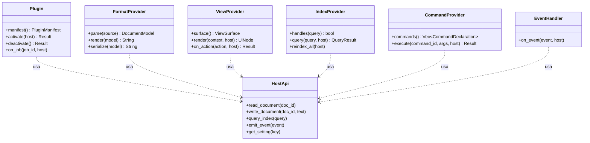

# Trait del contratto `fub-abi`

Per chi è: studenti e sviluppatori che vogliono capire quali interfacce definiscono le capacità estendibili di Fub.

---

## Panoramica

In Fub, tutto ciò che non è il nucleo di base (il motore dei file) è un **provider**, cioè un componente che implementa uno o più **trait** (interfacce) definiti nel crate [`crates/fub-abi`](file:///home/fubeo/Files/Progetti/Fub/crates/fub-abi/src/traits.rs).

Un trait in Rust è come un contratto: stabilisce quali funzioni un componente deve fornire, senza specificare come sono implementate internamente.

---

## I trait spiegati uno per uno

### 1. `Plugin`
Rappresenta il ciclo di vita di un modulo. Dice al sistema chi è il plugin (`manifest`), cosa fare quando viene avviato (`activate`) o spento (`deactivate`), e come gestire operazioni in background (`on_job`).
- File sorgente: [`crates/fub-abi/src/traits.rs`](file:///home/fubeo/Files/Progetti/Fub/crates/fub-abi/src/traits.rs)

### 2. `FormatProvider`
Insegna a Fub a comprendere un formato di file (per esempio il Markdown). Trasforma il testo grezzo in una struttura ad albero (`DocumentModel`), converte il modello in HTML per l'anteprima (`render`), e lo risalva su disco (`serialize`).
- File sorgente: [`crates/fub-abi/src/format.rs`](file:///home/fubeo/Files/Progetti/Fub/crates/fub-abi/src/format.rs)

### 3. `ViewProvider`
Disegna un pannello dell'interfaccia utente (come l'albero dei file, il grafico dei link o la ricerca) restituendo un albero di componenti grafici (`UiNode`), senza dover scrivere codice HTML direttamente.
- File sorgente: [`crates/fub-abi/src/traits.rs`](file:///home/fubeo/Files/Progetti/Fub/crates/fub-abi/src/traits.rs)

### 4. `IndexProvider`
Risponde a interrogazioni sui dati del vault (per esempio "trova tutte le note con il tag `#scuola`" o "cerca la parola *algoritmo*").
- File sorgente: [`crates/fub-abi/src/traits.rs`](file:///home/fubeo/Files/Progetti/Fub/crates/fub-abi/src/traits.rs)

### 5. `CommandProvider`
Aggiunge comandi eseguibili dall'utente (per esempio tramite la tastiera o un menu dei comandi).
- File sorgente: [`crates/fub-abi/src/traits.rs`](file:///home/fubeo/Files/Progetti/Fub/crates/fub-abi/src/traits.rs)

### 6. `HostApi`
È il punto di accesso unico attraverso cui tutti i provider interagiscono con il resto del programma: leggere un file, fare una ricerca, registrare un log o inviare una notifica.

---

## Se vuoi il dettaglio

- Guarda il file [`crates/fub-abi/src/traits.rs`](file:///home/fubeo/Files/Progetti/Fub/crates/fub-abi/src/traits.rs) per l'elenco completo delle definizioni in Rust.
- Guarda [`docs/06-contratto/01-i-trait-in-rust.md`](file:///home/fubeo/Files/Progetti/Fub/docs/06-contratto/01-i-trait-in-rust.md) per approfondire come questi trait vengono implementati.
