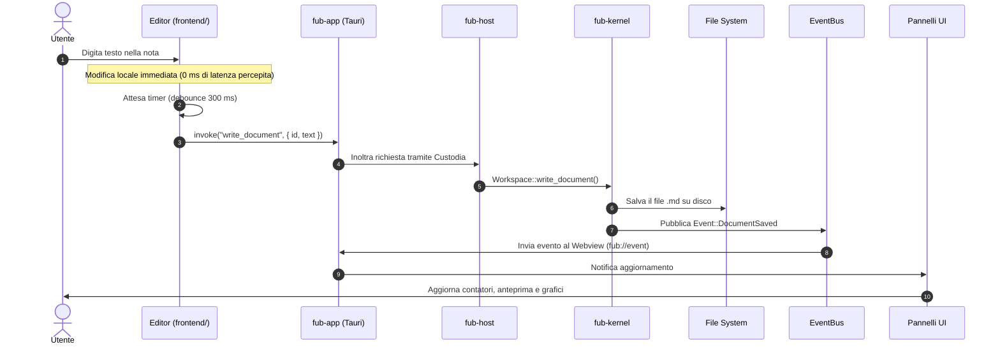

# Sequenza tasto → pixel

Per chi è: studenti che vogliono seguire il viaggio di una modifica dal momento in cui si preme un tasto nell'editor fino a quando il testo è salvato e visibile sullo schermo.

---

## Il viaggio di una modifica

Quando scrivi una lettera nell'editor di Fub, si attiva una catena di passaggi coordinati tra l'interfaccia grafica (la **shell** in TypeScript) e il motore centrale (il **kernel** in Rust).

---

## Cosa succede in ciascun passo

1. **La digitazione immediata**: quando l'utente preme un tasto, l'editor (basato su CodeMirror 6) mostra subito il carattere a video, senza aspettare il disco.
2. **Il freno al salvataggio (debounce)**: per non sovraccaricare il disco scrivendo a ogni singola lettera, la shell aspetta qualche frazione di secondo (300 ms) dopo l'ultima battuta.
3. **La chiamata IPC**: la shell invia il testo aggiornato a `fub-app` usando la funzione `invoke` di Tauri.
4. **Il passaggio per la custodia**: `fub-host` gestisce l'accesso concorrente al vault tramite un lucchetto di lettura/scrittura (`RwLock`), garantendo che nessuna operazione entri in conflitto.
5. **La scrittura sul disco**: il `fub-kernel` scrive fisicamente il file `.md` nella cartella del vault sul computer.
6. **L'evento di avvenuta scrittura**: il kernel emette un evento (`Event::DocumentSaved`) sul bus di messaggi interno.
7. **La notifica alla shell**: l'evento viene instradato verso la finestra dell'applicazione attraverso il canale `fub://event`.
8. **L'aggiornamento dei pannelli**: i pannelli aperti (anteprima, conteggio parole, grafico dei collegamenti) si ridisegnano per mostrare i dati aggiornati.

---

## Se vuoi il dettaglio

- Guarda [`crates/fub-app/src/lib.rs`](file:///home/fubeo/Files/Progetti/Fub/crates/fub-app/src/lib.rs) per i comandi IPC registrati.
- Guarda [`crates/fub-kernel/src/workspace.rs`](file:///home/fubeo/Files/Progetti/Fub/crates/fub-kernel/src/workspace.rs) per la funzione di scrittura dei documenti.
- Guarda [`docs/07-ui/03-comandi-eventi-ipc.md`](file:///home/fubeo/Files/Progetti/Fub/docs/07-ui/03-comandi-eventi-ipc.md) per capire come funziona lo scambio di messaggi IPC.
