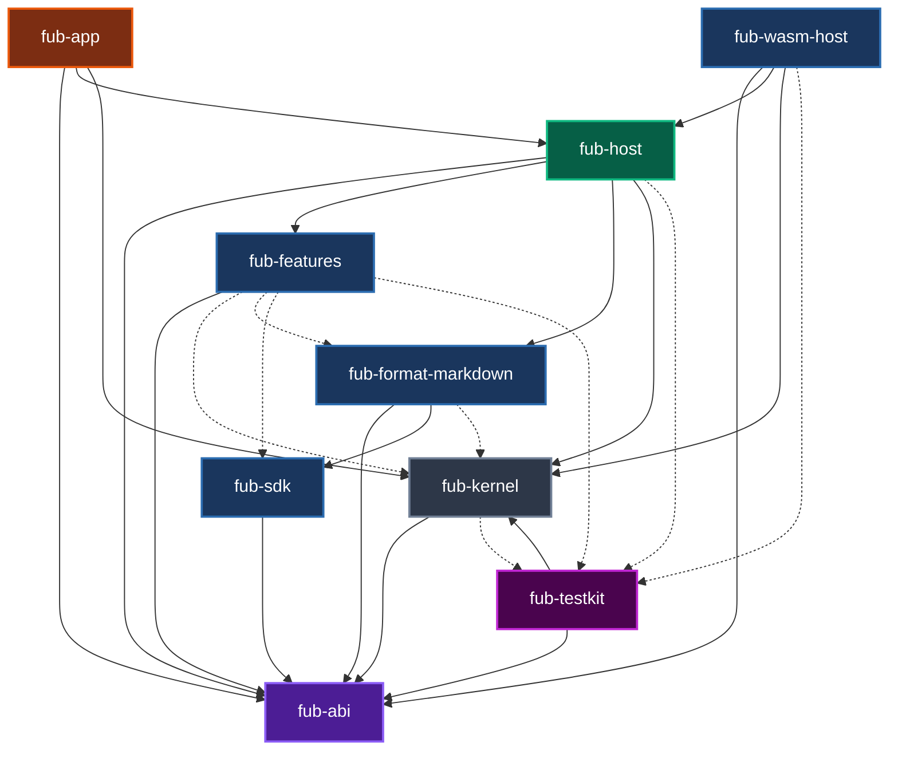

# Componenti e dipendenze del workspace

## Grafo verificato

Il diagramma mostra tutti i crate Rust del workspace e le dipendenze fra membri.

- `-->`: dipendenza normale;
- `-.->`: dipendenza presente soltanto in `[dev-dependencies]`.

## Invarianti principali

1. `fub-abi` non dipende da altri crate del workspace ed evita dipendenze legate a UI, formato e runtime.
2. `fub-features` usa `fub-abi` come una vera estensione; il kernel compare soltanto nei test.
3. `fub-testkit` è un banco di prova e non entra come dipendenza normale nelle librerie.
4. `fub-host` assembla il sistema senza dipendere da Tauri.
5. `fub-app` è il solo adattatore desktop e non sostituisce il composition root.

## Fonte di verità

Il test [`dependency_invariant.rs`](../../crates/fub-abi/tests/dependency_invariant.rs) legge il blocco marcato `@grafo-dipendenze` e lo confronta nei due versi con i manifest. Un crate o una freccia mancanti rendono la CI rossa.

Per una descrizione dei componenti consulta [`riferimento/componenti.md`](../riferimento/componenti.md).