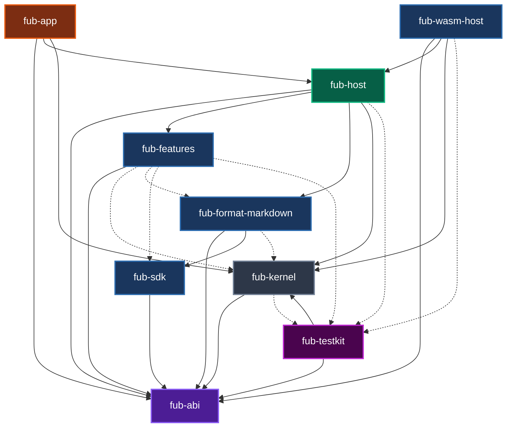

# Componenti e dipendenze del workspace

## Il grafo delle dipendenze

Il diagramma seguente mostra tutti i crate Rust presenti nel workspace e le relazioni tra di essi.
- **Freccia continua (`-->`)**: dipendenza normale (il modulo è necessario per compilare ed eseguire la libreria).
- **Freccia tratteggiata (`-.->`)**: dipendenza di solo test (`[dev-dependencies]`, usata solo durante l'esecuzione dei test automatici).

---

## Regole chiave dell'architettura

1. **`fub-abi` non dipende da nessuno**: è la radice di tutto il sistema. Contiene solo definizioni di tipi e trait, senza dipendere da motori grafici, parser o runtime esterni.
2. **`fub-features` non dipende dal kernel**: le funzionalità ufficiali (ricerca, tag, grafici) usano unicamente le interfacce pubbliche di `fub-abi`, esattamente come farà un plugin di terze parti.
3. **`fub-testkit` non entra in nessuna libreria**: serve solo per eseguire test automatici e non viene mai incluso nei file finali distribuiti all'utente.
4. **`fub-host` non dipende da Tauri**: l'assemblaggio di Fub è separato dall'interfaccia grafica per consentire in futuro l'uso da riga di comando (CLI) o altri ambienti.

---

## Se vuoi il dettaglio

- Guarda [`crates/fub-abi/tests/dependency_invariant.rs`](../../crates/fub-abi/tests/dependency_invariant.rs) per il test automatico che verifica la fedeltà di questo diagramma.
- Guarda la panoramica in [`docs/02-componenti/01-panoramica.md`](../02-componenti/01-panoramica.md) per la spiegazione dettagliata di ciascun crate.
