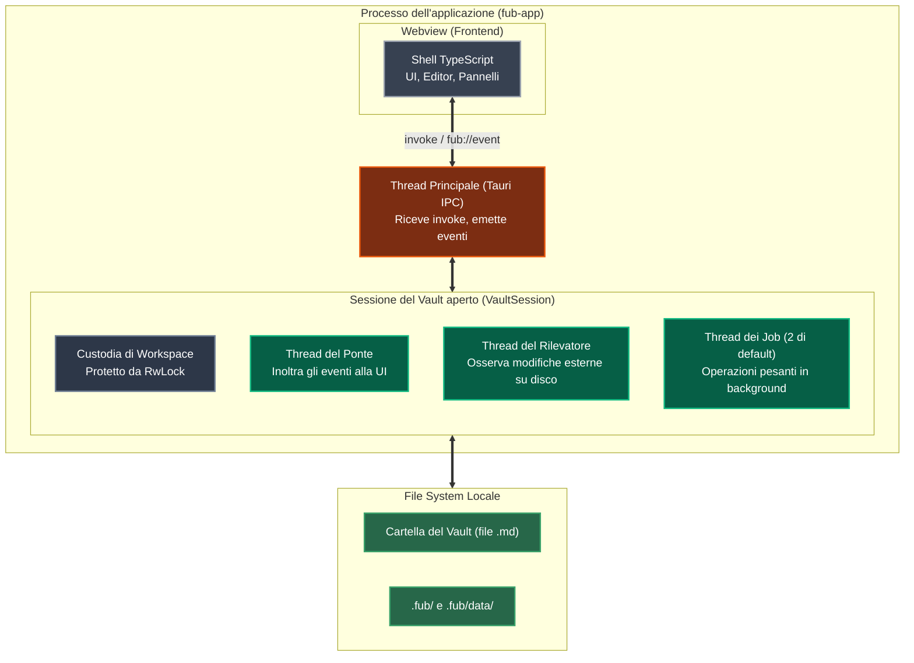

# Processi e thread a runtime

Per chi è: studenti che vogliono capire come è organizzata la memoria, quali processi sono in esecuzione e quanti thread lavorano mentre Fub è aperto.

---

## Struttura dell'esecuzione

Fub gira come **un unico processo** di sistema operativo, all'interno del quale convivono l'interfaccia grafica (la webview di Tauri) e i vari thread di lavoro in Rust.

---

## Chi fa cosa

| Elemento | Tipo | Descrizione |
|---|---|---|
| **Webview** | Render UI | Mostra l'interfaccia web (HTML/CSS/JS) compilata con Vite e gestita con CodeMirror 6. |
| **Thread Principale** | Gestore IPC | Riceve i comandi inviati dalla shell e coordina le risposte. |
| **Custodia (`RwLock`)** | Sincronizzazione | Consente a più letture contemporanee di avvenire in parallelo, mentre le scritture ottengono accesso esclusivo per evitare corruzioni. |
| **Thread del Ponte** | Notifiche | Prende gli eventi generati dal kernel e li invia in modo ordinato alla webview. |
| **Thread del Rilevatore** | File Watcher | Usa la libreria `notify` per accorgersi se un file nel vault viene modificato da un programma esterno (per esempio da Obsidian o da Git). |
| **Thread dei Job** | Background Pool | Esegue compiti che richiedono tempo (come indicizzare migliaia di file o fare ricerche complesse) senza bloccare l'interfaccia utente. |

---

## Se vuoi il dettaglio

- Guarda [`crates/fub-host/src/session.rs`](file:///home/fubeo/Files/Progetti/Fub/crates/fub-host/src/session.rs) per la struttura `VaultSession`.
- Guarda [`crates/fub-host/src/custodia.rs`](file:///home/fubeo/Files/Progetti/Fub/crates/fub-host/src/custodia.rs) per il meccanismo di protezione concorrente.
- Guarda [`crates/fub-host/src/bridge.rs`](file:///home/fubeo/Files/Progetti/Fub/crates/fub-host/src/bridge.rs) per il funzionamento del ponte eventi.
