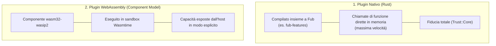

# Plugin nativi vs Plugin WebAssembly

## Stato attuale

**Plugin nativi: implementati. Runtime WASM: parziale (M5 in corso).**

Il confine WebAssembly viene già attraversato in esecuzione: `Plugin` e `CommandProvider` hanno un proxy WASM reale, condividono la stessa istanza del componente e passano dalla stessa porta di montaggio usata dai provider nativi. Sono inoltre presenti isolamento del component model, limiti di memoria/tempo e alcune famiglie di host function.

Non è ancora corretto leggere questa pagina come «qualunque trait di `fub-abi` è già utilizzabile da un plugin `.wasm` installato dall'utente». Gli altri provider, la discovery/installazione dei componenti dal vault e il passaggio della UI dichiarativa sono ancora parti di M5. Lo stato puntuale, con ciò che è fatto e ciò che manca, è in [`M5-wasm-runtime.md`](../milestones/M5-wasm-runtime.md).

---

## Le due modalità di estensione

In Fub esistono due backend per il modello di estensione:

---

## Confronto punto per punto

| Aspetto | Plugin Nativo | Plugin WebAssembly |
|---|---|---|
| **Stato** | Implementato | **Parziale — M5 in corso** |
| **Linguaggio** | Rust | Qualunque toolchain capace di produrre un componente compatibile con il WIT |
| **Distribuzione** | Compilato nel binario di Fub | **Target:** componente `.wasm` scoperto a runtime. Oggi gli esempi vengono costruiti ed esercitati dai test; la discovery utente non è ancora completa. |
| **Prestazioni** | Chiamata Rust diretta | Confine misurato in M5; il costo è piccolo ma non nullo |
| **Sicurezza e isolamento** | Codice fidato nel processo | Memoria isolata; WASI non viene linkato; sono raggiungibili solo le famiglie host che Fub collega esplicitamente |
| **Contratto** | Implementa i trait di `fub-abi` | Implementa le interfacce del contratto WIT |
| **Provider già attraversati in WASM** | Tutti quelli montati nativamente | Al momento `Plugin` e `CommandProvider`; gli altri arrivano con M5 |

---

## La regola architetturale: stessa porta, backend diverso

L'obiettivo del progetto è che il kernel riceva provider attraverso lo stesso contratto senza contenere rami del tipo «se è WASM fai X, se è nativo fai Y». Questa proprietà è già dimostrata per il ciclo di vita del plugin e per `CommandProvider`; **non implica ancora che tutti i trait abbiano oggi il relativo proxy WASM**.

Per questo conviene distinguere due frasi:

- **Il contratto è comune**: vero già oggi.
- **Ogni superficie del contratto attraversa già il confine WASM**: non ancora; è il lavoro residuo di M5.

---

## Se vuoi il dettaglio

- Guarda [`docs/04-plugin/02-il-varco-hostapi.md`](./02-il-varco-hostapi.md) per capire come i plugin comunicano con il sistema.
- Guarda [`docs/04-plugin/03-i-permessi.md`](./03-i-permessi.md) per il sistema di permessi e sicurezza.
- Guarda [`docs/milestones/M5-wasm-runtime.md`](../milestones/M5-wasm-runtime.md) per lo stato implementativo preciso del runtime WASM.
