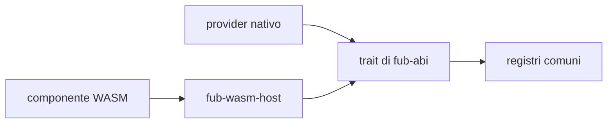

# Plugin nativi e componenti WebAssembly

## Stato

- **Bundle nativi:** implementati e usati dalle funzionalità ufficiali.
- **Backend WASM:** parziale, milestone M5 in corso.

Il runtime carica già componenti reali, attraversa `Plugin` e
`CommandProvider`, applica limiti di memoria e durata e collega alcune capacità
dell'host. Non esiste ancora un flusso utente stabile per scoprire e installare
un file dal vault.

## Confronto

| Aspetto | Nativo | WebAssembly |
|---|---|---|
| Forma | Crate Rust compilato nel processo | Componente compatibile con il WIT di Fub |
| Chiamata | Trait Rust diretto | Adattatore di `fub-wasm-host` sopra Wasmtime |
| Fiducia | Codice fidato, con accesso al processo | Memoria isolata e nessun ambiente WASI generale collegato |
| Capacità | Tutte quelle montate dal bundle | Soltanto le famiglie host collegate dal runtime |
| Provider disponibili | Quelli implementati dal crate | Oggi `Plugin` e `CommandProvider`; gli altri richiedono nuovi proxy |
| Distribuzione | Inclusa nella build di Fub | Gli esempi sono compilati e caricati dai test; installazione utente ancora assente |

## Stesso contratto, copertura diversa

Il kernel non deve contenere una variante “WASM” delle proprie regole. La
traduzione vive nel backend e termina sugli stessi trait. Questa proprietà è già
provata per il ciclo di vita e i comandi, ma non significa che ogni trait abbia
già un proxy WebAssembly.

## Sicurezza

`HostApi` applica policy e permessi a entrambi i backend quando usano il
contratto. La sandbox del sistema operativo, però, riguarda il componente WASM:
un provider nativo è codice Rust fidato e potrebbe chiamare direttamente API
esterne al contratto.

## Approfondimenti

- [`02-il-varco-hostapi.md`](02-il-varco-hostapi.md): capacità offerte dall'host.
- [`03-i-permessi.md`](03-i-permessi.md): permessi e limiti del modello.
- [`04-esempio-ping.md`](04-esempio-ping.md): componente minimo verificato dai test.
- [`../milestones/M5-wasm-runtime.md`](../milestones/M5-wasm-runtime.md): stato dettagliato di M5.
