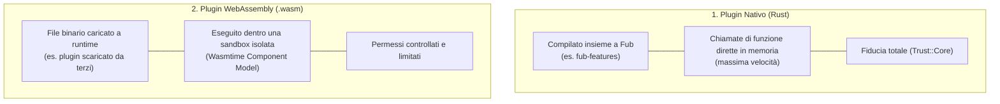

# Plugin nativi vs Plugin WebAssembly

Per chi è: studenti che vogliono capire la differenza tra un plugin integrato nel codice (nativo) e un plugin esterno compilato in WebAssembly (WASM).

---

## Le due modalità di estensione

In Fub esistono due modi per implementare un plugin:

---

## Confronto punto per punto

| Aspetto | Plugin Nativo | Plugin WebAssembly |
|---|---|---|
| **Linguaggio** | Rust | Qualunque linguaggio che compila in WASM (Rust, C, Go, ecc.) |
| **Come viene distribuito** | Compilato direttamente nel binario di Fub | File `.wasm` caricato a runtime nella cartella del vault |
| **Prestazioni** | Massime (chiamata diretta a metodo Rust) | Quasi native (con piccolo costo di passaggio memoria per la sandbox) |
| **Sicurezza e Isolamento** | Accesso completo alla memoria di Fub | **Sandbox totale**: non può leggere altri file né toccare la rete senza permesso |
| **Contratto e Trait** | Implementa i trait di `fub-abi` in Rust | Implementa le stesse interfacce descritte in `abi.wit` |

---

## La regola d'oro: la stessa interfaccia

La caratteristica più importante dell'architettura di Fub è che **il kernel non fa differenze**: che un provider sia nativo o WASM, il modo in cui Fub gli chiede di visualizzare un pannello o analizzare un testo è identico. L'unica differenza è il canale di comunicazione attraverso cui passa la richiesta.

---

## Se vuoi il dettaglio

- Guarda [`docs/04-plugin/02-il-varco-hostapi.md`](file:///home/fubeo/Files/Progetti/Fub/docs/04-plugin/02-il-varco-hostapi.md) per capire come i plugin comunicano con il sistema.
- Guarda [`docs/04-plugin/03-i-permessi.md`](file:///home/fubeo/Files/Progetti/Fub/docs/04-plugin/03-i-permessi.md) per il sistema di permessi e sicurezza.
