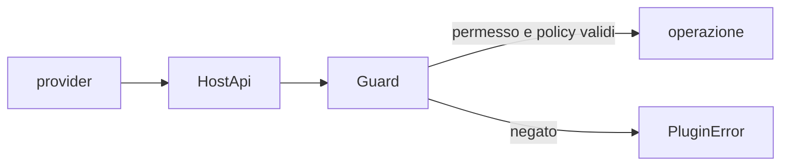

# Il varco `HostApi`

`HostApi` è l'insieme delle capacità che il kernel presta a un provider durante
una chiamata. Il provider non riceve il `Workspace` intero: vede interfacce
strette e gli errori del contratto.

Il trait aggrega **quarantadue** metodi [conta: hostapi-metodi]. Le famiglie
principali sono:

| Famiglia | Esempi di operazioni |
|---|---|
| Lettura del vault | sorgente, modello, elenco dei documenti e struttura. |
| Scrittura del vault | creazione, modifica, rinomina, cestino e ripristino. |
| Query | ricerca e interrogazioni degli indici registrati. |
| Eventi e job | emissione di eventi, progresso e avvio di lavoro in background. |
| Dati del plugin | lettura, scrittura, rimozione ed elenco nello spazio assegnato al plugin. |
| Impostazioni | lettura e, per chi è autorizzato, scrittura delle chiavi dichiarate. |
| Ambiente | ora, entropia, locale e contesto attivo. |
| Comandi e servizi | invocazione di superfici registrate da altri provider. |
| Rete | richieste attraverso il client controllato dall'host. |

## Il controllo

Il `Guard` conosce identità, fiducia e permessi del chiamante. Le operazioni
sullo storage del plugin vengono inoltre confinate al namespace assegnato; un
path relativo non può uscire da quella radice.

I dati persistenti del plugin vivono oggi sotto `.fub/plugins/<id>/`; le cache
separate vivono sotto `.fub/data/plugins/<id>/`. Il provider usa i metodi del
contratto e non compone direttamente questi percorsi.

## Confine architetturale e confine di sicurezza

Per un componente WASM, `HostApi` è anche il solo accesso alle risorse che
`fub-wasm-host` collega: non viene fornito un ambiente WASI generale.

Per un provider nativo, `HostApi` resta il confine corretto dell'architettura e
delle policy, ma non può impedire a codice Rust malevolo compilato nel processo
di usare direttamente il sistema operativo. Per questo i bundle nativi sono
fidati.

La definizione completa è in
[`crates/fub-abi/src/traits.rs`](../../crates/fub-abi/src/traits.rs); i controlli
sono in
[`crates/fub-kernel/src/host/guard.rs`](../../crates/fub-kernel/src/host/guard.rs).
