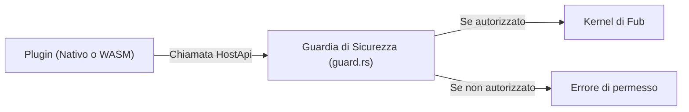

# Il varco `HostApi`

Per chi è: studenti che vogliono capire come un plugin può richiedere servizi a Fub (leggere un file, fare una query o registrare dati).

---

## La porta unica verso il mondo

Un plugin non può accedere liberamente alle risorse del computer (non può aprire file a caso o aprire connessioni socket dirette). Tutto ciò che desidera fare deve passare attraverso l'interfaccia **`HostApi`**, fornita da Fub ad ogni chiamata.

---

## Le capacità disponibili in `HostApi`

L'interfaccia `HostApi` raggruppa diverse famiglie di funzioni:

1. **Documenti del Vault**:
   - `read_document(doc_id)`: legge il testo o il modello di una nota.
   - `write_document(doc_id, text)`: aggiorna il contenuto di una nota (richiede il permesso di scrittura).
2. **Canale Dati e Indici**:
   - `query_index(query)`: esegue una ricerca strutturata (es. per tag, proprietà o testo) e riceve i risultati.
3. **Eventi**:
   - `emit_event(event)`: pubblica un evento personalizzato che altri componenti possono ascoltare.
4. **Stato e Dati del Plugin**:
   - `read_blob(key)` / `write_blob(key, data)`: salva dati persistenti riservati al plugin sotto `.fub/data/plugins/<id>/`.
5. **Impostazioni e Ambiente**:
   - `get_setting(key)`: legge un valore di configurazione.
   - `now()`: ottiene l'orario corrente.

---

## Perché un'interfaccia unica?

1. **Controllo centralizzato dei permessi**: prima di eseguire l'operazione richiesta dal plugin, `guard.rs` verifica se il manifest del plugin dichiara il permesso necessario.
2. **Isolamento**: un plugin malfunzionante o malevolo non può compromettere file al di fuori del vault o accedere a cartelle di sistema non autorizzate.

---

## Se vuoi il dettaglio

- Guarda [`crates/fub-abi/src/traits.rs`](../../crates/fub-abi/src/traits.rs) per la definizione completa del trait `HostApi`.
- Guarda [`docs/04-plugin/03-i-permessi.md`](./03-i-permessi.md) per scoprire come funzionano i permessi.
