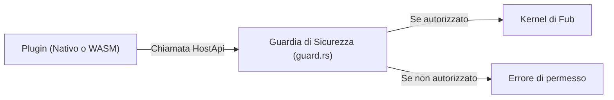

# Il varco `HostApi`

## La porta unica verso il mondo

Un plugin non può accedere liberamente alle risorse del computer (non può aprire file a caso o aprire connessioni socket dirette). Tutto ciò che desidera fare deve passare attraverso l'interfaccia **`HostApi`**, fornita da Fub ad ogni chiamata.

---

## Le capacità disponibili in `HostApi`

L'interfaccia `HostApi` raggruppa **quarantadue** metodi [conta: hostapi-metodi] suddivisi in diverse famiglie:

1. **Documenti del Vault (`VaultRead`, `VaultWrite`, `VaultStructure`)**:
   - `read_document(doc_id)`: legge la sorgente di testo UTF-8 di una nota.
   - `read_model(doc_id)`: legge il modello strutturato ad albero (`DocumentModel`).
   - `write_document(doc_id, text, base)`: aggiorna il contenuto di una nota (richiede il permesso `fub:write-vault`).
   - `create_document`, `rename_document`, `trash_document`, `restore_document`, `empty_trash`.
2. **Canale Dati e Indici (`HostQuery`)**:
   - `query_index(query)`: esegue una ricerca strutturata (es. per tag, proprietà o full-text) e riceve i risultati.
3. **Eventi e Job (`HostEvents`)**:
   - `emit(event)`: pubblica un evento personalizzato che altri componenti possono ascoltare.
   - `spawn_job(spec)`: avvia un'operazione asincrona in background.
4. **Stato e Dati del Plugin (`DataRead`, `DataWrite`)**:
   - `data_read(path)` / `data_write(path, data)`: storage isolato e persistente sotto `.fub/data/plugins/<id>/`.
5. **Impostazioni e Ambiente (`SettingsRead`, `SettingsWrite`, `HostEnv`)**:
   - `setting(key)` / `set_setting(key, value)`: lettura e scrittura configurazioni.
   - `now_unix_millis()`: timestamp Unix corrente in millisecondi.
   - `user_locale()`, `random_bytes(n)`, `active_context()`.
6. **Comandi, Servizi e Rete (`HostCommands`, `HostServices`, `HostNetwork`)**:
   - `run_command(cmd, args)`, `call_service(srv, method, args)`, `fetch(request)`.

---

## Perché un'interfaccia unica?

1. **Controllo centralizzato dei permessi**: prima di eseguire l'operazione richiesta dal plugin, `guard.rs` verifica se il manifest del plugin dichiara il permesso necessario.
2. **Isolamento**: un plugin malfunzionante o malevolo non può compromettere file al di fuori del vault o accedere a cartelle di sistema non autorizzate.

---

## Se vuoi il dettaglio

- Guarda [`crates/fub-abi/src/traits.rs`](../../crates/fub-abi/src/traits.rs) per la definizione completa del trait `HostApi`.
- Guarda [`docs/04-plugin/03-i-permessi.md`](./03-i-permessi.md) per scoprire come funzionano i permessi.
