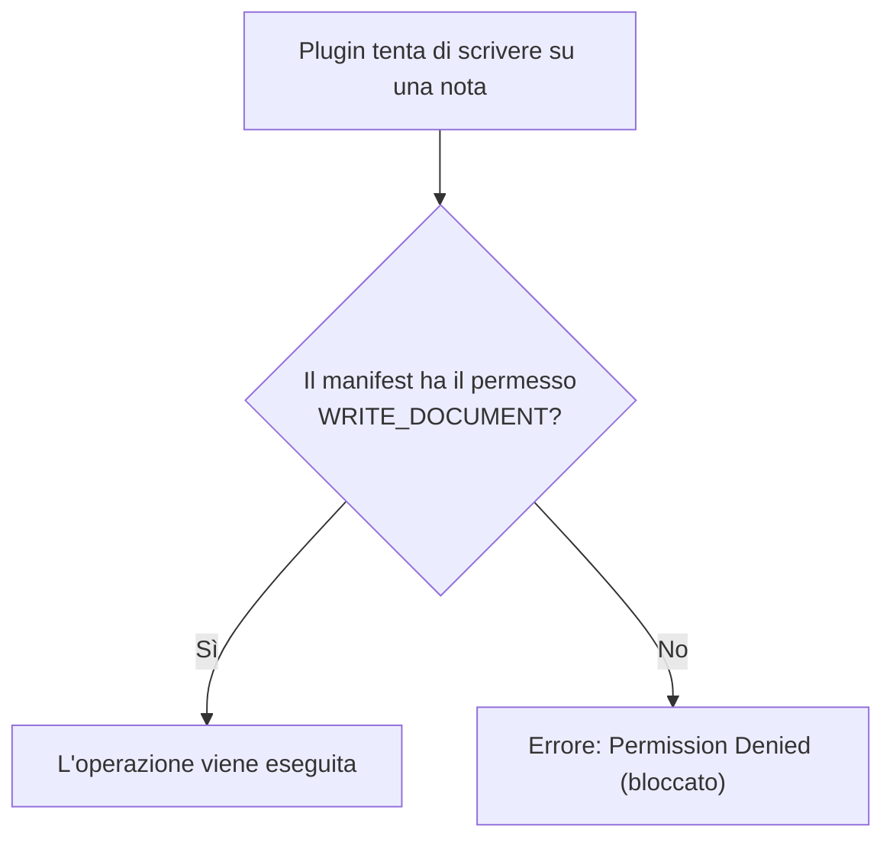

# Permessi e sicurezza dei plugin

## Il principio del minimo privilegio

Ogni plugin deve dichiarare nel proprio **manifest** (la sua carta d'identità) esattamente quali permessi richiede per funzionare. Se tenta di compiere un'azione non dichiarata, l'operazione viene bloccata immediatamente.



---

## I permessi dichiarabili

I permessi disponibili sono definiti in [`crates/fub-abi/src/options.rs`](../../crates/fub-abi/src/options.rs) e includono:

- `READ_VAULT`: permette di leggere i file e la struttura delle note.
- `WRITE_DOCUMENT`: permette di creare o modificare documenti nel vault.
- `NETWORK`: permette di effettuare chiamate HTTP verso internet.
- `STORAGE`: permette di salvare file persistenti nella cartella privata del plugin.
- `COMMANDS`: permette di registrare nuovi comandi eseguibili dall'utente.
- `CLIPBOARD`: permette di leggere o scrivere negli appunti di sistema.

---

## Come il kernel applica i permessi

Nel modulo [`crates/fub-kernel/src/host/guard.rs`](../../crates/fub-kernel/src/host/guard.rs), ogni metodo esposto tramite `HostApi` viene controllato dalla funzione di guardia prima di toccare il disco o lo stato:

```rust
// Esempio concettuale del controllo di guardia
if !self.has_permission(Capability::WriteDocument) {
    return Err(FubError::PermissionDenied("manca il permesso WRITE_DOCUMENT"));
}
```

Questo meccanismo protegge l'utente da plugin di terze parti dannosi o con bug, assicurando che nessuna nota venga modificata all'insaputa dell'utente.

---

## Se vuoi il dettaglio

- Guarda [`crates/fub-kernel/src/host/guard.rs`](../../crates/fub-kernel/src/host/guard.rs) per l'implementazione del controllo di sicurezza.
- Guarda [`docs/04-plugin/04-esempio-ping.md`](./04-esempio-ping.md) per vedere come un plugin dichiara i propri permessi nel codice.
