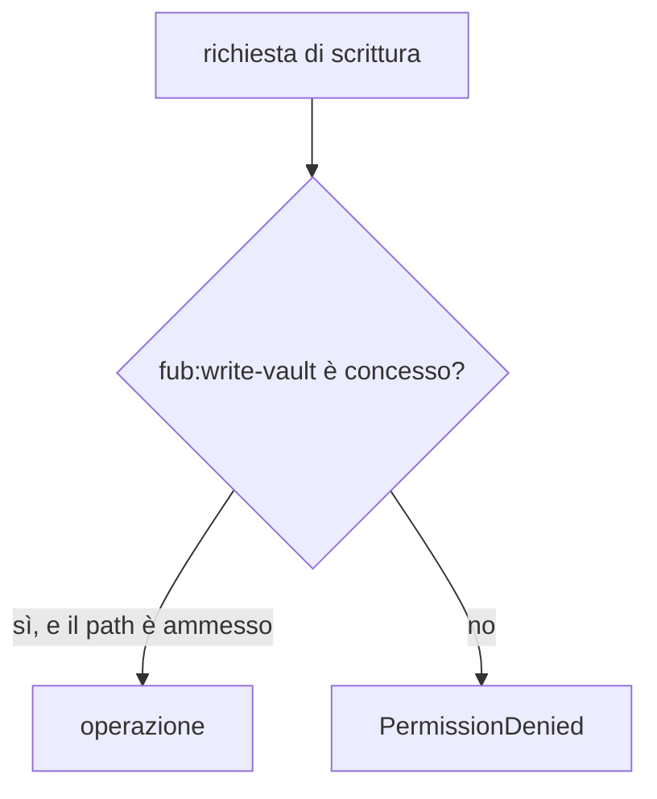

# Permessi dei plugin

Il manifest dichiara le capacità richieste dal bundle. Quando un provider usa
`HostApi`, il `Guard` verifica sia il permesso generale sia le restrizioni
associate, come prefissi di path o host di rete.

## Vocabolario corrente

| Permesso | Significato |
|---|---|
| `fub:read-vault` | Leggere il vault; può portare una lista di prefissi ammessi. |
| `fub:write-vault` | Scrivere il vault; usa la stessa forma di restrizione per path. |
| `fub:network` | Usare la rete attraverso l'host; può portare una allowlist di host. |
| `fub:read-clipboard` | Leggere gli appunti del sistema. |
| `fub:write-clipboard` | Scrivere negli appunti del sistema. |
| `fub:camera` | Nome riservato per l'accesso alla fotocamera. |
| `fub:microphone` | Nome riservato per l'accesso al microfono. |
| `fub:external-fs` | Nome riservato per il filesystem esterno al vault. |
| `fub:run-command` | Invocare comandi registrati. |
| `fub:call-service` | Chiamare servizi esposti da altri provider. |
| `fub:write-settings` | Modificare impostazioni dichiarate scrivibili da un programma. |
| `fub:read-session` | Conoscere documento e superficie attivi. |
| `fub:read-selection` | Leggere il testo selezionato dall'utente. |
| `fub:read-drafts` | Leggere bozze non ancora salvate. |

Il vocabolario contiene **quattordici** nomi [conta: permessi-dichiarabili].
Camera, microfono, filesystem esterno e appunti sono già nominati per stabilire
la granularità del consenso, ma il contratto corrente non offre ancora una
famiglia host per tutte queste operazioni. Dichiarare un nome non crea da solo
una capacità.

## Operazioni senza permesso dedicato

Lo spazio dati isolato del plugin non richiede un permesso del manifest: il
namespace del chiamante è già il recinto. Leggere gli schemi e i valori delle
impostazioni non richiede un permesso perché, per contratto, quello store non
contiene segreti; scriverli richiede invece `fub:write-settings` e una chiave
marcata `program_writable`.

## Limiti della garanzia

Il permesso dice cosa il provider può chiedere attraverso `HostApi`; non
significa che ogni richiesta produca un dialogo per l'utente. Inoltre non è una
sandbox per il codice nativo fidato, che gira nello stesso processo. La barriera
di sistema più forte riguarda i componenti WASM, ai quali non vengono collegati
filesystem o rete generici.

I nomi autorevoli sono in
[`crates/fub-abi/src/options.rs`](../../crates/fub-abi/src/options.rs); il punto
di applicazione è
[`crates/fub-kernel/src/host/guard.rs`](../../crates/fub-kernel/src/host/guard.rs).
