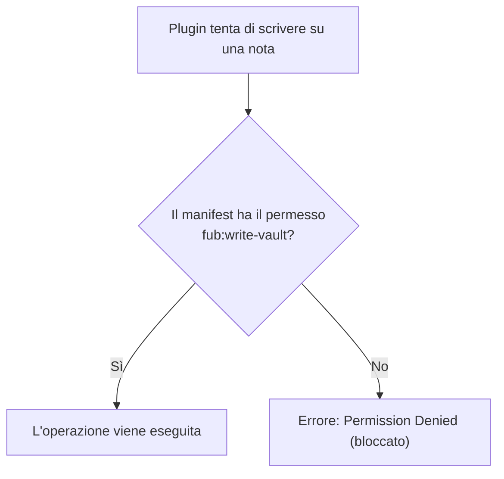

# Permessi e sicurezza dei plugin

## Il principio del minimo privilegio

Ogni plugin deve dichiarare nel proprio **manifest** (la sua carta d'identità) esattamente quali permessi richiede per funzionare. Se tenta di compiere un'azione non dichiarata, l'operazione viene bloccata immediatamente.



---

## I permessi dichiarabili

I permessi disponibili sono definiti in [`crates/fub-abi/src/options.rs`](../../crates/fub-abi/src/options.rs) e includono:

- `fub:read-vault`: permette di leggere i file e la struttura delle note.
- `fub:write-vault`: permette di creare o modificare documenti nel vault.
- `fub:network`: permette di effettuare chiamate di rete (HTTP verso internet, con eventuale allowlist host).
- `fub:external-fs`: permette di accedere al filesystem al di fuori del vault.
- `fub:read-clipboard` / `fub:write-clipboard`: permettono di leggere o scrivere negli appunti di sistema.
- `fub:run-command`: permette di invocare comandi registrati da altri provider.
- `fub:call-service`: permette di invocare metodi esposti da servizi di altri plugin.
- `fub:write-settings`: permette la modifica programmatica delle impostazioni consentite.
- `fub:read-session`: permette di conoscere il contesto attivo (es. quale documento/pannello ha il focus).
- `fub:read-selection`: permette di leggere il testo correntemente selezionato dall'utente.
- `fub:read-drafts`: permette di consultare il buffer delle bozze non ancora salvate.
- `fub:camera` / `fub:microphone`: accesso a fotocamera e microfono per acquisizioni multimediali.

*(Nota: lo storage isolato del plugin sotto `.fub/data/plugins/<id>/` tramite `data_read`/`data_write` è sempre consentito di default).*

---

## Come il kernel applica i permessi

Nel modulo [`crates/fub-kernel/src/host/guard.rs`](../../crates/fub-kernel/src/host/guard.rs), ogni metodo esposto tramite `HostApi` viene controllato dalla funzione di guardia prima di toccare il disco o lo stato:

```rust
// Esempio concettuale del controllo di guardia
if !self.has_permission(Capability::VaultWrite) {
    return Err(PluginError::PermissionDenied("manca il permesso fub:write-vault".into()));
}
```

Questo meccanismo protegge l'utente da plugin di terze parti dannosi o con bug, assicurando che nessuna nota venga modificata all'insaputa dell'utente.

---

## Se vuoi il dettaglio

- Guarda [`crates/fub-kernel/src/host/guard.rs`](../../crates/fub-kernel/src/host/guard.rs) per l'implementazione del controllo di sicurezza.
- Guarda [`docs/04-plugin/04-esempio-ping.md`](./04-esempio-ping.md) per vedere come un plugin dichiara i propri permessi nel codice.
