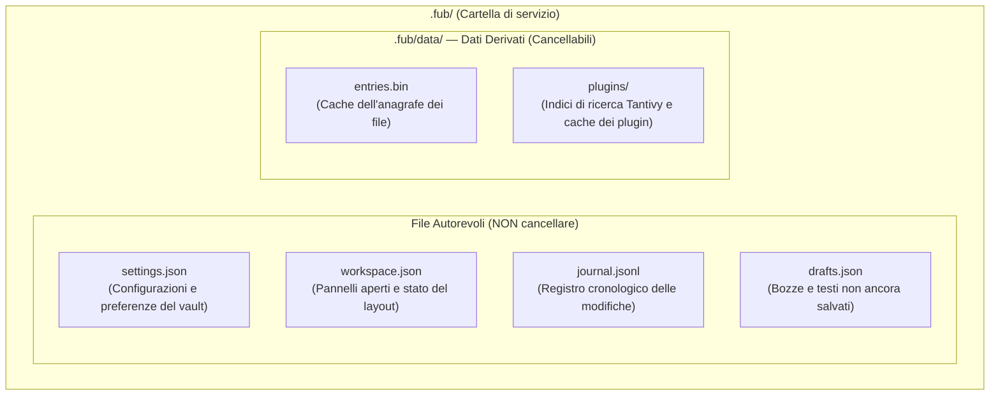

# La cartella `.fub/`: stato, indici e metadati

## Due categorie di file: Autorevoli vs Derivati

All'interno di ogni vault aperto, Fub crea una cartella nascosta chiamata `.fub/`. I file al suo interno si dividono rigorosamente in due categorie:

---

## 1. File Autorevoli (di configurazione e stato)

Questi file contengono informazioni che non possono essere ricostruite a partire dal testo delle note:
- `.fub/settings.json`: impostazioni specifiche per quel vault (ad esempio lingua, tema o plugin abilitati).
- `.fub/workspace.json`: stato della finestra (quali schede sono aperte, quale nota è visualizzata nell'editor).
- `.fub/journal.jsonl`: registro delle ultime operazioni per consentire il ripristino sicuro dopo una chiusura inaspettata.
- `.fub/drafts.json`: contenuto temporaneo delle modifiche digitate e non ancora inviate al file definitivo su disco.

---

## 2. File Derivati (`.fub/data/`)

Tutto ciò che sta sotto `.fub/data/` è **derivato**:
- Indici di ricerca full-text costruiti da `tantivy`.
- Cache delle intestazioni e dei collegamenti per velocizzare l'avvio.

**Proprietà fondamentale**: se chiudi Fub ed elimini l'intera cartella `.fub/data/`, all'avvio successivo Fub rileggerà tutte le note `.md` e ricostruirà gli indici in automatico, senza perdere nessun dato personale!

---

## Se vuoi il dettaglio

- Guarda [`crates/fub-kernel/src/organization.rs`](../../crates/fub-kernel/src/organization.rs) per la gestione dei file di configurazione.
- Guarda [`docs/05-disco/03-cestino-e-sidecar.md`](./03-cestino-e-sidecar.md) per scoprire come vengono gestite le note eliminate.
