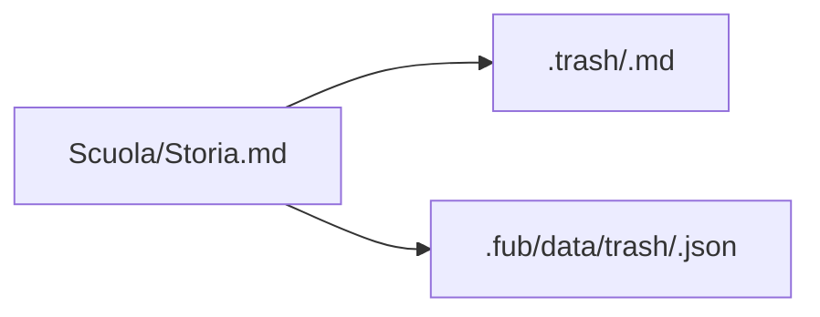

# Il cestino e i sidecar

Quando Fub cestina una voce, la sposta nella cartella `.trash/` alla radice del
vault. Il file non viene cancellato definitivamente finché il cestino non viene
svuotato.

Il nome nel cestino può ricevere un timbro per evitare collisioni con un file
già presente.

## Contenuto del sidecar

Per le voci cestinate da Fub, il sidecar conserva:

- versione dello schema;
- percorso originale;
- quando disponibile, dimensione e data del file usate per riconoscere l'elemento corretto;
- quando disponibile, istante della cancellazione.

Il path originale permette di ripristinare la voce nella cartella di partenza.
Il timbro impedisce che un vecchio sidecar venga applicato a un file omonimo
cestinato successivamente.

## Compatibilità con altri programmi

`.trash/` è la stessa convenzione usata dal cestino locale di Obsidian. Un
programma esterno può però spostare o rimuovere file senza aggiornare i sidecar
di Fub.

Quando una voce non ha un sidecar valido, Fub degrada in modo esplicito: usa il
nome disponibile e ripristina in radice invece di inventare un percorso. Questa
compatibilità è meno ricca del ripristino di una voce cestinata da Fub.

## Non è cache eliminabile

Il sidecar contiene informazioni che il file in `.trash/` non possiede. Al
momento vive sotto `.fub/data/trash/`, ma non è ricostruibile dalla sola nota:
cancellarlo può perdere percorso originale e data reale di eliminazione.

L'implementazione è in
[`../../crates/fub-kernel/src/vault.rs`](../../crates/fub-kernel/src/vault.rs).
