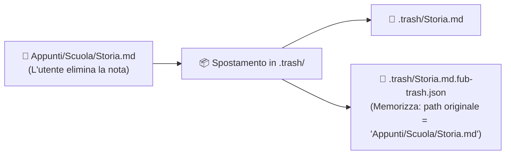

# Il Cestino `.trash/` e i file sidecar

Per chi è: studenti che vogliono capire come Fub gestisce l'eliminazione e il ripristino sicuro delle note.

---

## Come funziona il cestino

Quando elimini una nota in Fub:
1. Il file non viene cancellato definitivamente dal disco.
2. Viene invece **spostato nella cartella `.trash/`** situata nella radice del vault.
3. Se presente, Fub crea accanto al file cestinato un file di supporto invisibile chiamato **sidecar** (con estensione `.fub-trash.json`).

---

## A cosa serve il file sidecar?

Un file **sidecar** (letteralmente "il carrellino laterale di una motocicletta") è un piccolo file di metadati salvato accanto a un file principale.

Nel caso del cestino, memorizza:
- Il percorso originale dove si trovava il file prima dell'eliminazione.
- La data e l'ora esatta in cui è stato cestinato.

Grazie a queste informazioni, quando l'utente preme **"Ripristina nota"**, Fub è in grado di ricollocare il file esattamente nella cartella di provenienza (ricreando eventuali sottocartelle se necessario).

---

## Compatibilità con Obsidian

Fub usa la stessa cartella `.trash/` standard adottata da Obsidian. Ciò significa che:
- Le note eliminate con Fub sono visibili nel cestino di Obsidian.
- Le note eliminate da Obsidian possono essere viste e ripristinate anche da Fub.

---

## Se vuoi il dettaglio

- Guarda [`crates/fub-kernel/src/entries.rs`](../../crates/fub-kernel/src/entries.rs) per la logica di spostamento dei file nel cestino.
