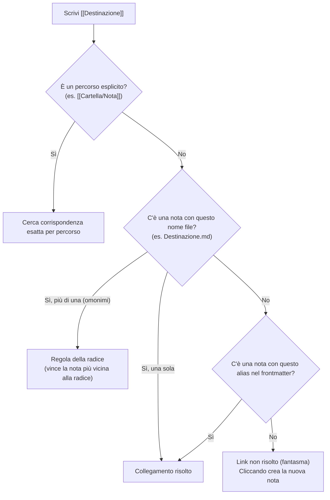

# Risoluzione dei collegamenti (`LinkGraph`)

La navigazione ipertestuale tra le note in Fub supporta la sintassi dei **wikilink** (`[[...]]`) ed è compatibile con i criteri di risoluzione adottati da Obsidian.

---

## 1. Come viene risolto un Wikilink

Quando scrivi un wikilink all'interno di una nota, il motore del kernel ([`crates/fub-kernel`](../../crates/fub-kernel)) cerca la nota di destinazione applicando una sequenza precisa di regole:



---

## 2. I criteri nel dettaglio

### A. Percorso relativo ed esplicito
Se il link contiene barre `/` (come `[[Progetti/Rust/Guida]]`), la ricerca punta direttamente al file situato in quella sottocartella specifica.

### B. Nome file semplice e percorso più vicino alla radice (*Shortest Path*)
Se il link contiene solo il nome (come `[[Appunti]]`):
1. Fub cerca un file chiamato `Appunti.md` nel vault.
2. Se esistono più file con lo stesso nome in cartelle diverse (es. `Appunti.md` nella radice e `Personale/Appunti.md`), vince la nota con il minor numero di segmenti nel percorso (più vicina alla radice del vault); a parità di profondità si applica l'ordine lessicografico.

### C. Risoluzione tramite Alias nel Frontmatter
Una nota può definire uno o più nomi alternativi (alias) nel proprio frontmatter YAML:

```markdown
---
aliases:
  - Architettura del Sistema
  - Mappa Moduli
---
```

Scrivere `[[Architettura del Sistema]]` punterà automaticamente a questa nota, anche se il file si chiama `01-architettura.md`.

### D. Collegamenti a Sezioni e Blocchi
- **A un titolo specifico**: `[[NomeNota#Titolo Sezione]]` apre la nota e posiziona il cursore direttamente sotto quell'intestazione.
- **A un singolo blocco**: `[[NomeNota#^id-blocco]]` punta a un paragrafo marcato con un identificatore di blocco in fondo.

---

## 3. Link non ancora creati (*Ghost Links*)

Se scrivi un wikilink a una nota che non esiste ancora (es. `[[Idea Futura]]`):
- Il link viene evidenziato come non risolto.
- Facendo clic sul link, Fub crea istantaneamente il file `Idea Futura.md` nella cartella predefinita, risolvendo il collegamento.

---

## Se vuoi il dettaglio

- Guarda [`crates/fub-kernel/src/graph.rs`](../../crates/fub-kernel/src/graph.rs) per l'implementazione del grafo dei collegamenti (`LinkGraph`).
- Guarda [`docs/05-disco/01-note-utente.md`](01-note-utente.md) per la struttura generale dei file `.md`.
