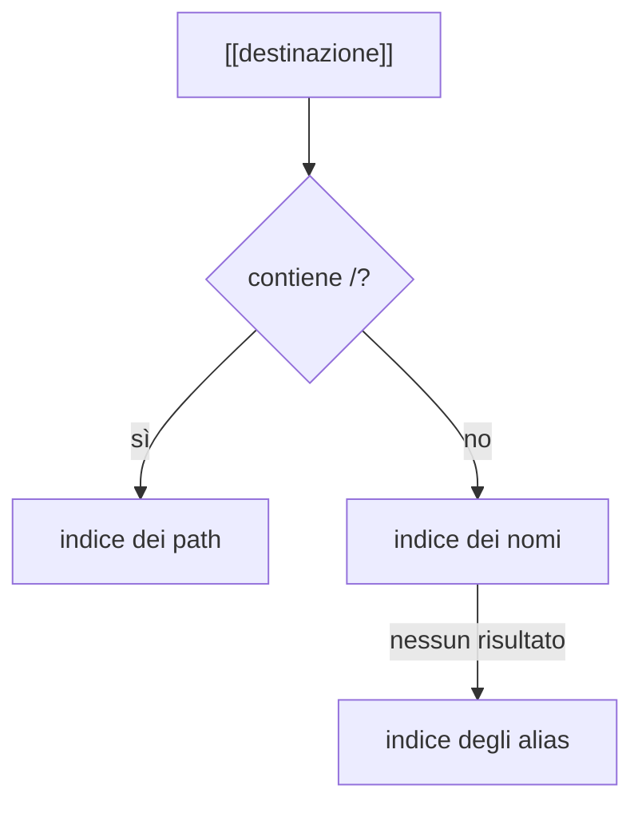

# Risoluzione dei collegamenti

Il grafo lavora sul `DocumentModel`, non sul Markdown grezzo. Distingue tre
bersagli:

- `Wiki`, prodotto da un wikilink;
- `Path`, prodotto da un normale link Markdown verso un file del vault;
- `Url`, che non diventa un arco interno.

## Wikilink

Un wikilink viene risolto globalmente:

1. se contiene `/`, prova il path relativo al vault senza estensione;
2. altrimenti prova il nome del file;
3. se il nome non risolve, prova gli alias del frontmatter.

Quando più documenti condividono nome, path senza estensione o alias, i
candidati sono ordinati in modo deterministico: prima il path più corto, poi
l'ordine lessicografico. La forma esatta scritta dall'utente aiuta a preferire
la corrispondenza corretta quando le chiavi normalizzate coincidono.

## Link Markdown

Un link come `[testo](../Nota.md)` è un path relativo al documento sorgente.
Viene normalizzato contro la sua cartella e risolto soltanto per path: non pesca
un alias con lo stesso testo.

## Frammenti e link irrisolti

Titoli e identificatori di blocco restringono la destinazione dentro un
documento, ma non cambiano quale documento viene scelto. Un link senza bersaglio
resta irrisolto nel grafo. La creazione di una nuova nota è un'azione separata
della shell; questa pagina non promette che ogni clic su un link fantasma crei
automaticamente un file.

## Aggiornamento

Il grafo conserva indici inversi per ricalcolare soltanto i documenti la cui
risoluzione può cambiare dopo creazione, modifica, rinomina o rimozione. La
ricostruzione completa resta l'oracolo usato dai test per verificare il risultato
incrementale.

Il codice è in
[`../../crates/fub-kernel/src/graph.rs`](../../crates/fub-kernel/src/graph.rs).
