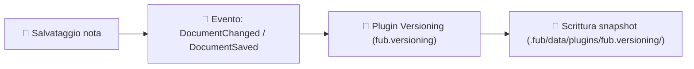

# Snapshot, Versionamento e Protezione Dati

La sicurezza dei dati è un principio fondamentale di Fub: ogni modifica alle note viene tracciata attraverso un sistema di snapshot automatici che protegge da perdite accidentali o errori di digitazione.

---

## 1. Come funziona il Versionamento

Il modulo di versionamento (situato in [`crates/fub-features/src/versioning.rs`](../../crates/fub-features/src/versioning.rs)) è implementato come un `EventHandler` ufficiale che ascolta gli eventi del kernel:



---

## 2. Struttura dei dati su disco

Tutti gli snapshot storici vengono conservati nella cartella privata del modulo di versionamento (`.fub/data/plugins/fub.versioning/`):

```text
.fub/data/plugins/fub.versioning/
├── versions.json            # Indice centrale: mappa ogni doc_id alla lista delle versioni
└── <dir_nota>/
    ├── meta.json            # Metadati della nota e data di eventuale eliminazione (tombstone)
    └── 1724270400000.md     # Contenuto integrale del file al timestamp Unix indicato
```

---

## 3. Gestione del ciclo di vita

1. **Campionamento (*Copy-on-Write*)**: quando salvi una nota, se è trascorso un intervallo di tempo minimo dall'ultimo snapshot, Fub genera una copia timestamped del testo.
2. **Tracciamento dei cambi di nome (`DocumentRenamed`)**: se rinomini una nota, la cronologia degli snapshot viene preservata e agganciata al nuovo nome del documento.
3. **Cancellazione con lapide (*Tombstone*)**: se una nota viene eliminata, lo store di versionamento registra una voce di tomba (*tombstone*). Questo permette di consultare lo storico e il contenuto della nota anche dopo la sua cancellazione.

---

## 4. Ripristino di una versione precedente

Attraverso il pannello della cronologia o tramite il trait `HostApi`:
- L'utente può visualizzare le differenze (*diff*) tra la versione attuale e qualsiasi snapshot passato.
- Premendo **"Ripristina questa versione"**, il kernel sovrascrive il file `.md` con il contenuto storico selezionato, emettendo a sua volta un nuovo evento di salvataggio.

---

## Se vuoi il dettaglio

- Guarda [`crates/fub-features/src/versioning.rs`](../../crates/fub-features/src/versioning.rs) per il codice Rust del modulo.
- Guarda [`docs/05-disco/02-cartella-fub.md`](02-cartella-fub.md) per l'organizzazione generale di `.fub/`.
