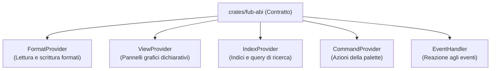

# I trait principali in Rust (`fub-abi`)

Per chi è: studenti e sviluppatori che vogliono comprendere nel dettaglio come sono strutturate le interfacce in Rust in [`crates/fub-abi/src/traits.rs`](file:///home/fubeo/Files/Progetti/Fub/crates/fub-abi/src/traits.rs).

---

## Il ruolo dei Trait

In Rust, un **trait** definisce un insieme di metodi che un tipo di dato deve implementare. In Fub, i trait rappresentano i punti di estensione del sistema.

---

## 1. `FormatProvider`
Permette a Fub di capire un formato di file (es. Markdown):
- `parse`: prende una stringa grezza e genera la struttura `DocumentModel`.
- `render`: trasforma un `DocumentModel` in una stringa HTML sicura.
- `serialize`: riconverte un `DocumentModel` modificato in testo grezzo.

File: [`crates/fub-abi/src/format.rs`](file:///home/fubeo/Files/Progetti/Fub/crates/fub-abi/src/format.rs)

---

## 2. `ViewProvider`
Permette di costruire un pannello dell'interfaccia utente:
- `surface`: dichiara in quale zona dello schermo vive la vista (es. barra laterale sinistra, pannello destro o barra inferiore).
- `render`: riceve il contesto attuale e restituisce un albero `UiNode` con i componenti grafici.
- `on_action`: gestisce i clic sui pulsanti o le interazioni dell'utente.

File: [`crates/fub-abi/src/traits.rs`](file:///home/fubeo/Files/Progetti/Fub/crates/fub-abi/src/traits.rs)

---

## 3. `IndexProvider`
Permette di rispondere a ricerche ed estrazioni dati:
- `handles`: verifica se questo indice sa rispondere a una certa query (es. "ricerca full-text").
- `query`: esegue la ricerca e restituisce i risultati ordinati.
- `reindex_all`: indicizza da zero tutti i file del vault.

File: [`crates/fub-abi/src/traits.rs`](file:///home/fubeo/Files/Progetti/Fub/crates/fub-abi/src/traits.rs)

---

## 4. `CommandProvider`
Espone comandi eseguibili:
- `commands`: restituisce l'elenco dei comandi offerti con titolo, descrizione e parametri richiesti.
- `execute`: esegue il comando con gli argomenti forniti.

File: [`crates/fub-abi/src/traits.rs`](file:///home/fubeo/Files/Progetti/Fub/crates/fub-abi/src/traits.rs)

---

## Se vuoi il dettaglio

- Guarda [`docs/06-contratto/02-il-modello-dati.md`](file:///home/fubeo/Files/Progetti/Fub/docs/06-contratto/02-il-modello-dati.md) per scoprire come è rappresentata una nota in memoria.
- Guarda [`docs/06-contratto/03-il-contratto-wit.md`](file:///home/fubeo/Files/Progetti/Fub/docs/06-contratto/03-il-contratto-wit.md) per la versione WebAssembly (WIT).
