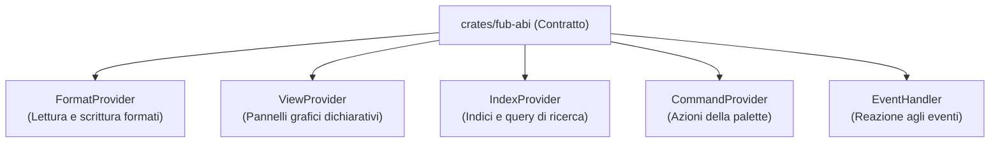

# I trait principali in Rust (`fub-abi`)

## Il ruolo dei Trait

In Rust, un **trait** definisce un insieme di metodi che un tipo di dato deve implementare. In Fub, i trait rappresentano i punti di estensione del sistema.

---

## 1. `FormatProvider`
Permette a Fub di capire un formato di file (es. Markdown):
- `descriptor` / `capabilities`: dichiara estensioni gestite e sintassi supportate.
- `parse`: riceve la sorgente `DocumentSource` e genera la struttura `DocumentModel`.
- `render_html`: trasforma un `DocumentModel` in una stringa HTML sicura per l'anteprima.
- `serialize`: serializza un `DocumentModel` per la generazione di nuove note o frammenti.

File: [`crates/fub-abi/src/format.rs`](../../crates/fub-abi/src/format.rs)

---

## 2. `ViewProvider`
Permette di costruire un pannello dell'interfaccia utente:
- `views`: dichiara i descrittori delle viste offerte (`ViewSpec`), inclusa la superficie di montaggio (`surface`).
- `interests`: specifica quali variazioni di contesto o eventi richiedono il ridisegno della vista.
- `render_view`: riceve l'istanza e `ReadApi` (in sola lettura), restituendo un albero `UiNode` con i componenti grafici dichiarativi.
- `on_action`: gestisce le interazioni scatenate dall'utente (`UiAction`) ricevendo `HostApi`.

File: [`crates/fub-abi/src/traits.rs`](../../crates/fub-abi/src/traits.rs)

---

## 3. `IndexProvider`
Permette di rispondere a ricerche ed estrazioni dati:
- `routes`: dichiara le rotte statiche di query supportate dall'indice.
- `query`: esegue la ricerca e restituisce i risultati strutturati.
- `on_documents_indexed` / `on_documents_removed`: aggiorna incrementalmente l'indice all'aggiunta o rimozione di documenti.

File: [`crates/fub-abi/src/traits.rs`](../../crates/fub-abi/src/traits.rs)

---

## 4. `CommandProvider`
Espone comandi eseguibili:
- `commands`: restituisce l'elenco dei comandi offerti (`Vec<CommandSpec>`) con titolo, descrizione e parametri richiesti.
- `invoke`: esegue il comando con gli argomenti forniti tramite `HostApi`.

File: [`crates/fub-abi/src/traits.rs`](../../crates/fub-abi/src/traits.rs)

---

## 5. `EventHandler`
Ascolta e reagisce alle notifiche del sistema:
- `subscribed`: restituisce la maschera degli eventi di interesse (`EventMask`).
- `handle`: riceve la notifica dell'evento emesso sul bus.

File: [`crates/fub-abi/src/traits.rs`](../../crates/fub-abi/src/traits.rs)

---

## Se vuoi il dettaglio

- Guarda [`docs/06-contratto/02-il-modello-dati.md`](./02-il-modello-dati.md) per scoprire come è rappresentata una nota in memoria.
- Guarda [`docs/06-contratto/03-il-contratto-wit.md`](./03-il-contratto-wit.md) per la versione WebAssembly (WIT).
