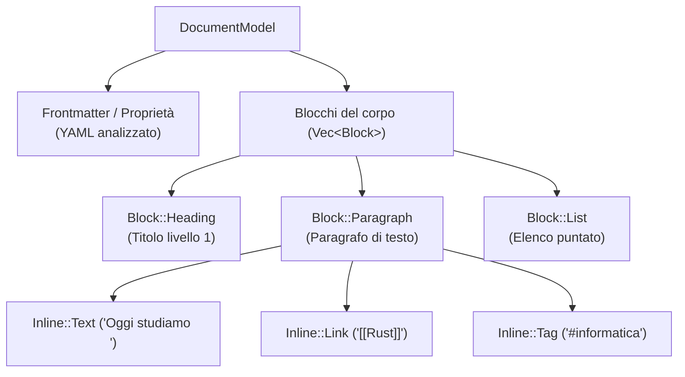

# Il Modello del Documento (`DocumentModel`)

## Dalla stringa all'albero

Quando una nota viene aperta, il testo non rimane una semplice sequenza di caratteri, ma viene trasformato in una struttura dati tipizzata chiamata **`DocumentModel`** (definita in [`crates/fub-abi/src/model.rs`](../../crates/fub-abi/src/model.rs)).

---

## 1. I Blocchi (`Block`)
Rappresentano le unità logiche verticali della pagina:
- `Block::Paragraph`: un paragrafo di testo.
- `Block::Heading`: un'intestazione (con livello da 1 a 6).
- `Block::List`: una lista ordinata o puntata.
- `Block::CodeBlock`: un blocco di codice con evidenziazione sintattica.
- `Block::Blockquote`: una citazione.
- `Block::Table`: una tabella con righe e colonne.

---

## 2. Gli Elementi in Linea (`Inline`)
Rappresentano gli elementi all'interno di un blocco:
- `Inline::Text`: testo normale.
- `Inline::Emphasis` / `Inline::Strong`: corsivo e grassetto.
- `Inline::Link`: collegamento ipertestuale o wikilink (`[[...]]`).
- `Inline::Tag`: etichetta tematica (`#...`).
- `Inline::Code`: frammento di codice in linea (tra backtick `` ` ``).

---

## 3. Gli intervalli di testo (`Span`)
Ogni nodo dell'albero conserva uno `Span` che indica l'intervallo di byte esatto `[start, end]` nel file originale.

Questo consente all'editor di evidenziare o modificare chirurgicamente una parola senza dover riscrivere tutto il documento.

---

## Se vuoi il dettaglio

- Guarda [`crates/fub-abi/src/model.rs`](../../crates/fub-abi/src/model.rs) per la definizione completa dei tipi `Block`, `Inline` e `Span`.
