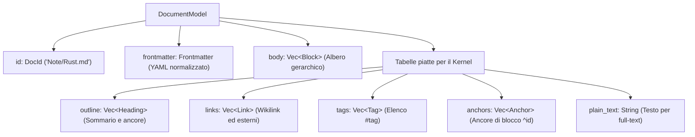

# Il Modello del Documento (`DocumentModel`)

## Dalla stringa all'albero agnostico

Quando una nota viene aperta o analizzata da un `FormatProvider` (es. `fub-format-markdown`), il testo sorgente viene trasformato in una struttura dati tipizzata chiamata **`DocumentModel`** (definita in [`crates/fub-abi/src/model.rs`](../../crates/fub-abi/src/model.rs)).

Il modello unificato assolve a due compiti fondamentali:
1. **Rappresentazione ad albero gerarchico (`body`)**: per il rendering HTML, la live preview e la modifica strutturata.
2. **Proiezioni piatte indicizzate (`outline`, `links`, `tags`, `anchors`, `plain_text`)**: estratti lineari che permettono al kernel e ai motori di ricerca (Tantivy, grafo) di operare a velocità istantanea senza dover percorrere ricorsivamente l'albero per ogni interrogazione.

---

## 1. Struttura dei Blocchi (`Block`)

I blocchi rappresentano le unità logiche verticali della pagina:

| Variante | Campi principali | Descrizione |
|---|---|---|
| `Block::Paragraph` | `inlines: Vec<Inline>`, `span: Span` | Paragrafo di testo contenente elementi in linea. |
| `Block::Heading` | `level: u8` (1..=6), `inlines: Vec<Inline>`, `span: Span` | Intestazione con livello gerarchico e testo. |
| `Block::List` | `kind: ListKind` (Ordered/Unordered), `items: Vec<ListItem>`, `span: Span` | Elenco puntato o numerato con eventuale annidamento. |
| `Block::CodeBlock` | `lang: Option<String>`, `text: String`, `span: Span` | Blocco di codice sorgente recintato con linguaggio facoltativo. |
| `Block::Quote` | `blocks: Vec<Block>`, `span: Span` | Citazione a blocchi annidabili (*blockquote*). |
| `Block::Table` | `header: Vec<TableCell>`, `rows: Vec<Vec<TableCell>>`, `alignments: Vec<Align>`, `span: Span` | Tabella formattata con allineamenti per colonna. |
| `Block::ThematicBreak` | `span: Span` | Linea orizzontale di interruzione tematica (`---`). |
| `Block::ReferenceDefinition` | `label: String`, `target: String`, `title: Option<String>`, `span: Span` | Definizione di link CommonMark di riferimento. |
| `Block::Custom` | `custom_kind: String`, `blocks: Vec<Block>`, `attrs: Map`, `span: Span` | Meccanismo di estensione per callout (`[!NOTE]`), formule matematiche a blocco, ecc. |

---

## 2. Elementi in Linea (`Inline`)

Gli elementi in linea formano il testo formattato all'interno di un blocco:

- `Inline::Text(String)`: testo piatto semplice.
- `Inline::Emph(Vec<Inline>)`: testo in corsivo (`*testo*`).
- `Inline::Strong(Vec<Inline>)`: testo marcato in grassetto (`**testo**`).
- `Inline::Strikethrough(Vec<Inline>)`: testo barrato (`~~testo~~`).
- `Inline::Superscript(Vec<Inline>)`: apice (`^testo^`).
- `Inline::Link { target: LinkTarget, text: Vec<Inline>, span: Span }`: wikilink (`[[Nota]]`), link markdown o embed (`![[Immagine.png]]`).
- `Inline::TagRef(String)`: etichetta tematica inline (`#programmazione`).
- `Inline::Code(String)`: frammento di codice racchiuso tra backtick (` `codice` `).
- `Inline::Math(String)`: formula matematica inline in notazione TeX (`$E=mc^2$`).
- `Inline::HardBreak` / `Inline::SoftBreak`: a capo forzato o a capo logico.

---

## 3. Identificativi e Intervalli di Testo

### `DocId`
L'identità di ogni documento nel vault è rigorosamente **il suo percorso relativo normalizzato** (es. `Cartella/Guida.md`). Il metodo `.page_name()` restituisce il basename privo di estensione, utilizzato per la risoluzione elastica dei collegamenti in stile Obsidian.

### `Span`
Ogni singolo nodo dell'albero conserva uno `Span { start: usize, end: usize }` che indica l'intervallo semiaperto di byte `[start, end)` nella sorgente originale.
- **Live Preview chirurgica**: permette a CodeMirror 6 di rimpiazzare o decorare porzioni di testo senza dover ri-renderizzare l'intero buffer.
- **Round-trip fedele**: garantisce che le riscritture non alterino spaziature o formattazioni estranee alla modifica.

---

## 4. Metadati e Frontmatter (`Frontmatter`)

I metadati YAML/TOML all'inizio del file vengono parsati in una mappa JSON (`Frontmatter`):
- Il metodo `.property(key, formats)` converte il valore grezzo in un [`PropertyValue`](../../crates/fub-abi/src/model.rs) tipizzato (stringhe, numeri, booleani, date ISO/personalizzate, liste).
- Il metodo `.aliases()` estrae automaticamente la lista degli alias per la risoluzione dei wikilink.

---

## Se vuoi il dettaglio

- Guarda [`crates/fub-abi/src/model.rs`](../../crates/fub-abi/src/model.rs) per le definizioni Rust complete di `DocumentModel`, `Block`, `Inline`, `Span` e `Frontmatter`.
- Guarda [`crates/fub-format-markdown/src/parse.rs`](../../crates/fub-format-markdown/src/parse.rs) per comprendere come l'albero di `comrak` viene proiettato in `DocumentModel`.
