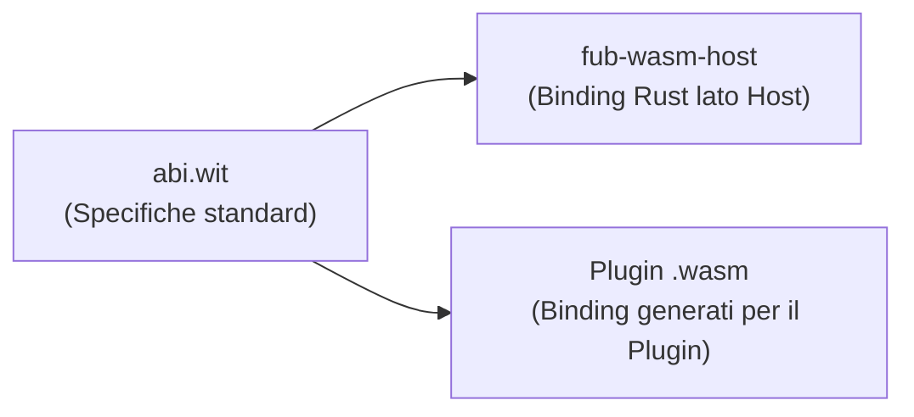

# Il Contratto WIT e WebAssembly Interface Types

Per chi è: studenti che vogliono capire come i tipi di Fub vengono descritti in modo agnostico per funzionare con WebAssembly.

---

## Cos'è WIT?

**WIT** (*WebAssembly Interface Types*) è un linguaggio di specifica standard per definire tipi di dato e interfacce di funzioni che devono essere scambiate tra un programma principale (l'host) e un modulo WebAssembly (il guest).

In Fub, il contratto WIT si trova in [`crates/fub-abi/wit/fub/abi.wit`](file:///home/fubeo/Files/Progetti/Fub/crates/fub-abi/wit/fub/abi.wit) ed è l'equivalente esatto delle strutture Rust in `crates/fub-abi/src/`.



---

## Esempio di definizione WIT

Ecco come una funzione del contratto appare nel file `abi.wit`:

```wit
// Estratto da crates/fub-abi/wit/fub/abi.wit
interface host-vault-read {
    /// Legge il contenuto di una nota nel vault
    read-document: func(path: string) -> result<string, plugin-error>;

    /// Restituisce la versione di revisione del documento
    document-revision: func(path: string) -> result<u64, plugin-error>;
}
```

Grazie a questa descrizione, gli strumenti come `wit-bindgen` generano automaticamente il codice di comunicazione sia per il plugin sia per Fub.

---

## La regola del Freeze: crescere solo per aggiunta

A partire dalla Milestone 4 (congelamento del contratto), il file `abi.wit` adotta una regola di stabilità fondamentale:
- I tipi e le funzioni esistenti **non possono essere rimossi o modificati** (romperebbero i plugin già compilati).
- Il contratto può crescere **solo per aggiunta** di nuove interfacce opzionali.

Questa promessa è garantita da un test automatico dedicato: [`crates/fub-abi/tests/wit_additivity.rs`](file:///home/fubeo/Files/Progetti/Fub/crates/fub-abi/tests/wit_additivity.rs).

---

## Se vuoi il dettaglio

- Guarda [`crates/fub-abi/wit/fub/abi.wit`](file:///home/fubeo/Files/Progetti/Fub/crates/fub-abi/wit/fub/abi.wit) per leggere l'intero contratto WIT.
- Guarda [`crates/fub-abi/tests/wit_conformance.rs`](file:///home/fubeo/Files/Progetti/Fub/crates/fub-abi/tests/wit_conformance.rs) per il test che verifica la corrispondenza 1:1 tra Rust e WIT.
