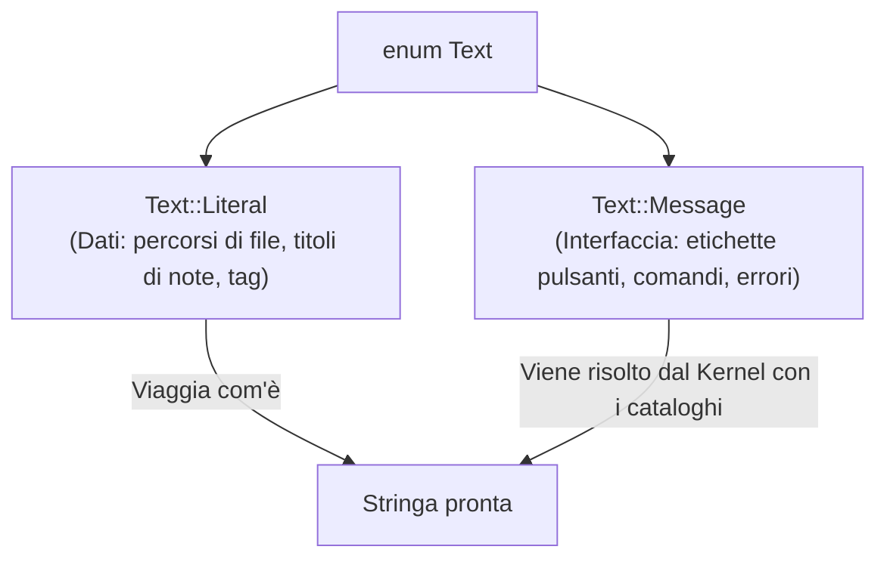

# Localizzazione e Gestione delle Lingue (`i18n`)

In Fub, la localizzazione dei testi dell'interfaccia, dei comandi e dei messaggi di errore è gestita in modo dichiarativo e centralizzato nel modulo [`crates/fub-abi/src/text.rs`](../../crates/fub-abi/src/text.rs).

---

## 1. I due tipi di testo (`Text`)

Invece di usare semplici stringhe cablate nel codice, il contratto adotta l'enum **`Text`**:



- **`Text::Literal(String)`**: rappresenta dati puri che non vanno tradotti (il nome di un file, un percorso o il titolo scritto dall'utente).
- **`Text::Message(Message)`**: rappresenta una chiave di traduzione (es. `backlinks.empty`) associata a eventuali argomenti tipizzati.

---

## 2. Come funziona la risoluzione (La scala a 4 gradini)

Quando il kernel riceve una struttura contenente messaggi da mostrare a schermo, cerca la traduzione scendendo lungo una scala di specificità (*ladder*):

1. **Lingua esatta dell'utente con regione** (es. `it-IT`).
2. **Lingua base** senza regione (es. `it`).
3. **Lingua di ripiego predefinita del plugin** (`default_locale` specificato nel manifest, es. `en`).
4. **La chiave nuda** (se nessuna traduzione esiste, viene mostrata la chiave stessa per rendere subito evidente e cercabile la stringa mancante).

---

## 3. I cataloghi di stringhe nel Manifest

I plugin dichiarano i propri cataloghi direttamente nel manifest:

```rust
PluginManifest {
    id: "mio.plugin".to_string(),
    default_locale: "it".to_string(),
    strings: vec![
        StringCatalog::new("it")
            .with("saluto", "Ciao {nome}!")
            .with("conteggio", "{n} elementi trovati"),
        StringCatalog::new("en")
            .with("saluto", "Hello {nome}!")
            .with("conteggio", "{n} items found"),
    ],
    // ...
}
```

---

## 4. Argomenti tipizzati (`ArgValue`)

I valori dinamici inseriti nei template non sono semplici stringhe preformattate, ma valori tipizzati:
- `ArgValue::Text`: frammento di testo non traducibile.
- `ArgValue::Int` e `ArgValue::Float`: numeri.
- `ArgValue::Timestamp`: istante Unix UTC in millisecondi, formattato automaticamente secondo il fuso e il formato data dell'utente.

---

## Se vuoi il dettaglio

- Guarda [`crates/fub-abi/src/text.rs`](../../crates/fub-abi/src/text.rs) per la definizione completa di `Text`, `Message` e `StringCatalog`.
- Guarda [`crates/fub-abi/src/locale.rs`](../../crates/fub-abi/src/locale.rs) per la struttura `Locale` e la formattazione temporale.
