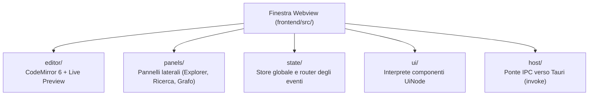

# La Shell e l'interfaccia frontend

Per chi è: studenti che vogliono capire come è organizzata la webview di Fub scritta in TypeScript e Vite.

---

## Architettura del Frontend

L'interfaccia utente di Fub (la **shell**) si trova nella cartella [`frontend/`](file:///home/fubeo/Files/Progetti/Fub/frontend). Non usa framework pesanti, ma un'architettura modulare in TypeScript puro con rendering reattivo:

---

## 1. L'Editor (`editor/`)
Basato su **CodeMirror 6**:
- Supporta l'anteprima live (*live preview*): quando non stai modificando un elemento, lo visualizza formattato (titolo, grassetto, lista), mentre mostra il codice Markdown quando ci sposti il cursore sopra.
- Gestisce il completamento automatico per wikilink `[[...]]` e tag `#...`.

---

## 2. I Pannelli (`panels/`)
Fub include diversi pannelli laterali:
- **File Explorer**: albero dei file e delle cartelle del vault.
- **Search**: barra di ricerca istantanea.
- **Graph View**: vista interattiva a nodi e collegamenti tra le note.
- **Outline / Struttura**: indice dei titoli del documento aperto.
- **Trash**: visualizzazione e ripristino delle note cestinate.

---

## 3. Gestione dello Stato e degli Eventi (`state/`)
Lo stato dell'interfaccia (quale nota è aperta, quali schede sono attive) è centralizzato. Quando dal backend arriva un evento tramite `fub://event`, il router interno notifica solo i pannelli interessati senza ridisegnare l'intera pagina.

---

## Se vuoi il dettaglio

- Guarda [`docs/07-ui/02-il-protocollo-ui-node.md`](file:///home/fubeo/Files/Progetti/Fub/docs/07-ui/02-il-protocollo-ui-node.md) per scoprire come il backend costruisce l'interfaccia grafica.
- Guarda [`docs/07-ui/03-comandi-eventi-ipc.md`](file:///home/fubeo/Files/Progetti/Fub/docs/07-ui/03-comandi-eventi-ipc.md) per il funzionamento della comunicazione IPC.
