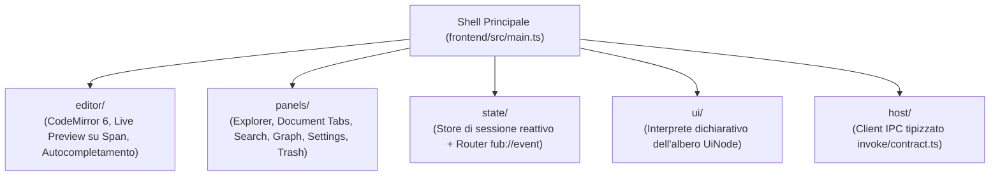

# La Shell e l'interfaccia frontend

## Architettura del Frontend

L'interfaccia utente di Fub (la **shell**) risiede nella directory [`frontend/`](../../frontend).

È realizzata in TypeScript puro (senza framework pesanti a runtime) per massimizzare la reattività e mantenere un consumo di memoria minimo, sfruttando un'architettura modulare a componenti reattivi.

---

## 1. Il Sottosistema Editor (`editor/`)

Il cuore dell'esperienza di scrittura è costruito attorno a **CodeMirror 6** ed esteso con plugin modulari:

- **`livepreview.ts`**: applica decorazioni dinamiche (*Atomic Ranges* e *Widget Decorations*) basate sugli `Span` calcolati da `fub-format-markdown`. Quando il cursore non si trova sopra un elemento, ne mostra la resa visiva (grassetto, elenchi, formule matematiche, callout, immagini incorporate), svelando la sorgente Markdown appena l'utente ci si posiziona.
- **`completions.ts`**: autocompletamento ad alte prestazioni per wikilink (`[[...]]`) e tag (`#...`), alimentato dagli indici veloci del kernel.
- **`editor-commands.ts`**: scorciatoie e manipolazioni del buffer (toggle grassetto/corsivo, inserimento link, formattazione tabelle).

---

## 2. I Pannelli e la Gestione delle Viste (`panels/`)

La shell organizza l'area di lavoro in pannelli laterali e centrali:

| Pannello | File sorgente | Ruolo e Funzionalità |
|---|---|---|
| **Document Manager** | [`src/panels/document.ts`](../../frontend/src/panels/document.ts) | Gestione delle schede aperte (*tabs*), cronologia di navigazione (avanti/indietro), timer di debounce per il salvataggio su disco (400 ms) e gestione bozze in RAM. |
| **File Explorer** | [`src/panels/explorer.ts`](../../frontend/src/panels/explorer.ts) | Albero navigabile delle cartelle, note fissate (*pinned*), icone personalizzate, folder note e riordinamento manuale. |
| **Quick Switcher** | [`src/panels/quick-switcher.ts`](../../frontend/src/panels/quick-switcher.ts) | Palette di comando modale per l'apertura istantanea di note e l'esecuzione di comandi globali. |
| **Graph View** | [`src/panels/graph.ts`](../../frontend/src/panels/graph.ts) | Canvas 2D interattivo che renderizza nodi e collegamenti tra le note del vault con simulazione a forze. |
| **Search Panel** | [`src/panels/search.ts`](../../frontend/src/panels/search.ts) | Interfaccia per la ricerca full-text (*omnisearch*) alimentata da Tantivy. |
| **Settings Panel** | [`src/panels/settings.ts`](../../frontend/src/panels/settings.ts) | Pannello preferenze e configurazione vault generato tramite `UiNode`. |
| **Trash Panel** | [`src/panels/trash.ts`](../../frontend/src/panels/trash.ts) | Visualizzazione delle note eliminate e ripristino con metadati d'origine. |

---

## 3. Gestione dello Stato e Bus Eventi (`state/`)

- **`store.ts`**: mantiene in memoria lo stato della sessione (vault corrente, documento attivo, pannelli montati, preferenze).
- **`events.ts`**: ascoltatore centrale del canale WebSocket/IPC `fub://event`. Quando il backend emette un evento (es. `DocumentChanged`, `DocumentRenamed`, `IndexingProgress`), il router aggiorna selettivamente solo i componenti interessati, senza scatenare render globali.

---

## 4. Ponte IPC e Contratti (`host/`)

Tutta la comunicazione tra la webview TypeScript e il backend Rust di `fub-app` / `fub-host` è tipizzata e presidiata:
- **`contract.ts`**: definizioni TypeScript generate o sincronizzate 1:1 con i tipi di `fub-abi` (`WriteBase`, `IndexQuery`, `Event`, `UiNode`).
- **`ipc.ts`**: wrapper attorno a `@tauri-apps/api/core::invoke` che gestisce la serializzazione serde, propagazione degli errori e cancellazione asincrona.

---

## File chiave del frontend

- [`frontend/src/main.ts`](../../frontend/src/main.ts): entrypoint principale e montaggio della shell.
- [`frontend/src/editor/editor.ts`](../../frontend/src/editor/editor.ts): configurazione dello stato e delle estensioni CodeMirror 6.
- [`frontend/src/editor/livepreview.ts`](../../frontend/src/editor/livepreview.ts): motore di decorazioni live preview.
- [`frontend/src/panels/document.ts`](../../frontend/src/panels/document.ts): ciclo di vita dell'editing e salvataggio documenti.
- [`frontend/src/ui/node.ts`](../../frontend/src/ui/node.ts): interprete che trasforma `UiNode` in elementi DOM sicuri.

---

## Se vuoi il dettaglio

- Guarda [`docs/07-ui/02-il-protocollo-ui-node.md`](./02-il-protocollo-ui-node.md) per scoprire come i componenti grafici vengono descritti in modo agnostico.
- Guarda [`docs/07-ui/03-comandi-eventi-ipc.md`](./03-comandi-eventi-ipc.md) per il protocollo dettagliato delle chiamate IPC e degli eventi.
- Guarda [`docs/07-ui/04-temi-e-accessibilita.md`](./04-temi-e-accessibilita.md) per i token CSS e i requisiti di contrasto WCAG.
