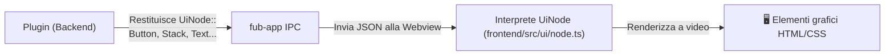

# Il Protocollo `UiNode`: Interfaccia Dichiarativa

## Che cos'è una UI Dichiarativa?

Invece di manipolare direttamente gli elementi del DOM della pagina web, il backend descrive ciò che vuole mostrare restituendo un albero di dati chiamato **`UiNode`** (definito in [`crates/fub-abi/src/ui.rs`](../../crates/fub-abi/src/ui.rs)).

La shell nel frontend riceve questo albero e si occupa di disegnarlo a schermo usando componenti stilizzati e coerenti.

---

## Componenti `UiNode` disponibili

- **Contenitori**:
  - `UiNode::Stack`: raggruppa elementi in riga (orizzontale) o colonna (verticale).
  - `UiNode::Card`: un riquadro con bordo e sfondo per evidenziare contenuti.
  - `UiNode::Grid` / `UiNode::Table`: visualizzazione a griglia o tabella.
- **Contenuti e Controlli**:
  - `UiNode::Text`: un'etichetta di testo con stile (titolo, sottotitolo, corpo).
  - `UiNode::Button`: un pulsante cliccabile che invia un'azione (`Intent`) al backend.
  - `UiNode::TextInput`: un campo di testo per l'input dell'utente.
  - `UiNode::Checkbox` / `UiNode::Select`: caselle di spunta e menu a tendina.
  - `UiNode::Badge`: una piccola etichetta colorata per mostrare tag o stati.

---

## Vantaggi del protocollo `UiNode`

1. **Sicurezza**: i plugin non possono iniettare script JavaScript malevoli nel DOM (*Cross-Site Scripting* o XSS).
2. **Tema uniforme**: tutti i plugin hanno automaticamente lo stesso stile visivo, rispettando i colori del tema chiaro/scuro e le dimensioni scelte dall'utente.
3. **Portabilità**: la stessa descrizione `UiNode` può essere renderizzata in futuro su interfacce native per smartphone o tablet senza dover cambiare una riga di codice del plugin.

---

## Se vuoi il dettaglio

- Guarda [`crates/fub-abi/src/ui.rs`](../../crates/fub-abi/src/ui.rs) per la definizione Rust dei nodi.
- Guarda [`frontend/src/ui/node.ts`](../../frontend/src/ui/node.ts) per vedere come la webview converte i nodi in elementi visivi.
