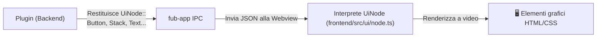

# Il Protocollo `UiNode`: Interfaccia Dichiarativa

## Che cos'è una UI Dichiarativa?

Invece di manipolare direttamente gli elementi del DOM della pagina web, il backend descrive ciò che vuole mostrare restituendo un albero di dati chiamato **`UiNode`** (definito in [`crates/fub-abi/src/ui.rs`](../../crates/fub-abi/src/ui.rs)).

La shell nel frontend riceve questo albero e si occupa di disegnarlo a schermo usando componenti stilizzati e coerenti.

---

## Componenti `UiNode` disponibili

- **Struttura e Layout**:
  - `UiNode::Stack`: raggruppa elementi in riga (orizzontale) o colonna (verticale) con spaziatura controllata (`gap`).
  - `UiNode::Section`: gruppo ripiegabile con titolo (`collapsed`).
  - `UiNode::Table` / `UiNode::Row`: visualizzazione a tabella tipizzata con colonne configurabili.
  - `UiNode::Tree` / `UiNode::TreeItem`: alberi gerarchici (file explorer, outline, tag annidati).
  - `UiNode::Tabs` / `UiNode::Tab`: interfaccia a schede.
- **Contenuti e Controlli**:
  - `UiNode::Text` / `UiNode::Heading`: etichette e intestazioni di testo localizzabili (`Text`).
  - `UiNode::Button`: pulsante interattivo con intento semantico (`Intent`: `Neutral`, `Primary`, `Danger`) e azione associata (`ActionRef`).
  - `UiNode::TextInput` / `UiNode::TextArea` / `UiNode::Number`: campi di input testo e numerici.
  - `UiNode::Checkbox` / `UiNode::Select` / `UiNode::Radio` / `UiNode::Slider` / `UiNode::DatePicker`: controlli di selezione, regolazione e date.
  - `UiNode::Badge`: etichetta compatta per mostrare stati o contatori con rispettivo `Intent`.
  - `UiNode::Progress` / `UiNode::Separator` / `UiNode::EmptyState`: barre di avanzamento, divisori e schermate di stato vuoto.

---

## Vantaggi del protocollo `UiNode`

1. **Sicurezza**: i plugin non possono iniettare script JavaScript malevoli nel DOM (*Cross-Site Scripting* o XSS).
2. **Tema uniforme**: tutti i plugin hanno automaticamente lo stesso stile visivo, rispettando i colori del tema chiaro/scuro e le dimensioni scelte dall'utente.
3. **Portabilità**: la stessa descrizione `UiNode` può essere renderizzata in futuro su interfacce native per smartphone o tablet senza dover cambiare una riga di codice del plugin.

---

## Se vuoi il dettaglio

- Guarda [`crates/fub-abi/src/ui.rs`](../../crates/fub-abi/src/ui.rs) per la definizione Rust dei nodi.
- Guarda [`frontend/src/ui/node.ts`](../../frontend/src/ui/node.ts) per vedere come la webview converte i nodi in elementi visivi.
