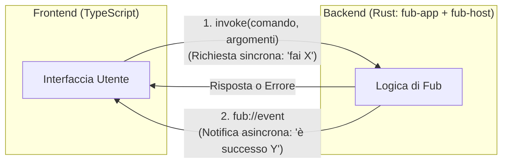

# Comunicazione IPC: Comandi ed Eventi

## Il doppio canale IPC

La comunicazione tra il frontend (webview) e il backend (Rust) avviene attraverso due direzioni ben distinte:



---

## 1. I Comandi (`invoke`: da Frontend a Backend)

Quando l'utente compie un'azione (apre un file, salva una nota, esegue una ricerca), il frontend invia un comando IPC:

```typescript
// Esempio: chiamata dal frontend
import { invoke } from '@tauri-apps/api/core';

const nuovaRevisione = await invoke<string>('write_document', {
    id: 'Appunti.md',
    source: '# Titolo aggiornato',
    base: { kind: 'descends_from', value: 'sha256-precedente...' }
});
```

Nel backend, il comando è gestito in [`crates/fub-app/src/lib.rs`](../../crates/fub-app/src/lib.rs):

```rust
#[tauri::command]
pub fn write_document(
    host: State<Host>,
    id: String,
    source: String,
    base: WriteBase,
    vault: Option<String>,
) -> Result<String, PluginError> {
    let ws = host.workspace(vault.as_deref())?;
    let mut ws = ws.write()?;
    ws.write_document(&doc_id(&id)?, &source, base)
        .map(|r| r.0)
        .map_err(PluginError::from)
}
```

---

## 2. Gli Eventi (`fub://event`: da Backend a Frontend)

Quando qualcosa cambia nel vault (per esempio un file viene salvato o modificato all'esterno da un altro programma), il backend emette un evento:

- Il thread del ponte ([`crates/fub-host/src/bridge.rs`](../../crates/fub-host/src/bridge.rs)) preleva l'evento dal kernel.
- Tauri trasmette l'evento alla webview attraverso il canale dedicato `fub://event`.
- Lo store del frontend riceve il payload e aggiorna i pannelli coinvolti.

---

## Se vuoi il dettaglio

- Guarda [`crates/fub-app/src/lib.rs`](../../crates/fub-app/src/lib.rs) per tutti i comandi IPC disponibili.
- Guarda [`frontend/src/host/`](../../frontend/src/host) per i wrapper TypeScript che chiamano questi comandi.
