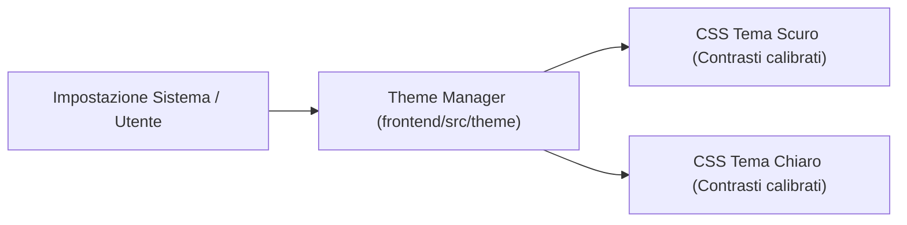

# Temi, Design Token e Accessibilità

## I Design Token e le Variabili CSS

Fub non usa colori fissi nel codice dell'interfaccia, ma impiega **variabili CSS** (dette *design token*) che cambiano automaticamente in base alla modalità selezionata dall'utente.

I file si trovano in [`frontend/src/theme/`](../../frontend/src/theme):
- **Superfici**: `--doc-bg` (carta dell'editor), `--bg` (sfondo dell'app), `--bg-chrome` (scocca e titlebar), `--bg-elev` (pannelli e modali), `--bg-panel` (riquadri), `--bg-input` (campi di input), `--border` (filetti e divisori).
- **Stati**: `--bg-hover` (interazione puntatore), `--bg-active` (selezione attiva).
- **Inchiostri e Testo**: `--text` (testo principale ad alto contrasto), `--muted` (testo secondario e metadati).
- **Accenti**: `--accent` (colore d'accento per azioni primarie), `--accent-soft` (inchiostro d'accento tenue), `--accent-contrast` (testo ad alto contrasto su fondo accento).

---

## Modalità Chiara e Scura

La shell rileva automaticamente le preferenze del sistema operativo e consente di forzare una modalità specifica:
- **Tema Scuro (*Dark Mode*)**: ottimizzato per ridurre l'affaticamento visivo in ambienti poco illuminati.
- **Tema Chiaro (*Light Mode*)**: colori ad alto contrasto per ambienti luminosi.

---

## Standard di Accessibilità (WCAG)

Tutte le combinazioni di colore tra testo e sfondo sono verificate automaticamente con strumenti di test (come `axe-core` nei test di frontend) per garantire il rispetto del livello **AA delle linee guida WCAG**:
- Contrasto minimo di 4.5:1 per il testo normale.
- Contrasto minimo di 3:1 per elementi grafici e testi di grandi dimensioni.
- Supporto completo per la navigazione tramite sola tastiera (tasto `Tab`, frecce e scorciatoie veloci).

---

## Se vuoi il dettaglio

- Guarda [`frontend/src/theme/`](../../frontend/src/theme) per esplorare le definizioni dei token di stile.
- Guarda [`frontend/bench/a11y.mjs`](../../frontend/bench/a11y.mjs) per il banco di prova automatico del contrasto dei colori.
